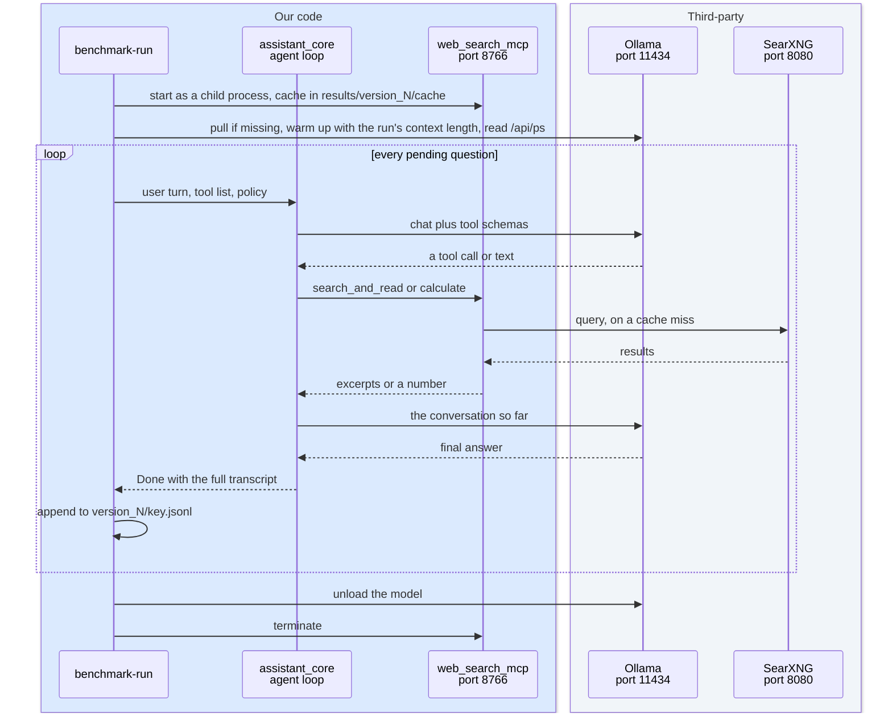

# 1. Choosing the model, the LLM benchmark
<!-- complexity: packages=3 parts=3 concepts=2 tier=deep -->

The benchmark is how the project decides which language model answers your questions. It asks each candidate model the same 28 questions through the same agent loop the assistant runs in production, records every tool call and every answer, checks the answers against a written rubric, and prints one score per model. The model at the top of that table is the one the assistant speaks with, and its memory footprint is what sized the Mac.

## Where this fits

```mermaid
flowchart TB
--8<-- "_includes/system_map.mmd"
class ollama,mcp,laptop current
```

Three nodes are highlighted, in two rows. In the top row, with the devices, the laptop is where a benchmark pass is launched and where its results land, as files under `benchmark/results/`. Two rows down, among the Mac's native services, sit Ollama and `web_search_mcp`. Each question goes from the laptop into Ollama as a chat with tool schemas attached, exactly as the conversation agent in the Home Assistant row sends it. When the model asks for a tool, the call goes over MCP to a copy of `web_search_mcp` that the benchmark starts for itself on port 8766, next to the product's server on 8765, so a run can cache search results without touching the live service; that copy still reaches SearXNG in the Docker row and the search engines in the bottom row. Excerpts and calculator results come back into the loop, the final answer comes back to the laptop, and nothing else in the map is involved: the Home Assistant row, the speech services, and the puck all sit a pass out.

## Key definitions

- **Candidate.** One model configuration the benchmark scores: an Ollama model tag, an API model, or a set of hand-written answers, named by a key in `benchmark/config.yaml`.
- **Gate.** A pass-or-fail rule in the benchmark rubric. Failing a gate zeroes the question, so a fluent fabrication cannot score well.
- **LLM-as-judge.** Using a strong model to grade another model's answer against a written rubric.
- **Reference sketch.** Two or three sentences in the benchmark saying what a correct answer must contain, so the judge checks against it instead of working the problem itself.
- **Preview build.** A 3-bit build of a model whose 4-bit production build does not fit the prototype machine. A high preview score is strong evidence for the production build; a low one is only weak evidence against it.

## Packages and tools

| Tool | What it is | How this part uses it |
|---|---|---|
| Ollama 0.33.3 and the `ollama` Python client 0.6.2 | A server that downloads language models and answers chat requests over HTTP on port 11434, and the client library that talks to it | Every local candidate runs through it. The harness pulls a missing model tag, warms the model up, reads how much of it sits on the GPU, and unloads it after the run |
| `anthropic` 1.4.0 | The Python client for Anthropic's API | Two jobs: runs the frontier baseline (Claude Opus 5) through the same loop, and acts as the judge when judging goes through the API. Both spend prepaid credit |
| `mcp` 2.1.1 | The Model Context Protocol client library | Connects the agent loop to `web_search_mcp` over HTTP and turns the server's tool list into the schemas each model sees |
| `web_search_mcp` and SearXNG | Our tool server ([section 3](03_web_search_mcp.md)) and the metasearch engine in Docker on port 8080 | The harness starts its own tool server as a child process with a per-run cache folder, so every candidate in a pass reads the same pages for the same query |
| `pydantic` 2.13.5 | A library for typed data records validated on load | Every file the benchmark reads or writes is a pydantic model: questions, candidates, transcripts, gate lists, judge verdicts, scores. The judge is forced to return JSON that fits the `JudgeVerdict` model |
| `pyyaml` 6.0.3 and `rich` 15.0.0 | A YAML parser and a terminal formatting library | YAML holds the questions, the configuration, the hand-written answers, and the review sheet. `rich` prints the progress lines and the speed table |
| Claude Code and the `benchmark-judge` subagent | The coding assistant this project is developed with, and an agent definition in `.claude/agents/` | The free judging path: the subagent reads exported case files and writes one verdict file per question, on the user's subscription rather than the API balance |

## How it works

### The question set, the rubric, and the configuration

```mermaid
flowchart LR
--8<-- "_includes/palette.mmd"
subgraph files["Three files define the benchmark"]
  questions[("benchmark/questions.yaml<br/>28 questions, set 1.2")]
  rubric[("benchmark/rubric.md<br/>the judge's instructions")]
  config[("benchmark/config.yaml<br/>candidates, policy, judge")]
end
subgraph readers["What reads them"]
  harness["the harness<br/>run.py and gates.py"]
  judge["the judge<br/>Claude Opus 5"]
end
config -- "candidate keys,<br/>temperature 0.7, 4 tool rounds,<br/>600 output tokens" --> harness
questions -- "turns, expected_search,<br/>max_words, expected_route" --> harness
questions -- "reference sketch,<br/>gates_for_judge" --> judge
rubric -- "sent verbatim as<br/>the system prompt" --> judge
class questions,rubric,config,harness ours
class judge ext
```

Three files define the benchmark, and everything else is machinery that reads them.

`benchmark/questions.yaml` holds 28 questions in three categories. Category A (A1 to A11) should be answered from knowledge or reasoning without searching: explaining why a mixture-of-experts model fits in less memory than its parameter count suggests, diagnosing a yellowing plant, a two-turn conversation about a 16 GB versus a 24 GB machine. Category B (B11 to B21) should trigger a search: the current federal funds rate, a day trip from Lucerne tomorrow, why GPU prices rose. Category C (C23 to C28) is explicit arithmetic that should go through the calculator tools: a tip, compound savings, a mortgage payment. Each question carries `expected_search` (`no`, `yes`, or `instructed` when the question itself says "search for"), optional `constraints` (`max_words`, `budget_usd`, `no_product_names`), the gates the judge should watch for, and a reference sketch with the figures a correct answer must contain. Questions A2, A7, and all of category C also carry `expected_route: calculate`, which lets the report score the question router in [section 4](04_conversation_agent.md) on its own.

`benchmark/rubric.md` is the text the judge receives as its system prompt, unchanged. It defines the five gates only a reader of the transcript can detect (a fabricated current fact, a violated constraint, an estimate presented as fact, lost prior-turn context, agreeing with a false premise) and three dimension scores: answer quality 0 to 5, judgment 0 to 3, spoken fit 0 to 2. Ten points per question, 280 per candidate, 110 for A, 110 for B, 60 for C.

`benchmark/config.yaml` lists the candidates and the policy every one of them runs under: temperature 0.7, at most 4 tool rounds per turn, at most 600 output tokens, a 200-word spoken budget, a 16,384-token context, and a 60-second tool timeout. Each candidate has a `key` you pass on the command line, a `provider` (`ollama`, `anthropic`, or `manual`), the model tag, and optional flags: `preview: true` for the 3-bit builds and `baseline: true` for the frontier model. The same file names the judge model, `claude-opus-5`, and the review sample: 20 percent of each candidate's questions, drawn with the seed 20260905.

### A pass: every question through the real agent loop



A pass is one `benchmark-run --run version_N` invocation, and `version_N` is a folder under `benchmark/results/`. The harness first checks that SearXNG answers, then starts `web_search_mcp` as a child process with `WEB_SEARCH_CACHE_DIR` pointing at `version_N/cache`. Before starting it, it refuses to continue if port 8766 is already taken, and after starting it, it lists the server's tools and refuses to continue unless all six expected tools (`search_and_read`, `web_search`, `fetch_page`, `calculate`, `percent`, `convert`) are present, so a stale server from an earlier run can never answer this run's tool calls. It writes `run_meta.json` with the question set version, the system prompt version, the policy, the candidate list, the machine, the chip, the memory size, the Ollama version, and the git commit.

For each candidate the harness pulls the model tag if Ollama does not have it, then sends a one-token warm-up request with the run's context length and reads Ollama's `/api/ps` to compare the model's size with the bytes resident on the GPU. A model that does not fit prints a yellow warning and is still run, with `fully_on_gpu: false` recorded in every result so the report can flag its latency as unreliable. The Anthropic baseline is built only if `ANTHROPIC_API_KEY` is in `.env`; otherwise it is skipped with a message. Manual candidates are skipped here and produced by `benchmark-manual` instead.

Each question then runs through `assistant_core.agent_loop.run`, the same function the Home Assistant component calls. A two-turn question is run as two turns, with the second turn seeing the first turn's conversation. The result of a question is a `QuestionResult`: the transcript of every turn, with each model call's timing and token counts, each tool call and its result, the router's decision, the memory fit, and an error string if the model call itself failed. It is appended to `version_N/<key>.jsonl` as soon as it finishes, which is why a pass can be interrupted and resumed: questions already in the file are skipped unless you pass `--force`. After the last question the model is unloaded, and deleted from disk if you passed `--delete-models`, which matters for the 11 to 14 GB preview builds.

### Gates the harness decides on its own

```mermaid
flowchart TB
--8<-- "_includes/palette.mmd"
subgraph input["One transcript"]
  result[("one QuestionResult<br/>every turn's transcript")]
end
subgraph first["The first check decides whether the rest run"]
  failed{"did the model<br/>call fail?"}
end
subgraph checks["Six independent checks on the transcript"]
  c1{"searched on a<br/>category A or C question?"}
  c2{"skipped the search on<br/>a category B question?"}
  c3{"a tool call the loop<br/>could not parse?"}
  c4{"more than 4 tool<br/>rounds in one turn?"}
  c5{"empty final<br/>answer?"}
  c6{"over the question's<br/>max_words?"}
end
subgraph output["What the judge sees"]
  runerr["run_error<br/>the judge is skipped"]
  gates[("harness_gates<br/>every check that failed,<br/>possibly none")]
end
result --> failed
failed -- "yes" --> runerr
failed -- "no, run all six" --> checks
checks -- "every yes" --> gates
class result,failed,runerr,c1,c2,c3,c4,c5,c6,gates ours
```

Some gates need no judgment, only a look at the transcript. `benchmark/gates.py` evaluates six of them together and returns every one that failed. "Searched" means any call to `search_and_read`, `web_search`, or `fetch_page`; calculator calls do not count, so a category C question that calls `calculate` and never searches passes both search gates. The word-limit gate applies only to questions that declare `max_words` (A10, the 45-second spoken explanation, with a limit of 120). A question whose model call raised an exception gets the single gate `run_error` and is never sent to the judge.

*From `benchmark/gates.py`, `harness_gates`:*

```python
def harness_gates(question: Question, result: QuestionResult, max_tool_rounds: int) -> list[Gate]:
    if result.error:
        return [Gate.RUN_ERROR]
    checks = (
        (Gate.SEARCHED_ON_NO_SEARCH_QUESTION, result.searched and not question.should_search),
        (Gate.DID_NOT_SEARCH_ON_SEARCH_QUESTION, question.should_search and not result.searched),
        (Gate.MALFORMED_TOOL_CALL, any(transcript.malformed_tool_calls for transcript in result.turns)),
        (Gate.TOO_MANY_TOOL_CALLS, any(transcript.tool_call_count > max_tool_rounds for transcript in result.turns)),
        (Gate.NO_FINAL_ANSWER, not result.final.final_answer.strip()),
        (Gate.VIOLATED_EXPLICIT_CONSTRAINT, exceeds_word_limit(question, result)),
    )
    return [gate for gate, failed in checks if failed]
```

The harness gates and the judge's gates meet in the `Score` record. Its `gates` property is the union of both lists, `dimension_total` is the sum of the three judge scores, and `total` is zero the moment any gate is present. The report prints both totals side by side, so the gap between them is what the gates cost a candidate. The same record notices when the harness and the judge disagree about the search decision, which is what puts a question on the review sheet.

*From `benchmark/records.py`, `Score`:*

```python
    @property
    def gates(self) -> list[Gate]:
        judge_gates = self.judge.gates_hit if self.judge else []
        return sorted(set(self.harness_gates) | set(judge_gates))

    @property
    def dimension_total(self) -> int:
        if self.judge is None:
            return 0
        return self.judge.answer_quality + self.judge.judgment + self.judge.spoken_fit

    @property
    def total(self) -> int:
        return 0 if self.gates else self.dimension_total

    @property
    def harness_and_judge_disagree(self) -> bool:
        if self.judge is None:
            return False
        harness_says_search_wrong = any(gate in (Gate.SEARCHED_ON_NO_SEARCH_QUESTION, Gate.DID_NOT_SEARCH_ON_SEARCH_QUESTION) for gate in self.harness_gates)
        return harness_says_search_wrong == self.judge.search_decision_correct
```

### The judge: two paths to the same rubric

```mermaid
flowchart TB
--8<-- "_includes/palette.mmd"
subgraph transcripts["Transcripts of a pass"]
  results[("version_N/key.jsonl")]
end
subgraph rendering["One case per unjudged question"]
  case["render_case<br/>question, reference sketch,<br/>every turn, harness notes"]
end
subgraph handoff["Hand-off files, subagent path only"]
  cases[("judge_cases/key/qid.md<br/>manifest.json, rubric.md")]
end
subgraph judges["The judge, Claude Opus 5 reading the rubric"]
  api>"Anthropic API<br/>messages.parse with the<br/>JudgeVerdict schema"]
  sub>"benchmark-judge subagent<br/>Claude Code, Opus"]
end
subgraph verdicts["Verdicts"]
  verdict[("judge_cases/key/qid.verdict.json")]
end
subgraph scored["Scores"]
  scores[("version_N/key.scores.jsonl")]
end
results --> case
case -- "no flag: spends credit" --> api
case -- "--export: free" --> cases
cases --> sub
sub --> verdict
api -- "a verdict that fits<br/>the schema" --> scores
verdict -- "--import: checks gate<br/>names and ranges" --> scores
class results,case,cases,verdict,scores ours
class api,sub ext
```

Every transcript is graded by Claude Opus 5 reading the rubric. Whichever path you take, the judge sees the same text: the question with its metadata and reference sketch, every turn rendered as `USER`, `ASSISTANT`, `TOOL CALL`, and `TOOL RESULT` lines, a note when the word cap cut the spoken answer, and the harness observations (whether the assistant searched, how many tool and calculator calls it made, what the router decided, and which harness gates already apply). The judge is told to grade the final assistant message of the last turn and to score the three dimensions even when a gate applies.

The subagent path is the one in use. `benchmark-judge version_N --export` writes one markdown case per unjudged question under `version_N/judge_cases/<key>/`, a `manifest.json` listing each case and the path of the verdict it expects, and a copy of the rubric one folder up. You then hand one candidate's folder to the `benchmark-judge` subagent defined in `.claude/agents/benchmark-judge.md`, which reads the rubric, grades every case in the manifest without reading other candidates' folders, and writes `<qid>.verdict.json` next to each case. `benchmark-judge version_N --import` parses each verdict with the `JudgeVerdict` model, rejects any file with an unknown gate name or a score outside its range, and writes `<key>.scores.jsonl` with the judge recorded as `claude-opus-5 (Claude Code subagent)` and zero API tokens. A rejected verdict is reported and left unscored, so you re-run the subagent for that case and import again.

The API path is the same command with no flag. It reads `ANTHROPIC_API_KEY` from `.env`, sends up to four cases at a time, and asks the API to return a `JudgeVerdict` directly, so a malformed verdict cannot come back. Each score records the input and output tokens, and the command prints an estimate at Claude Opus 5 list prices, 5 dollars per million input tokens and 25 per million output tokens. This spends prepaid credit; the subagent path does not.

*From `benchmark/judge.py`, `ask_judge`:*

```python
async def ask_judge(client: anthropic.AsyncAnthropic, judge_config: JudgeConfig, rubric: str, case_text: str) -> tuple[JudgeVerdict, str, tuple[int, int]]:
    response = await client.messages.parse(
        model=judge_config.model,
        max_tokens=JUDGE_MAX_TOKENS,
        system=rubric,
        messages=[{"role": "user", "content": case_text}],
        output_format=JudgeVerdict,
    )
    if response.stop_reason == "refusal" or response.parsed_output is None:
        raise ValueError(f"judge returned no verdict (stop_reason={response.stop_reason})")
    return validate_ranges(response.parsed_output), response.model, (response.usage.input_tokens, response.usage.output_tokens)
```

### The report and the review sheet

```mermaid
flowchart LR
--8<-- "_includes/palette.mmd"
subgraph inputs["Read from version_N"]
  jsonl[("key.jsonl<br/>transcripts, timing, memory fit")]
  scores[("key.scores.jsonl<br/>harness gates plus verdict")]
  meta[("run_meta.json<br/>prompt version, policy, machine")]
  previous[("an earlier version_M<br/>with --compare")]
  human[("review_sheet.yaml<br/>your gates and scores")]
end
subgraph command["One command"]
  report["benchmark-report"]
end
subgraph outputs["Written next to them"]
  md[("report.md<br/>scores, gates, router accuracy,<br/>latency, per-question matrix, spend")]
  sheet[("review_sheet.yaml and .md<br/>20 percent sample plus disagreements")]
end
jsonl --> report
scores --> report
meta --> report
previous -. "shared questions only" .-> report
human -. "agreement rate" .-> report
report --> md
report --> sheet
class jsonl,scores,meta,previous,human,report,md,sheet ours
```

`benchmark-report version_N` reads every candidate's results and scores and writes `report.md` next to them. The scores table is sorted by total and shows, per candidate, the total, the ungated total, the three category totals, the fraction of the baseline when the baseline ran, the number of gated questions, and the mean of each dimension. Below it come the gate counts by type, the router's accuracy (how many questions the rule layer decided, how many the model layer decided, and each candidate's misroutes), a table of medians that are logged but never scored (time to first token, total time, answer words, questions searched, and whether the model was fully on the GPU), a per-question matrix where `G (7)` means a question gated to zero that earned 7 dimension points, the judge that produced the scores, and the paid API spend. When any candidate is a preview build the report carries the caveat that a high preview score is strong evidence for the production build and a low one weak evidence against it. `--compare version_M` adds a table of totals restricted to the questions both passes share, so a pass with new questions is not inflated.

The same command writes the review sheet. For each candidate it draws 20 percent of the judged questions with a seed fixed per candidate, adds every question where the harness and the judge disagree about the search decision, and writes them to `review_sheet.yaml` with the judge's gates, scores, and one-sentence reasons alongside an empty `human` block, plus a readable `review_sheet.md`. You fill in the human block by hand and re-run the report; the values you entered survive re-renders, and once any are present the report prints the gate agreement rate against a 90 percent target and the mean absolute difference in dimension totals.

### The hand-written reference and the speed table

No diagram is needed here: both tools reuse the pass in the second part above with a different client in the model's seat.

`benchmark-manual <key> --run version_N` replays scripted answers from `benchmark/manual/<key>.yaml` through the real agent loop and a real tool server. Each scripted turn lists the search queries to issue, any other tool calls such as `calculate` expressions, and the final spoken answer. A `ScriptedAnswerClient` plays the tool calls first and the answer second, so the transcript carries genuine excerpts and genuine calculator results, and the gates, the word cap, and the judge treat the file exactly like a model run. The configured reference, `claude-fable-5-1-manual-2`, was written closed book by a fresh Claude Fable 5.1 subagent that saw only the questions and the system prompt and ran the tools itself. It is the ceiling for the question set, not a model you could buy, and its losses show which questions punish even a careful answer.

`scripts/benchmark_llm.py --run version_N` measures raw speed rather than quality. For every Ollama candidate it sends a 400-word and a 3,000-word prompt at temperature 0, asks for 128 tokens, and reports prompt tokens per second, time to first token, and generation tokens per second, with a column saying whether the model was fully on the GPU. The table is printed and written to `version_N/speed.md`. These numbers project how a model will feel on the production Mac ([section 2](02_local_llm.md)); they play no part in the score.

### Reading the standings

No diagram is needed here: the standings are one table, `benchmark/results/version_5/report.md`.

Pass 5 ran every runnable candidate under system prompt 1.5 with routing on, judged by the subagent, for a paid spend of zero. Gemma 4 26B-A4B at UD-IQ4_XS scored 232 of 280 with one gated question, above the hand-written reference at 226. Qwen 3.6 35B-A3B at UD-IQ3_XXS scored 208, the 3-bit Gemma 26B build 199, the dense Gemma 4 12B 186, Gemma 4 E4B 176, Qwen 3.5 4B 157, Qwen 3.5 9B 154, and gpt-oss 20B 145 with nine gates. The two large mixture-of-experts previews called the calculator on all six arithmetic questions and searched every question that needed it; their remaining losses are answers that overrun the spoken word cap. Their latency on the 16 GB laptop, one to three minutes per answer, is not part of the score, because neither fits on the GPU there: 7.5 of 15.2 GB resident for the top scorer. That is the reading behind the decision in [section 8](08_hardware_and_deployment.md): a 26B or 35B mixture-of-experts model at full 4-bit precision, on a 32 GB machine.

## Run it yourself

Every command runs from the repository folder. A pass takes most of a 16 GB machine, so first make sure the Home Assistant VM and the speech services are down, then check that Ollama is listening and start SearXNG:

```bash
pgrep -fl benchmark-run || echo "no benchmark running"
scripts/haos_vm.sh stop
scripts/services.sh status        # ollama on 11434 should be listening; whisper and kokoro should not
scripts/searxng.sh up
```

Pick a fresh folder name for your pass. `benchmark/results/` is committed, and one folder is one pass, so do not write into `version_5`. Run two questions through one of the small models:

```bash
uv run benchmark-run --run version_6 --candidate gemma4-e4b --question A1 --question C23
```

You will see a rule line naming the candidate and the number of pending questions, a pull progress bar the first time the tag is missing, and then one line per question:

```
  A1   no search route=answer/model    calls=0 ttft=1.4s total=4.7s words=76
  C23  no search route=calculate/rule  calls=1 ttft=1.2s total=6.1s words=31
```

The results are in `benchmark/results/version_6/gemma4-e4b.jsonl`, with `run_meta.json` and a `cache/` folder beside it. Stop a run with Ctrl-C. The tool server child stops with the harness, and the finished questions stay in the file, so running the same command again continues where it stopped. Add `--force` to redo questions that already have a result.

Judge those two answers through the subagent, which costs nothing:

```bash
uv run benchmark-judge version_6 --export
```

You will see `gemma4-e4b: exported 2 cases to benchmark/results/version_6/judge_cases/gemma4-e4b`. In Claude Code, ask for the `benchmark-judge` subagent and give it that folder; it replies with the number of verdicts it wrote. Then import them and render the report:

```bash
uv run benchmark-judge version_6 --import
uv run benchmark-report version_6
```

The import prints `gemma4-e4b: imported 2 verdicts`, and the report prints `wrote benchmark/results/version_6/report.md and benchmark/results/version_6/review_sheet.yaml`. Open `report.md` to see the tables from the previous section for your two questions. Running `benchmark-judge version_6` with no flag judges through the Anthropic API instead. It needs `ANTHROPIC_API_KEY` in `.env`, prints `judge usage: N in / M out, about $X`, and the dollars are real: `benchmark/results/version_1/report.md` records about $6.77 for judging eight candidates that way, and running the frontier baseline costs more on top. Use the API path only when you mean to.

For a full pass over every candidate, omit `--candidate`. The large preview builds are 11 to 14 GB each, so add `--delete-models` to remove each one after its run, and expect the pass to take hours on a 16 GB machine because those models spill to the CPU:

```bash
uv run benchmark-run --run version_6 --delete-models
uv run benchmark-manual claude-fable-5-1-manual-2 --run version_6
uv run benchmark-report version_6 --compare version_5
```

The Anthropic baseline in that pass runs only when `ANTHROPIC_API_KEY` is set, and prints its API usage and cost when it finishes. For raw speed alone, which takes a minute per model:

```bash
uv run python scripts/benchmark_llm.py --run version_6 --candidate gemma4-e4b
```

You will see a table headed "Raw speed on this machine" with a short and a long prompt row, and `benchmark/results/version_6/speed.md` beside it. When you are done, stop SearXNG with `scripts/searxng.sh down` if you started it only for this; Ollama stays up.

## Where to look in the code

| Path | What you find there |
|---|---|
| `benchmark/run.py` | `benchmark-run`: loads the config and questions, starts the tool server child, prepares and releases each model, runs each question through `agent_loop.run`, appends results, prints the per-question line |
| `benchmark/gates.py` | The six mechanical gates and the `run_error` gate |
| `benchmark/records.py` | Every typed record: `Question`, `Candidate`, `Services`, `JudgeConfig`, `QuestionResult`, `JudgeVerdict`, `Score`, and the loaders for the YAML files |
| `benchmark/judge.py` | `benchmark-judge`: case rendering, the API path, `--export`, `--import`, and range validation of verdicts |
| `benchmark/report.py` | `benchmark-report`: every table in `report.md`, the comparison, and the review sheet with its seeded sample |
| `benchmark/costs.py` | Claude Opus 5 list prices and the dollar estimate |
| `benchmark/mcp_process.py` | Starting `web_search_mcp` as a child with a per-run cache, the port check, and the tool-list check |
| `benchmark/ollama_utils.py` | Pull, warm-up, memory fit from `/api/ps`, unload, delete |
| `benchmark/manual_run.py` | `benchmark-manual` and the `ScriptedAnswerClient` that plays hand-written answers |
| `benchmark/questions.yaml`, `benchmark/rubric.md`, `benchmark/config.yaml` | The question set, the judge's instructions, and the candidate list with the shared policy |
| `benchmark/manual/` | The hand-written reference answers, one YAML file per manual candidate |
| `benchmark/results/version_N/` | One folder per pass: `run_meta.json`, `<key>.jsonl`, `<key>.scores.jsonl`, `judge_cases/`, `cache/`, `report.md`, `review_sheet.yaml`, `speed.md` |
| `scripts/benchmark_llm.py` | The raw speed table |
| `.claude/agents/benchmark-judge.md` | The subagent's grading procedure and the verdict file format |
| `tests/test_gates_and_records.py`, `tests/test_manual_run.py`, `tests/test_mcp_process.py` | Gate detection on synthetic results, score zeroing and disagreement, scripted turns, and the port check |

## Further reading

- Design doc: [design_docs/v1/01_llm_benchmark.md](https://github.com/seanlin2000/home_assistant/blob/main/design_docs/v1/01_llm_benchmark.md), including the pass-by-pass results and what each pass showed
- [unsloth/gemma-4-26B-A4B-it-GGUF](https://huggingface.co/unsloth/gemma-4-26B-A4B-it-GGUF), the source of the Gemma preview builds and their sizes on disk
- [unsloth/Qwen3.6-35B-A3B-GGUF](https://huggingface.co/unsloth/Qwen3.6-35B-A3B-GGUF/tree/main), the same for the Qwen preview
- [ollama.com/library/qwen3.5](https://ollama.com/library/qwen3.5), the tags and sizes behind the two small Qwen candidates
- [gemma4.dev, thinking mode](https://gemma4.dev/docs/concepts/thinking-mode), why the Gemma candidates run with thinking off
- [willitrunai.com on gpt-oss-20b](https://willitrunai.com/blog/gpt-oss-20b-vram-requirements), what a 13 GB model does on a 16 GB Mac
