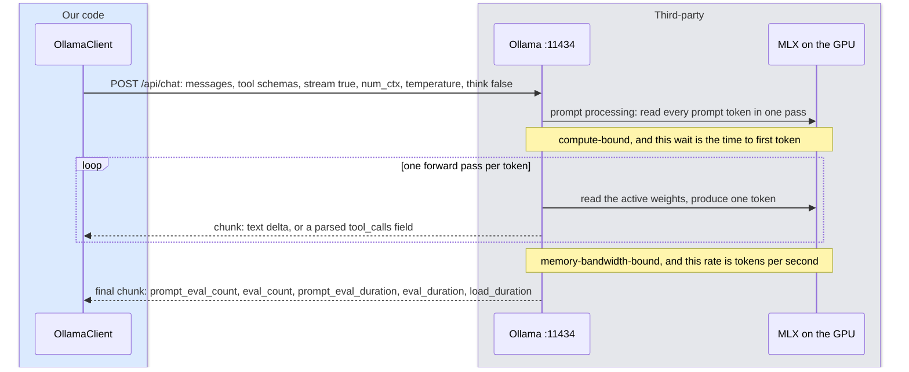
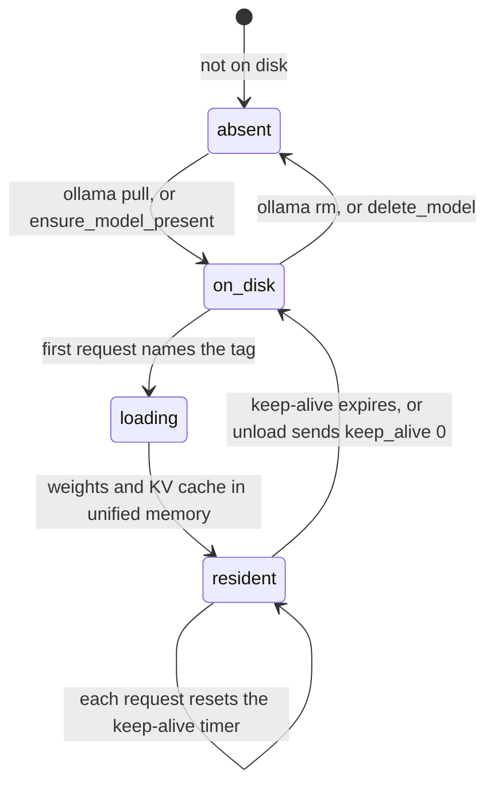

# 2. Running a language model on a Mac
<!-- complexity: packages=2 parts=2 concepts=3 tier=standard -->

This part is the model itself: the program that turns a question, a persona, and a page of search excerpts into an answer, one token at a time, on the Mac in the room. Ollama downloads the model, keeps it in the Mac's memory, runs it on the GPU, and answers HTTP requests from the conversation agent and from the benchmark. Nothing about the question or the answer leaves the machine.

## Where this fits

```mermaid
flowchart LR
--8<-- "_includes/system_map.mmd"
class ollama current
```

Ollama sits among the native macOS processes that launchd keeps alive. The conversation agent inside the Home Assistant VM sends it the chat so far plus the schemas of the tools it may call, and gets back a stream of tokens or a structured tool call. The laptop's benchmark sends the same kind of request. Ollama talks to nothing else: it reads weights from disk once, then reads memory.

## Key definitions

- **Parameters.** The learned numbers inside a model. "26B" means 26 billion of them. More parameters means more capability and more memory.
- **Mixture of experts (MoE).** A model whose layers are split into many "experts" with a small router picking a few per token. It must hold every expert in memory but computes with only the active ones, so it runs nearly as fast as a much smaller model.
- **Quantization.** Storing model weights at 4 or 3 bits instead of 16. Four-bit cuts memory by about four times with a small quality loss; three-bit cuts further with a noticeable loss.
- **Unified memory.** One pool of memory shared by the CPU and GPU on Apple Silicon. Its size decides which models fit.
- **KV cache.** The model's working memory for the current context. It costs memory in proportion to context length and saves recomputation.
- **Context window.** The maximum number of tokens the model can see at once: the system prompt, the conversation, and tool results together.
- **Time to first token.** How long the model takes to read the prompt before it starts writing. It grows with prompt length and is the wait you notice.
- **Tokens per second.** How fast the model writes once it has started. Speech plays at about three to four tokens per second, so any faster model keeps up.
- **Model tag.** The name Ollama uses for one downloadable build of a model, such as `gemma4:e4b-it-qat`. The part after the colon names the size and quantization, and the same tag can point at a different build after a re-pull, so the build id is recorded too.
- **Keep-alive.** How long Ollama keeps a model's weights in memory after the last request. Zero unloads at once, a duration such as `10m` unloads after that idle time, and `-1` keeps the model resident until Ollama stops.
- **Thinking mode.** A setting on recent models that makes them write a hidden chain of reasoning before the answer. It helps hard problems and multiplies latency, so the assistant turns it off on every request.

## Packages and tools

| Tool | What it is | How this part uses it |
|---|---|---|
| Ollama 0.33.3 | A program, installed with Homebrew, that downloads open-weight models and serves them over HTTP on port 11434 | Hosts the model, loads it into unified memory, parses each model family's tool-call format, and reports timing statistics with every answer. The agent, Home Assistant, and the benchmark all speak its API |
| MLX and Metal | Apple's machine learning framework and the GPU interface beneath it, built into Ollama on Apple Silicon | The reason generation runs on the GPU instead of the CPU. Nothing in this repository calls them directly |
| `ollama` Python package 0.6.2 | A thin typed client for the Ollama HTTP API | `OllamaClient` in `assistant_core/llm_client.py` streams chat responses through it; `benchmark/ollama_utils.py` uses it to list, load, inspect, and unload models |
| launchd | macOS's service manager | `scripts/services.sh install` writes a launchd agent that starts `ollama serve` at login, keeps it alive, binds it to the LAN, and keeps the model resident |

## How it works

### Part 1: What the model costs in memory

```mermaid
flowchart TB
--8<-- "_includes/palette.mmd"
subgraph mac["Prototype Mac: 16 GB of unified memory, shared by CPU and GPU"]
  macos["macOS<br/>about 3 GB"]
  haos["Home Assistant VM<br/>3 to 4 GB"]
  whisper["Whisper<br/>1.6 GB"]
  kokoro["Kokoro<br/>under 1 GB"]
  subgraph ollama["Ollama"]
    weights[("model weights, quantized<br/>gemma4:e4b-it-qat: 6.1 GB")]
    kv[("KV cache<br/>grows with context<br/>1 to 2 GB at 16k tokens")]
  end
end
class macos,haos,whisper,kokoro third
class weights,kv third
style ollama stroke:#f59e0b,stroke-width:4px
```

A model is a large array of numbers, its parameters, and running it means reading all of them for every token it writes. On Apple Silicon there is one pool of memory for the CPU and the GPU, so the question "does this model fit" is the question "do the weights plus the working memory fit next to everything else the Mac is running."

The weights take `parameters × bits per parameter ÷ 8` bytes. Models are published at 16 bits per parameter and stored for local use at 4 bits plus a little overhead, which is why the sizes below are about a quarter of what the parameter count suggests. The KV cache is the second cost: for every token in the context window the model keeps a few vectors so it never recomputes attention over earlier tokens, so the cache grows linearly with context length. The agent's context window is 16,384 tokens (`DEFAULT_CONTEXT_TOKENS` in `custom_components/studio_assistant/const.py`), which costs 1 to 2 GB for the models in play.

| Model tag | Parameters | Weights in memory | With a 16k KV cache | Runs on the 16 GB prototype |
|---|---|---|---|---|
| `qwen3.5:4b` | 4B dense, 4-bit | 3.4 GB | about 5 GB | yes, fully on the GPU |
| `gemma4:e4b-it-qat` | 4B effective, 4-bit | 6.1 GB | about 7.5 GB | yes, fully on the GPU |
| `qwen3.5:9b` | 9B dense, 4-bit | 6.6 GB | about 8 GB | yes, fully on the GPU |
| `gemma4:12b` | 12B dense, 4-bit | 7.6 GB | about 9 GB | yes, fully on the GPU |
| Gemma 4 26B-A4B | 26B total, 4B active, 4-bit | 15 to 17 GB | 17 to 19 GB | no; the benchmark ran a 3-bit preview that spilled to the CPU |

The first four sizes are what `ollama list` reports on the prototype. The last row is the model the benchmark points at for a 32 GB machine (section [1](01_llm_benchmark.md)), and it shows why a mixture-of-experts model is the right shape: the Mac must hold all 26 billion parameters, but each token touches only the 4 billion active ones, so it writes at a small model's speed with a large model's quality. On 32 GB the budget is macOS 3 GB, the Home Assistant VM 3 to 4 GB, the model 16 GB, its KV cache 1 to 2 GB, Whisper 1.6 GB, and text to speech under 1 GB: 25 to 27 GB in total.

When a model does not fit, Ollama does not refuse. It puts what it can on the GPU, runs the rest on the CPU, and generation slows to a crawl. Part 3 shows how the benchmark detects this.

### Part 2: One request, and the two speeds you feel



Every question the assistant answers is one or more of these requests. The agent posts the message history, the tool schemas, and a few options, and asks for a stream. Ollama then does two jobs in sequence, limited by different parts of the chip.

First it reads the prompt. Every token of the system prompt, the conversation so far, and any search excerpts passes through the model in one batch. The GPU multiplies large matrices and memory is not the bottleneck, so this step is compute-bound. Its duration is the time to first token, and it grows with prompt length. After a web search the prompt carries 3,000 to 6,000 tokens of page text, so this wait decides whether the answer starts in two seconds or eight.

Then it generates. Each new token is one forward pass, and a forward pass reads the weights of every active layer out of memory. Little arithmetic is reused between tokens, so the speed is set by memory bandwidth divided by the bytes of weights touched per token. That is why this step is memory-bandwidth-bound, why Apple's fast unified memory competes with discrete GPUs here, and why a mixture-of-experts model, which touches only its active experts, generates much faster than a dense model of the same total size. Speech plays at three to four tokens per second, so anything faster than about five stays ahead of the voice once streaming starts.

| Speed | What limits it | Grows with | What the reader feels |
|---|---|---|---|
| Time to first token | arithmetic throughput (compute-bound) | prompt length: system prompt, history, search excerpts | the silence before the answer starts |
| Tokens per second | memory bandwidth ÷ bytes read per token (memory-bandwidth-bound) | the model's active parameters | whether the voice ever has to pause mid-sentence |

If the model decides to use a tool, Ollama parses its structured output and returns a `tool_calls` field instead of text; the agent runs the tool and posts the whole conversation again (section [4](04_conversation_agent.md)). The final chunk carries the token counts and the durations of both phases in nanoseconds, which `ollama_stats` in `assistant_core/llm_client.py` turns into the statistics the benchmark records.

*From `assistant_core/llm_client.py`, `OllamaClient._stream`:*

```python
    async def _stream(self, messages: list[Message], tools: list[ToolSpec], policy: AgentPolicy) -> AsyncIterator[ollama.ChatResponse]:
        request: dict[str, Any] = {
            "model": self._model,
            "messages": [to_ollama_message(message) for message in messages],
            "tools": [to_ollama_tool(tool) for tool in tools] or None,
            "stream": True,
            "keep_alive": self._keep_alive,
            "options": {"temperature": policy.temperature, "num_ctx": policy.context_tokens, "num_predict": policy.max_output_tokens},
        }
        if policy.think is not None:
            request["think"] = policy.think
        try:
            return await self._client.chat(**request)
        except ollama.ResponseError as error:
            if "think" not in str(error).lower() or "think" not in request:
                raise
            # Some model families reject the thinking switch outright; they have no thinking mode to turn off.
            del request["think"]
            return await self._client.chat(**request)
```

Three options matter here. `num_ctx` is the context window, 16,384 tokens, and every request sends the same value because Ollama reloads the model when the context length changes, about five seconds for a 6 GB model. `num_predict` caps the answer at 600 tokens. `think` is `false` for Gemma 4 and Qwen and `low` for gpt-oss, because a model left to think spends its whole output budget reasoning in private and returns nothing to say aloud.

### Part 3: Keeping a model resident



Loading a model means reading gigabytes from disk, so Ollama loads on the first request and keeps the model resident for the keep-alive period. `scripts/services.sh install` writes a launchd agent that runs `ollama serve` with three settings: `OLLAMA_HOST=0.0.0.0:11434`, so the Home Assistant VM can reach it across the LAN; `OLLAMA_KEEP_ALIVE=-1`, so the model never unloads on its own and the first question of the day is not slow; and `OLLAMA_MAX_LOADED_MODELS=1`, so a second model is never loaded beside the first. The Home Assistant component points at `http://192.168.1.152:11434` and defaults to `gemma4:e4b-it-qat` (`custom_components/studio_assistant/const.py`); the model the running system has picked is on the [Versions of record](versions.md) page.

The benchmark uses the same server with a different rhythm, because it walks through every candidate on a machine that holds one at a time. `benchmark/ollama_utils.py` pulls a tag if it is missing, warms it up with a one-token request, checks that it sits entirely on the GPU through Ollama's `/api/ps` endpoint, and unloads it afterwards with a keep-alive of zero.

*From `benchmark/ollama_utils.py`, `memory_fit`:*

```python
async def memory_fit(client: ollama.AsyncClient, model: str) -> MemoryFit:
    running = await client.ps()
    for entry in running.models:
        if entry.model == model:
            return MemoryFit(model_size_bytes=entry.size, gpu_resident_bytes=entry.size_vram, fully_on_gpu=bool(entry.size and entry.size_vram and entry.size_vram >= entry.size))
    return MemoryFit()
```

A model whose `size_vram` is smaller than its `size` has spilled to the CPU. The benchmark report prints this as the "Fully on GPU" column, so a slow candidate is never mistaken for a slow model when the machine was the limit.

## Run it yourself

Ollama is always running on the Mac, so nothing needs starting. Check that it is listening and see which model, if any, is in memory:

```bash
scripts/services.sh status
ollama ps
```

You should see `ollama: listening on 11434` in the first output. The second prints a table with the columns `NAME`, `ID`, `SIZE`, `PROCESSOR`, `CONTEXT`, and `UNTIL`; it is empty when no model is loaded. Now talk to the raw model, with no persona, no tools, and no word cap:

```bash
ollama run gemma4:e4b-it-qat "In one sentence, why does bread rise?"
```

The first call after a while takes 5 to 30 seconds while the weights load; later calls answer in a second or two. Run `ollama ps` again and the model is listed with `100% GPU` under `PROCESSOR` and, under `UNTIL`, how long it stays loaded: `Forever` on a Mac where the launchd agent is installed, because the agent sets `OLLAMA_KEEP_ALIVE=-1`. To unload it by hand:

```bash
ollama stop gemma4:e4b-it-qat
```

To measure the two speeds on this machine, run the speed script for one candidate. It loads the model, times a 400-word prompt and a 3,000-word prompt, generates 128 tokens after each, unloads the model, and takes about a minute:

```bash
uv run python scripts/benchmark_llm.py --help
uv run python scripts/benchmark_llm.py --run version_5 --candidate gemma4-e4b
```

You should see a table titled "Raw speed on this machine": one row per prompt length with the prompt token count, the prompt processing rate, the time to first token, the generation rate, and whether the model was fully on the GPU. The same table is written to `benchmark/results/version_5/speed.md`. Candidate keys come from `benchmark/config.yaml`; leaving out `--candidate` measures every Ollama candidate, pulls any that are missing, and must not run while the Home Assistant VM is up. Press Ctrl-C to stop early; the model unloads when its ten-minute keep-alive expires, or at once with `ollama stop`.

## Where to look in the code

| Path | What you find there |
|---|---|
| [`assistant_core/llm_client.py`](https://github.com/seanlin2000/home_assistant/blob/main/assistant_core/llm_client.py) | `OllamaClient`: the streaming chat request, the tool-call and message conversions, the non-streaming `classify` call the router uses, and `ollama_stats`, which turns Ollama's nanosecond counters into seconds |
| [`benchmark/ollama_utils.py`](https://github.com/seanlin2000/home_assistant/blob/main/benchmark/ollama_utils.py) | The model lifecycle around a benchmark run: `ensure_model_present`, `warm_up`, `memory_fit`, `unload`, `delete_model` |
| [`scripts/benchmark_llm.py`](https://github.com/seanlin2000/home_assistant/blob/main/scripts/benchmark_llm.py) | The raw speed measurement: prompt processing and generation rates at a short and a long prompt, written to `speed.md` |
| [`scripts/services.sh`](https://github.com/seanlin2000/home_assistant/blob/main/scripts/services.sh) | `install_agents`, which writes the Ollama launchd agent with its LAN binding, keep-alive, and single-model limit |
| [`custom_components/studio_assistant/const.py`](https://github.com/seanlin2000/home_assistant/blob/main/custom_components/studio_assistant/const.py) | The component's defaults: the Ollama address, the model tag, the context window, the output cap, and the thinking switch |
| [`benchmark/config.yaml`](https://github.com/seanlin2000/home_assistant/blob/main/benchmark/config.yaml) | Every candidate's model tag and thinking setting, and the Ollama address the benchmark uses |
| [`docs/VERSIONS.md`](https://github.com/seanlin2000/home_assistant/blob/main/docs/VERSIONS.md) | The Ollama version and the model tags and build ids on the running machine, with the rule for re-pulling a tag |

## Further reading

- Design doc: [`design_docs/v1/02_local_llm.md`](https://github.com/seanlin2000/home_assistant/blob/main/design_docs/v1/02_local_llm.md), which also lists the failure modes and the thinking switch for each model family
- [Apple, exploring LLMs with MLX on the M5](https://machinelearning.apple.com/research/exploring-llms-mlx-m5), for measurements of how the neural accelerators cut time to first token, the number that matters most after a search
- [unsloth/gemma-4-26B-A4B-it-GGUF](https://huggingface.co/unsloth/gemma-4-26B-A4B-it-GGUF), for the file size of each quantization of the model the benchmark points at
- [Gemma 4 thinking mode](https://gemma4.dev/docs/concepts/thinking-mode), for what the hidden reasoning costs in latency and why it is off here
- [Best local LLMs on Apple Silicon](https://apxml.com/posts/best-local-llms-apple-silicon-mac), for the background on Ollama's MLX backend on Macs
