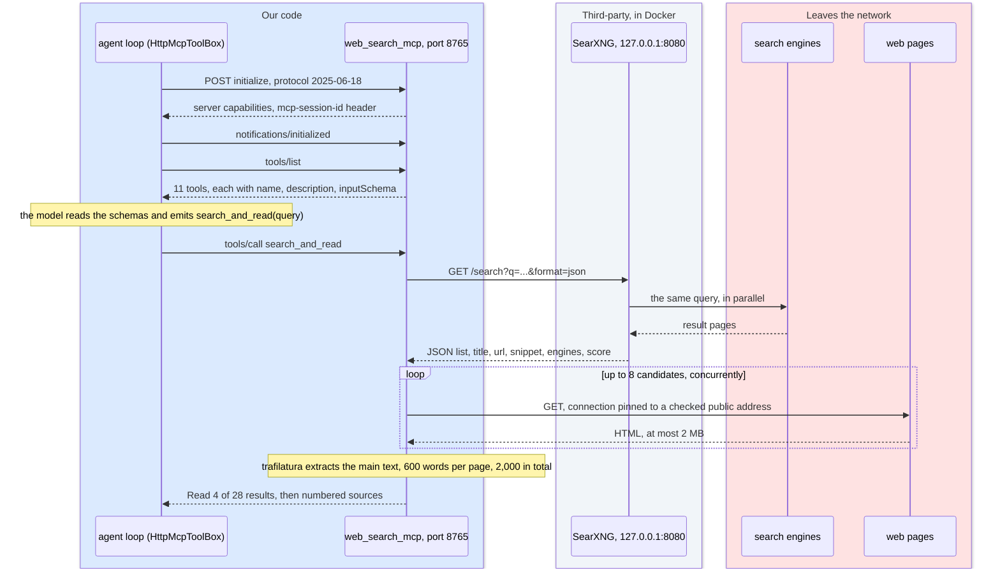

# 3. Web search as a tool, SearXNG and the MCP server
<!-- complexity: packages=3 parts=3 concepts=3 tier=deep -->

When you ask something the language model cannot know from training, such as today's interest rate or the price of a device, this part finds the answer on the web. The model asks for a search. Our tool server sends the query to SearXNG, a search aggregator running in Docker on the Mac, fetches the top pages, pulls out the readable text, and hands the model a numbered block of excerpts to answer from. The same server also does arithmetic exactly, so the model describes a calculation and never carries the digits itself.

## Where this fits

```mermaid
flowchart TB
--8<-- "_includes/system_map.mmd"
class mcp,searxng,engines current
style docker stroke:#f59e0b,stroke-width:4px
```

Read the map top to bottom: your devices, then Home Assistant, then the Mac's native services with the speaker beside them, then Docker Desktop, then the traffic that leaves the apartment. Tool calls enter `web_search_mcp`, in the row of native macOS services kept alive by launchd, over MCP from the conversation agent in the Home Assistant row above it and, during a benchmark, from the laptop. The server sends each search query down to SearXNG, a container in the Docker Desktop row that listens only on the Mac itself. SearXNG forwards the query to the public search engines in the bottom row, which is the first traffic that leaves the network. The server then fetches the pages the engines named, which is the second. What comes back up to the agent is plain text: numbered sources with a title, a URL, and the main text of each page, or the exact result of a calculation with a sentence the model can read aloud.

## Key definitions

- **MCP (Model Context Protocol).** A standard for exposing tools to a language model application over a network. A server declares tools with a name, a description, and a JSON schema; a client lists them, shows them to the model, and calls them when the model asks.
- **Tool schema.** The JSON description of a tool's parameters. The model reads the description to decide when to call the tool and the schema to produce valid arguments.
- **JSON-RPC.** A convention for calling named methods over any transport: the caller sends a JSON object with a method, its params, and an id, and the reply carries the same id. MCP messages are JSON-RPC 2.0.
- **Streamable HTTP.** MCP's current remote transport. Every message is a POST to one endpoint, and the server answers either with a JSON body or with a server-sent-events stream, which is a text response that arrives as a series of `data:` lines.
- **Metasearch.** A search engine that queries other search engines and merges their results rather than crawling the web itself. SearXNG is one.
- **Grounding.** Giving the model retrieved text to base its answer on, so it summarises evidence instead of recalling from training.
- **Main-content extraction.** Turning a web page into the text a person came for, stripping navigation, ads, scripts, and legal text.
- **Docker Desktop on macOS.** Runs Linux containers inside a hidden Linux VM. Containers there cannot see the GPU and cannot receive the network's discovery packets.
- **Prompt injection.** Text inside a tool result, here a web page, that is written like an instruction. The model cannot tell it apart from the user's words and may follow it, so the code bounds what an obeyed instruction can reach.
- **URL guard.** The rule that the tool server connects only to public web addresses: an allowed scheme, no local names, every resolved address globally routable, and every redirect hop checked again.
- **Globally routable address.** An IP address that belongs on the public internet. Loopback, private-range, link-local, and multicast addresses are not, and the guard refuses all of them.
- **DNS rebinding.** A hostile name server answers a safety check with a public address and the connection a moment later with a private one. The guard defeats it by connecting to the address it checked rather than resolving the name twice.

## Packages and tools

| Tool | What it is | How this part uses it |
|---|---|---|
| SearXNG (`searxng/searxng:latest`) | An open-source metasearch engine, run here as one Docker container named `studio-searxng` | Fans each query out to seven engines, merges and ranks the results, and returns them as JSON on `127.0.0.1:8080`. No account and no API key |
| Docker Desktop 4.89.0 | Runs Linux containers on macOS inside a hidden Linux VM | Hosts the SearXNG container. `docker/searxng/docker-compose.yml` binds the port to the Mac only and mounts `settings.yml` read-only |
| `mcp` 2.1.1 | The official Python MCP SDK | `MCPServer` turns each decorated Python function into a tool with a generated schema and serves them over streamable HTTP at `/mcp` on port 8765. `uvicorn` 0.52.4 and `starlette` 1.6.0 are the HTTP layer underneath, and the same `starlette` request objects serve the two plain routes `/healthz` and `/turns` |
| `httpx` 0.28.1 | An async HTTP client | Makes the SearXNG request, fetches pages with a 6 s timeout, and, on the agent side, is the only dependency of the MCP client in `assistant_core/mcp_http.py` |
| `trafilatura` 2.2.0 | A main-content extraction library | Turns each fetched HTML page into article text, keeping tables and dropping comments |
| `pydantic` 2.13.5 | Typed data models | `SearchResult`, `PageExcerpt`, and `SearchSettings` give every tool result and every setting a fixed shape |
| `diskcache` 5.6.3 | An on-disk key-value cache | Stores search results by query and page text by URL when a cache directory is set. On during a benchmark so every candidate model sees the same pages, off in the product |
| `curl` and a browser | Standard HTTP clients | Prove the server and the container are up, and let you use SearXNG at http://127.0.0.1:8080 like any search page |

## How it works

### One tool call, end to end



The server is one process called `assistant-tools`, built by `build_server` in `web_search_mcp/server.py`. It publishes eleven tools: `search_and_read`, `web_search`, and `fetch_page` for the web, and eight calculator tools registered by `calculator_mcp/register.py`. Each tool is a Python function with a docstring. The `mcp` package reads the function signature to produce the JSON schema and the docstring to produce the description, so the docstring is the text the model reads when it decides whether to call the tool. `search_and_read` is the tool the system prompt steers small models to, and it is the one the sequence above traces.

*From `web_search_mcp/server.py`, `search_and_read`:*

```python
    @server.tool()
    async def search_and_read(query: str) -> str:
        """Search the web and read the top pages. Returns numbered sources with title, URL, and the main text of each page, ready to synthesize an answer from. Use short keyword queries, e.g. "federal funds rate september 2026"."""
        results = await searxng.search(query)
        excerpts = await extractor.read_pages(results)
        return render_grounded_context(query, results, excerpts)
```

On the client side, the agent speaks the protocol with `HttpMcpToolBox` in `assistant_core/mcp_http.py`. It is a JSON-RPC client over `httpx` and nothing more, because Home Assistant pins its own older `mcp` release and the component cannot rely on that package's API. The client sends `initialize`, then the `notifications/initialized` notice, then `tools/list` once and caches the answer, then `tools/call` for each request. The server may answer any POST as plain JSON or as a server-sent-events stream, and `parse_messages` reads both. A session id arrives in the `mcp-session-id` response header and goes back on every later request. The benchmark on the laptop uses the official `mcp` client instead; both talk to the same server, which is the point of using a protocol rather than a private function.

The text the model gets back is built by `render_grounded_context`. It opens with `Read 4 of 28 results for "..."` so the model can say when evidence is thin, then lists each source as `[1] title`, `URL: ...`, and the text. When SearXNG returns nothing, the tool result tells the model to say it could not find anything and to answer from its own knowledge with that caveat. When results exist but no page could be read, it falls back to the first five snippets. `web_search` returns only the ranked list of the first 8 results, and `fetch_page` returns one page's text up to 1,200 words; a capable model can chain the two.

### SearXNG in Docker

```mermaid
flowchart TB
--8<-- "_includes/palette.mmd"
subgraph native["web_search_mcp, a native macOS process on the Mac"]
  client("SearxngClient<br/>at least 3 s between live requests")
end
subgraph disk["Files on the Mac's disk"]
  cache[("diskcache, search results by query<br/>on only when WEB_SEARCH_CACHE_DIR is set")]
  settings[("docker/searxng/settings.yml<br/>the seven engines, json output, timeouts")]
end
subgraph docker["Docker Desktop on the Mac"]
  searxng("SearXNG, container studio-searxng<br/>127.0.0.1:8080")
end
subgraph internet["Leaves the network"]
  engines("google, bing, brave, duckduckgo,<br/>startpage, yahoo, wikipedia")
end
client <-- "query, stored results" --> cache
client <-- "GET /search?q=...&format=json&language=en<br/>JSON: title, url, snippet, engines, score" --> searxng
settings -. "mounted read-only" .-> searxng
searxng <-- "the same query in parallel, result pages" --> engines
class client,cache ours
class searxng,settings third
class engines ext
```

SearXNG is the search engine the model never sees. It runs as one container defined in `docker/searxng/docker-compose.yml`: image `searxng/searxng:latest`, container name `studio-searxng`, restarted unless you stop it, port 8080 bound to `127.0.0.1` so nothing else on the Wi-Fi can reach it, every Linux capability dropped except the three it needs to change file ownership at start. The only file we control is `docker/searxng/settings.yml`, mounted read-only into the container. It keeps seven engines (`google`, `bing`, `brave`, `duckduckgo`, `startpage`, `yahoo`, `wikipedia`), enables the `json` output format next to `html`, sets the language to English and safe search off, turns SearXNG's own rate limiter off because the instance is not public, and gives each engine 6 s to answer with a hard stop at 10 s. The container needs a secret key; `scripts/searxng.sh up` generates one into `docker/searxng/.env`, which git ignores.

`SearxngClient` in `web_search_mcp/searxng_client.py` makes one GET per query with `format=json`, `language=en`, and `safesearch=0`, and turns each item of the JSON answer into a `SearchResult` with title, URL, snippet, the engines that returned it, and a score. Results that several engines agree on rank higher. Two things sit around that request. In front is the query cache: with a cache directory set, a repeated query returns the stored list without touching SearXNG. Behind is a minimum gap of 3 s between live requests, held under a lock so concurrent callers queue. The gap exists because the four large engines rate-limit or CAPTCHA a single home address that queries in bursts, and the three smaller engines keep search alive when they do. A spoken question rarely makes two live searches, so the assistant does not feel the gap; a benchmark firing dozens of questions does.

### Reading the pages

```mermaid
flowchart TB
--8<-- "_includes/palette.mmd"
results("ranked results from SearXNG") --> fetchable{"http or https, not a binary extension,<br/>not a blocked domain?"}
fetchable -- "no" --> dropped("skipped")
fetchable -- "yes, the first 8" --> download("download concurrently<br/>6 s timeout, 2 MB cap")
download --> extract("trafilatura.extract<br/>tables kept, comments dropped")
extract --> clip("first 600 words of each page")
clip --> keep("first 4 pages that had text")
keep --> budget("2,000 words in total")
budget --> block("numbered sources block")
class results third
class fetchable,dropped,download,extract,clip,keep,budget,block ours
```

Snippets are ten to thirty words chosen for a person skimming a results page. The model needs paragraphs, so `PageExtractor` in `web_search_mcp/page_extractor.py` reads the pages. `read_pages` first drops any result that is not `http` or `https`, ends in a binary extension such as `.pdf` or `.jpg`, or sits on a blocked domain. The blocked list in `web_search_mcp/settings.py` holds social networks and hard paywalls: Facebook, Instagram, X and Twitter, TikTok, Pinterest, LinkedIn, the Wall Street Journal, the Financial Times, Bloomberg, and the New York Times. It then takes the first eight survivors, twice the number of pages it wants, and fetches them at the same time with `asyncio.gather`, so one slow site costs at most the 6 s timeout rather than 6 s per page. Result order is kept, so the engines' ranking survives extraction.

Each downloaded page goes through `trafilatura.extract` with comments dropped, tables kept, and precision favoured over recall. Tables are kept because rate and price pages carry their numbers in tables. A page that yields nothing, times out, is not HTML, or is refused by the URL guard becomes an empty string and is skipped. The first 600 words of each page become a `PageExcerpt`, the first four excerpts with text are kept, and `apply_total_budget` trims the last of them so the whole block stays under 2,000 words. That cap is what keeps the prompt from ballooning, since the model must read the block before it writes a word and reading time on the Mac grows with prompt length. With a cache directory set, extracted text is stored by URL, so a repeated fetch never opens a socket.

### The URL guard

```mermaid
flowchart TB
--8<-- "_includes/palette.mmd"
url("URL from the model<br/>or from a search result") --> scheme{"scheme http or https?"}
scheme -- "no" --> refuse("UnsafeUrl: refused")
scheme -- "yes" --> name{"host is localhost or ends in<br/>.local .internal .lan .home .arpa?"}
name -- "yes" --> refuse
name -- "no" --> resolve("resolve the name once")
resolve --> public{"every address<br/>globally routable?"}
public -- "no" --> refuse
public -- "yes" --> connect("connect to the first approved address<br/>real name in the Host header and in TLS")
connect --> peer{"socket peer address public?"}
peer -- "no" --> refuse
peer -- "yes" --> redirect{"3xx redirect?"}
redirect -- "yes" --> hop("next hop, at most 5<br/>Location resolved against<br/>the current URL, checked again")
redirect -- "no" --> html{"content-type says html?"}
html -- "no" --> empty("nothing extracted")
html -- "yes" --> body("stream the body,<br/>stop past 2 MB")
class url third
class scheme,refuse,name,resolve,public,connect,peer,redirect,hop,html,empty,body ours
```

The model picks the URLs that `fetch_page` reads, and a web page can tell the model which URL to pick. That is prompt injection. It cannot be prevented at the model, so the code bounds what an obeyed instruction can reach: without a guard, an injected line could point the tool server at the router, the Home Assistant VM, Ollama's API on port 11434, or a cloud metadata address. `ensure_public_url` in `web_search_mcp/url_guard.py` runs before every connection. The scheme must be `http` or `https`. The host must not be `localhost`, `localhost.localdomain`, or `metadata.google.internal`, and must not end in `.local`, `.internal`, `.localhost`, `.lan`, `.home`, or `.arpa`. The name is resolved, and every address it resolves to must be globally routable, which `is_public_address` decides with Python's `ipaddress` module after unwrapping IPv4-mapped IPv6 addresses and refusing multicast. A name with one private address among several is refused whole.

Resolving the name once is not enough on its own, because a hostile name server can answer the check with a public address and the connection a moment later with a private one. So `ensure_public_url` returns the addresses it approved, and `_download` connects to the first of them. `pin_url_to_address` swaps the URL's host for that address, the real name travels in the `Host` header through `host_header`, and for `https` it also travels in the TLS handshake as `sni_hostname`, so certificate verification still checks the real name. Once the connection is up, `refuse_unless_public_peer` reads the peer address from the socket and refuses if it is not public, which also catches a transport that resolved on its own. Redirects are not followed automatically: each `Location` is resolved against the current URL and sent back through the whole check, at most five hops. The body is streamed and abandoned past 2,000,000 bytes, or sooner if the declared `Content-Length` is larger, so a hostile page cannot flood the model.

*From `web_search_mcp/page_extractor.py`, `_download`:*

```python
        async with httpx.AsyncClient(timeout=self._settings.fetch_timeout_seconds, follow_redirects=False, headers=headers, transport=self._transport) as client:
            for _ in range(self._settings.max_redirects + 1):
                addresses = await ensure_public_url(url, self._resolver)
                hostname = urlparse(url).hostname or ""
                extensions = {"sni_hostname": hostname} if urlparse(url).scheme == "https" else {}
                async with client.stream("GET", pin_url_to_address(url, addresses[0]), headers={"Host": host_header(url)}, extensions=extensions) as response:
                    refuse_unless_public_peer(response)
                    if response.is_redirect:
                        url = urljoin(url, response.headers.get("location", ""))
                        continue
                    response.raise_for_status()
                    if "html" not in response.headers.get("content-type", ""):
                        raise ValueError("not an HTML page")
                    return await self._read_capped(response)
        raise ValueError("too many redirects")
```

A refused address raises `UnsafeUrl`. `fetch_page` turns it into the sentence `Refused to fetch ...: ... Only public web addresses can be read.` so the model can tell you instead of retrying, and `search_and_read` silently skips that result and reads the next. The resolver and the HTTP transport are constructor arguments of `PageExtractor`, which is how `tests/test_url_guard.py` pretends a public-looking name resolves to the router and serves redirects without opening a socket. The broader rule stands: nothing derived from a web page is an instruction, and no tool that acts on the home is given to the model without an intent or confirmation layer in front of it, as [section 4](04_conversation_agent.md) explains.

### The calculator tools

```mermaid
flowchart TB
--8<-- "_includes/palette.mmd"
expr("expression<br/>e.g. $3,500 * 1.05 * 12") --> norm("normalize<br/>commas and $ dropped<br/>15% to (15/100), ^ to **")
norm --> parse("ast.parse in eval mode")
parse --> walk{"only numbers, + - * / // % **,<br/>pi, e, and the listed functions?"}
walk -- "no" --> err("Calculator error: ...<br/>returned as text so the model can fix its call")
walk -- "yes" --> guard{"exponent at most 1000,<br/>no division by zero,<br/>result under 1e30?"}
guard -- "no" --> err
guard -- "yes" --> result("result: 44,100<br/>spoken: 3500 * 1.05 * 12 equals 44,100")
class expr third
class norm,parse,walk,err,guard,result ours
```

A language model predicts the next token and does not carry, so every local model sets up a rent calculation correctly and then gets the digits wrong. The eight calculator tools in `calculator_mcp/` turn the arithmetic into a lookup the model only has to describe. `calculate(expression)` evaluates a whitelisted Python syntax tree: numbers, the operators `+ - * / // % **`, parentheses, the names `pi` and `e`, and the functions `round`, `sqrt`, `abs`, `min`, `max`, `log`, `log10`, `exp`, `floor`, and `ceil`. Before parsing, `normalize_expression` strips thousands separators and `$`, turns `×`, `÷`, and `^` into Python operators, and rewrites a percent literal such as `15%` as `(15/100)`. Anything else, including attribute access, other names, keyword arguments, an exponent above 1,000, division by zero, or a result beyond 1e30, raises `CalculatorError` with a message that says what is allowed. It is never `eval`.

The other seven tools are shaped for spoken questions: `percent(kind, a, b)` for "what is 18 percent of 245" and its cousins, `convert(value, from_unit, to_unit)` over a fixed unit table with temperature handled as an affine conversion, `growth_schedule` for compounding laid out period by period, `energy_cost` from watts, hours a day, and a price per kilowatt hour, `loan_payment`, `break_even`, and `date_math`. Every function returns a `Result` whose `render` prints the exact number first as `result: ...`, then a sentence as `spoken: ...`, then any details such as a schedule. Rounding happens only inside the sentence. There is no currency conversion, because that needs live rates and belongs to search, and no statistics, because there is no data source.

*From `calculator_mcp/register.py`, `rendered`:*

```python
def rendered(function: Callable[..., Result], *args: object, **kwargs: object) -> str:
    try:
        result: Result = function(*args, **kwargs)
    except CalculatorError as error:
        return f"Calculator error: {error}"
    except (TypeError, ValueError, OverflowError) as error:
        return f"Calculator error: {error}"
    return result.render()
```

Errors come back as tool text starting with `Calculator error:` rather than as a protocol failure, so the model can correct its arguments and call again instead of the agent loop stopping. There is no router deciding when a calculator is used. The server publishes each tool's name, description, and argument schema, the agent copies that list into every chat request, and the model reads it like any other text. The description is therefore the routing rule, which is why `calculate`'s says "for any calculation with more than one step and always for money", and the system prompt in [section 4](04_conversation_agent.md) repeats that rule in its own words.

### The two plain routes and the Host check

No diagram is needed here: these are two ordinary HTTP endpoints beside `/mcp`, each answered in a few lines of `register_operations_routes`. `GET /healthz` lists the tool names the server is serving and reports `ok`, or `degraded` with the missing names, against the six tools a live server must expose (`search_and_read`, `web_search`, `fetch_page`, `calculate`, `percent`, `convert`). That is how the health check in [section 10](10_operations.md) proves the process on port 8765 is ours. `POST /turns` accepts one `TurnRecord` from the conversation agent and appends it to a JSON Lines file named for the day under `WEB_SEARCH_TURNS_DIR`, which `TurnLog` prunes after 90 days; without that setting the route answers 503, and a body that is not a `TurnRecord` gets 400.

When the server is bound to the LAN so the VM can reach it, which is how `scripts/services.sh install` runs it (`WEB_SEARCH_HOST=0.0.0.0`), it serves only requests whose `Host` header names this machine and none that carry a browser `Origin`. The allowed list is `WEB_SEARCH_ALLOWED_HOSTS`, written by `services.sh` as the Mac's LAN address, `localhost`, and `127.0.0.1`, each with port 8765. `transport_security_for` hands that list to the `mcp` library for the `/mcp` endpoint, and `host_allowed` applies the same rule to `/healthz` and `/turns`; anything else gets 421. A web page open in a browser on the same Wi-Fi therefore cannot use DNS rebinding to reach the tool server. With no list, which is how the benchmark and the tests run it on localhost, the library's own default applies.

## Run it yourself

Everything here runs on the Mac, from the repository folder. Start with SearXNG, since the search tools are empty without it:

```bash
scripts/searxng.sh status
```

You see a `docker compose ps` table with `studio-searxng` in state `running` and the line `SearXNG JSON API: ok`. If the container is not running, `scripts/searxng.sh up` writes the secret into `docker/searxng/.env` the first time and starts it; give it a few seconds and run `status` again. Open http://127.0.0.1:8080 in a browser and you can use it like a search page, which is the quickest way to see what the model sees. `scripts/searxng.sh logs` tails the container's log; press Ctrl-C to stop tailing. `scripts/searxng.sh down` stops the container.

Next confirm the tool server is alive:

```bash
curl -s -o /dev/null -w "MCP server: %{http_code}\n" http://127.0.0.1:8765/mcp
curl -s http://127.0.0.1:8765/healthz
```

The first line prints `MCP server: 400`, and 400 is the healthy answer: the endpoint is up but wants an MCP client, not a browser. The second prints JSON with `"status": "ok"` and the eleven tool names. On the always-on Mac the server runs under launchd, and `scripts/services.sh status` shows port 8765 next to the other services, `scripts/services.sh logs mcp` tails `~/Library/Logs/studio-assistant/mcp.log` until you press Ctrl-C, and `scripts/services.sh restart mcp` restarts it. On a laptop without those agents, `uv run web-search-mcp` starts the same server in the foreground on `127.0.0.1:8765`; Ctrl-C stops it. Set `WEB_SEARCH_CACHE_DIR` to a folder before starting it if you want repeated queries served from disk.

Now call tools by hand with the same client the Home Assistant component uses:

```bash
uv run python - <<'EOF'
import asyncio
from assistant_core.mcp_http import HttpMcpToolBox
from assistant_core.models import ToolCall

async def main():
    async with HttpMcpToolBox("http://127.0.0.1:8765/mcp") as tools:
        for spec in await tools.list_tools():
            print(f"{spec.name:18} {spec.description[:80]}")
        print()
        print(await tools.call(ToolCall(id="1", name="percent", arguments={"kind": "of", "a": 18, "b": 245})))
        print()
        print((await tools.call(ToolCall(id="2", name="search_and_read", arguments={"query": "Home Assistant Voice Preview Edition price"})))[:1500])

asyncio.run(main())
EOF
```

You see eleven tools with the first line of each description, then `result: 44.10` with a `spoken:` line the model can read aloud, then `Read 4 of ...` followed by numbered excerpts with URLs. Those excerpts are exactly what the model reads before it answers a searched question. The search takes several seconds on a live query and returns at once on a cached repeat. The script exits on its own.

Finally, test the URL guard. Change the last call in the snippet to `fetch_page` with `{"url": "http://192.168.1.156/"}`, or any address on your own network, and run it again. The tool answers `Refused to fetch http://192.168.1.156/: '192.168.1.156' resolves to non-public address 192.168.1.156. Only public web addresses can be read.` and nothing on the network is touched. `uv run pytest tests/test_url_guard.py` runs the same rules against fake resolvers and redirects without opening a socket.

## Where to look in the code

| Path | What you find there |
|---|---|
| `web_search_mcp/server.py` | `build_server`: the three search tools, the calculator registration, `/healthz` and `/turns`, the Host allow-list, and `main` |
| `web_search_mcp/searxng_client.py` | `SearxngClient`: the SearXNG request, the query cache in front, the 3 s gap behind |
| `web_search_mcp/page_extractor.py` | `PageExtractor`: filtering, concurrent download, redirect handling, the byte cap, `trafilatura` extraction, and the word budgets |
| `web_search_mcp/url_guard.py` | `ensure_public_url`, `is_public_address`, `pin_url_to_address`, `host_header`: the public-address rule |
| `web_search_mcp/query_cache.py` | `QueryCache`: `diskcache` keyed by query and by URL, active only with a cache directory |
| `web_search_mcp/settings.py` | `SearchSettings`: every default and the `WEB_SEARCH_*` environment overrides |
| `web_search_mcp/turn_log.py` | `TurnLog`: one JSON Lines file per day under the turns directory, pruned after 90 days |
| `calculator_mcp/functions.py` | The eight calculator functions and `Result`, pure Python with no MCP dependency |
| `calculator_mcp/register.py` | `register_calculator_tools`: the tool docstrings the model reads, and `rendered` |
| `docker/searxng/docker-compose.yml`, `docker/searxng/settings.yml` | The container definition and the seven engines, output formats, and timeouts |
| `scripts/searxng.sh` | `up`, `down`, `restart`, `status`, `logs` for the container, and the secret in `docker/searxng/.env` |
| `assistant_core/mcp_http.py` | `HttpMcpToolBox`: the client side of the protocol, `initialize`, `tools/list`, `tools/call`, and the SSE parser |
| `tests/test_url_guard.py`, `tests/test_web_search_mcp.py`, `tests/test_calculator.py`, `tests/test_mcp_http.py` | The guard against private addresses, redirects, rebinding, and oversized pages; the tools listed and called in process; the arithmetic; the client against the real server |

## Further reading

- Design doc: https://github.com/seanlin2000/home_assistant/blob/main/design_docs/v1/03_web_search_mcp.md, with the as-built sections on the calculator tools, fetch safety, and engine rate limits
- SearXNG documentation, https://docs.searxng.org/, for every key `settings.yml` can hold and what each engine needs
- MCP Python SDK, https://github.com/modelcontextprotocol/python-sdk, for `MCPServer`, the `@server.tool()` decorator, and the transport settings the server passes on `run()`
- trafilatura, https://trafilatura.readthedocs.io/, for what `favor_precision` and `include_tables` change in extraction
- Home Assistant MCP integration, https://www.home-assistant.io/integrations/mcp/, and the discussion at https://github.com/orgs/home-assistant/discussions/1383 on its SSE-only client, which is why our agent is the MCP client rather than Home Assistant
