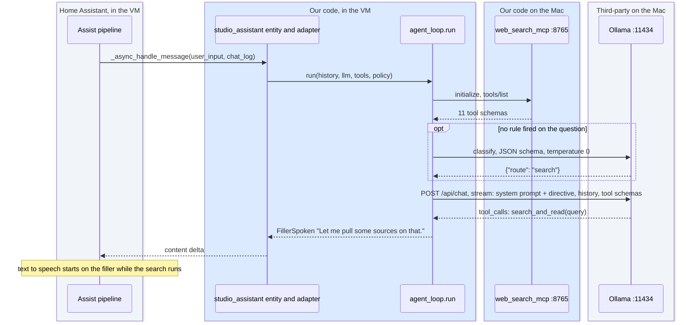
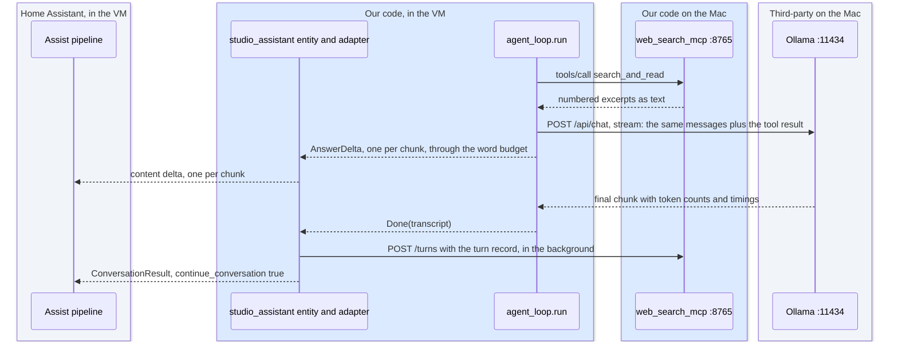

# 4. The conversation agent
<!-- complexity: packages=2 parts=3 concepts=3 tier=deep -->

This part is the code that answers you. Home Assistant hands it the words you said and the earlier turns of the conversation. It puts the persona and the house rules in front of the language model, decides before the model speaks whether the question needs the web or the calculator, runs the tools the model asks for, says a short filler sentence while they run, streams the answer to text to speech as it is written, stops speaking at the end of a sentence once the answer has gone on long enough, and asks Home Assistant to keep listening for a follow-up. The same loop runs inside the Home Assistant virtual machine as the `studio_assistant` component and on the laptop as the benchmark, so the code that was measured is the code you talk to.

## Where this fits

```mermaid
flowchart TB
--8<-- "_includes/system_map.mmd"
class agent,ollama,mcp current
```

Read the map top to bottom: your devices, then Home Assistant, then the Mac's services with the speaker beside them, then Docker, then what leaves the apartment. The agent is the highlighted stage in the Home Assistant row, where the four stages of the Assist pipeline sit side by side. Text enters it from the intent matcher, which passes on every sentence that matched none of its fixed patterns, together with the chat log of the conversation so far. The other two highlighted boxes are in the row below, the native services on the Mac: the agent sends the chat and the tool schemas down to Ollama and gets back a stream of tokens or a tool call, and tool calls go down over MCP to `web_search_mcp` and come back as text. What leaves the agent is one streamed spoken reply to the text-to-speech stage beside it, a flag that keeps the microphone open, and a record of the turn posted back to the tool server.

## Key definitions

- **Agent loop.** The pattern "call the model; if it asks for a tool, run the tool and call again; otherwise return the answer." Everything called an agent is this loop plus policy around it.
- **Tool calling.** Instead of answering, the model emits a structured request such as `web_search(query="current federal funds rate")`. Our code runs the tool, appends the result, and calls the model again.
- **Tool round.** One cycle of the agent loop in which the model asks for tools, the loop runs them, and the model is called again with the results. A turn allows at most four.
- **System prompt.** Instructions placed before the conversation that the model treats as standing orders: who it is, how long to answer, when to use tools.
- **Streaming.** Receiving the answer token by token as it is generated rather than waiting for the whole thing. For voice it means speech can start after the first sentence.
- **Filler sentence.** The short sentence the agent speaks the moment the model asks for its first tool, before the tool runs, so the listener hears something within a second or two. "Let me pull some sources on that." for a search, "Let me work that out." for arithmetic.
- **Word budget.** The soft cap on spoken words, 200 by default. Once the answer passes it, speech stops at the end of the current sentence and the transcript is marked truncated.
- **Question router.** The step before the first model call that decides whether a question needs the web, the calculator, or neither: fixed rules first, then one short structured-output call to the same model when no rule fires. The decision is appended to the system prompt as a directive.
- **Structured output.** Asking the model for a reply that must match a JSON schema. Ollama constrains generation so the reply is always valid JSON with one of the allowed values, which is how the router gets a one-word answer it can parse.
- **Temperature.** A sampling setting. Zero makes the model pick its most likely token every time; higher values add variety.
- **Custom component.** A Python package placed in Home Assistant's `custom_components/` folder and loaded at startup. It declares its dependencies in `manifest.json`.
- **Conversation entity.** The kind of Home Assistant entity a conversation agent is. The Assist pipeline calls it with the user's text and the chat log and expects a reply it can speak.
- **Chat log.** Home Assistant's record of one conversation's turns. It is handed to the conversation entity on every call and grows with the reply the entity streams into it, so the entity itself keeps no state.
- **Conversation id.** The identifier Home Assistant uses to group turns into one conversation. It hands the agent the history each call, so the agent stores nothing between calls.
- **Continue conversation.** A flag on the reply that tells Home Assistant to keep the microphone open for a follow-up without waiting for the wake word again. The agent sets it on every answer.
- **Transcript.** The record the agent loop returns at the end of a turn: every message, every tool exchange with its timing, token counts, the route decision, and the failure flags. The benchmark judges it; the component logs it and posts a trimmed copy as a turn record.
- **Turn record.** The trimmed copy of a transcript the component posts to the tool server's `/turns` route after each answer: the question, the answer, the route, the tool calls with their timings, and the failure flags, without the page text.
- **Deterministic versus model-driven behaviour.** Anything the product must do every time, such as the filler sentence, lives in code. Anything that needs judgement, such as whether to search, is left to the model with guidance in the prompt.

## Packages and tools

| Tool | What it is | How this part uses it |
|---|---|---|
| `ollama` 0.6.2 | The typed Python client for the Ollama HTTP API | `OllamaClient` in `assistant_core/llm_client.py` streams every chat request with the tool schemas attached and turns each chunk into a text delta or a tool call. Its `classify` method sends the router's question with a JSON schema in the `format` field. The component's `manifest.json` pins the same version so Home Assistant installs it inside the VM |
| `pydantic` 2.13.5 | Typed data models | The whole vocabulary of the loop is pydantic models in `assistant_core/models.py`: `Message`, `ToolCall`, `ToolSpec`, `AgentPolicy`, the events the model client emits, the events the loop emits, `RouteDecision`, and `Transcript`. `TurnRecord` in `turn_record.py` is one too, which is how it serialises to JSON for posting |
| `httpx` 0.28.1 | An async HTTP client | The only dependency of `HttpMcpToolBox`, the MCP client the component uses to list and call tools, and the client that posts turn records. Inside Home Assistant the component borrows Home Assistant's shared `httpx` client rather than opening its own |
| Home Assistant core 2026.9.1, `conversation` platform | The part of Home Assistant that defines what a conversation agent is | `StudioAssistantEntity` subclasses `ConversationEntity`, reads the `ChatLog`, streams the reply back with `async_add_delta_content_stream`, and returns a `ConversationResult` with `continue_conversation` set. The config flow and options form are built on Home Assistant's `ConfigFlow`, `OptionsFlow`, and `voluptuous` schemas |

The benchmark on the laptop adds two packages the component never loads: the official `mcp` 2.1.1 client behind `McpToolBox`, and the `anthropic` SDK behind `AnthropicClient` in `anthropic_client.py`, which runs the same loop against a frontier model as the benchmark's baseline (section [1](01_llm_benchmark.md)).

## How it works

### Two layers, one loop

```mermaid
flowchart TB
--8<-- "_includes/palette.mmd"
subgraph drivers["Who drives the loop: the benchmark on the laptop, the entity in custom_components/studio_assistant"]
  laptop("Laptop<br/>benchmark harness")
  entity("conversation.py<br/>StudioAssistantEntity")
end
subgraph component["The rest of custom_components/studio_assistant: runs only inside Home Assistant"]
  adapter("adapter.py<br/>chat log to Messages<br/>events to deltas")
  flow("config_flow.py, const.py<br/>addresses, model, policy")
end
subgraph core["assistant_core, the loop: plain Python, no Home Assistant import"]
  loop("agent_loop.py<br/>run")
  record("turn_record.py<br/>TurnRecord")
end
subgraph helpers["assistant_core, what the loop calls"]
  router("router.py<br/>decide_route, apply_route")
  prompts("prompts.py<br/>system prompt 1.5")
  memory("memory.py<br/>NoMemory")
  llm("llm_client.py<br/>OllamaClient")
  http("mcp_http.py<br/>HttpMcpToolBox")
end
subgraph mac["Services on the Mac"]
  ollama("Ollama :11434")
  mcp("web_search_mcp :8765")
end
laptop --> loop
entity -- "chat log in, deltas out" --> adapter
entity -- "reads settings" --> flow
entity --> loop
adapter -- "posts after each answer" --> record
loop --> router
loop --> prompts
loop --> memory
loop --> llm
loop --> http
llm -- "chat + tool schemas" --> ollama
http -- "tool calls over MCP" --> mcp
class entity,adapter,flow,loop,record,router,prompts,memory,llm,http,mcp ours
class ollama third
class laptop hw
```

The agent is two Python packages with one rule between them: nothing in `assistant_core` imports Home Assistant, and nothing outside `custom_components/studio_assistant` imports the component. `assistant_core` holds the loop, the router, the system prompt, the model client, the MCP client, the memory seam, and the turn record. The benchmark imports it directly on the laptop. The component imports it too, and adds only what Home Assistant needs to see an agent: an entity, a translation between Home Assistant's chat log and the loop's messages, and a settings form.

Home Assistant runs its own Python inside the virtual machine, and `assistant_core` is not a published package, so the deploy script copies it under `custom_components/studio_assistant/vendor/` next to the component, leaving out `anthropic_client.py`. The component's `__init__.py` adds that folder to the import path when it exists. Two consequences follow. `tools.py` imports the official `mcp` package only inside `McpToolBox`, because Home Assistant ships an older `mcp` release with a different client class, and the component talks to the tool server through `HttpMcpToolBox` instead. And `manifest.json` lists `ollama==0.6.2` and `pydantic>=2.0` as requirements, which Home Assistant installs into its own environment at startup. Section [6](06_home_assistant_core.md) covers the deploy itself.

The component registers one entity per config entry, `conversation.studio_assistant`, declares `en` as its language, and declares that it supports streaming. Everything it does happens in one method.

*From `custom_components/studio_assistant/conversation.py`, `StudioAssistantEntity._async_handle_message`:*

```python
    async def _async_handle_message(self, user_input: conversation.ConversationInput, chat_log: conversation.ChatLog) -> conversation.ConversationResult:
        settings = {**self.entry.data, **self.entry.options}
        history = adapter.chat_log_to_conversation(chat_log.content)
        llm = await self.hass.async_add_executor_job(OllamaClient, settings[CONF_MODEL], settings[CONF_OLLAMA_URL], "30m")
        policy = adapter.policy_from_settings(settings)
        try:
            async with HttpMcpToolBox(settings[CONF_MCP_URL], client=get_async_client(self.hass), timeout_seconds=policy.tool_timeout_seconds) as tools:
                events = agent_loop.run(history, llm, tools, policy)
                async for _content in chat_log.async_add_delta_content_stream(self.entity_id, adapter.agent_events_to_deltas(events, on_done=self._record_turn)):
                    pass
        except Exception as error:  # the tool server being down must not silence the assistant
            _LOGGER.warning("studio_assistant: search tool unavailable (%s); answering without it", error)
            events = agent_loop.run(history, llm, UnavailableToolBox(), policy)
            ...
        result = conversation.async_get_result_from_chat_log(user_input, chat_log)
        if settings.get(CONF_CONTINUE_CONVERSATION, DEFAULT_CONTINUE_CONVERSATION):
            return conversation.ConversationResult(response=result.response, conversation_id=result.conversation_id, continue_conversation=True)
        return result
```

Read it top to bottom. The settings are the config entry's data merged with its options. `chat_log_to_conversation` keeps only the user and assistant turns that have text, so Home Assistant's own system prompt and the tool results of earlier turns are not replayed. The Ollama client is created on a worker thread because building it opens an `httpx` client, which reads the certificate bundle from disk, and Home Assistant refuses blocking reads on its event loop; the `"30m"` asks Ollama to keep the model loaded for thirty minutes after each request. `policy_from_settings` copies the loop's defaults and overrides whichever fields the options form set. The tool box connects to the MCP server for this one turn, the loop runs, and `agent_events_to_deltas` turns its events into one streamed assistant message that Home Assistant writes into the chat log and, in a voice pipeline, hands to text to speech as it arrives. If the tool server cannot be reached at all, the entity logs a warning and runs the loop again with a tool box that lists no tools, so the model answers from what it knows. The result is read back out of the chat log and returned with `continue_conversation=True`.

The settings come from two forms. Adding the integration asks for the Ollama address, the model tag, and the tool server address, with defaults of `http://192.168.1.152:11434`, `gemma4:e4b-it-qat`, and `http://192.168.1.152:8765/mcp` from `const.py`; the form calls Ollama's `/api/tags` and refuses an address that does not answer or a model tag that is not listed. The options form, reached later from the integration's card, holds the model tag again plus the loop policy: temperature, word budget, tool rounds, context tokens, output tokens, the thinking switch, the tool timeout, and whether to continue the conversation. Saving the options reloads the entry, so a change takes effect on the next question. The model the running system has picked is on the [Versions of record](versions.md) page.

### One turn, from the chat log to the spoken reply



The second half of the same turn, from the search to the spoken answer:



The loop is an async generator: the caller iterates it and receives events, and the answer is being spoken while the generator is still running. The two diagrams together are the whole path for a question that needs a search. A question that needs nothing skips the two tool exchanges, and a question that needs arithmetic goes to the calculator instead of the search tool with the other filler sentence.

*From `assistant_core/agent_loop.py`, `run`:*

```python
async def run(conversation: list[Message], llm: LLMClient, tools: ToolBox, policy: AgentPolicy, memory: ConversationMemory | None = None) -> AsyncIterator[AgentEvent]:
    started = time.perf_counter()
    memory = memory or NoMemory()
    messages = build_messages(conversation, memory)
    transcript = Transcript(model=llm.model_name, system_prompt=system_prompt(), conversation=list(conversation))
    cap = SpokenAnswerCap(policy.word_budget)
    tool_specs = await load_tool_specs(tools, transcript)
    if policy.route_questions and tool_specs:
        transcript.route = await decide_route(llm, conversation, policy)
        messages = apply_route(messages, transcript.route)
    for round_index in range(policy.max_tool_rounds + 1):
        turn = ModelTurn()
        async for event in stream_model_turn(llm, messages, tool_specs, policy, turn, cap, transcript, started):
            yield event
        ...
        record_turn(transcript, turn, messages)
        if not turn.tool_calls:
            break
        ...
        async for event in execute_tool_calls(tools, turn.tool_calls, round_index, policy, messages, transcript):
            yield event
    finish_transcript(transcript, turn, cap, messages, started)
    memory.remember(transcript.conversation)
    yield Done(transcript=transcript)
```

`build_messages` puts the system prompt first and the conversation after it. The prompt is version 1.5 in `assistant_core/prompts.py`: the persona is Jarvis, a voice assistant in a small studio apartment; the second line is today's date, filled in on every request, so the model does not assume the year its training ended when it writes a search query; then the rules for answering (lead with the answer, one to three sentences, plain spoken prose, no lists or URLs, say when you are estimating, use earlier turns), the rules for when to search and when not to, and the rule to call the calculator for anything with more than one arithmetic step. `memory.get_context` is asked for what the assistant remembers about this user; `NoMemory` returns nothing, and the loop adds a "What you remember about this user" paragraph only when something comes back. Swapping in a real memory means replacing that class and nothing else.

The tool schemas are listed from the tool server once per turn. If that fails, the transcript records the error, the loop continues with no tools, and the router is skipped, because a directive to call a tool the model cannot see would only confuse it. Otherwise the router decides the route and appends its directive to the system prompt; the next part explains how.

Each pass through the `for` loop is one call to the model. `stream_model_turn` reads the client's events. A text delta goes through the word budget and, if anything survives, is yielded as an `AnswerDelta`. The first tool call of the turn yields a `FillerSpoken` event before the call is even collected, and the loop remembers that it has spoken so a second round of tools gets no second filler. The filler is picked at random from two short lists in `AgentPolicy`: three web lines when the tool is `search_and_read`, `web_search`, or `fetch_page`, and two arithmetic lines otherwise, because "checking the web" is wrong when the assistant is only doing sums on the Mac. Ollama reports the tool call and the loop passes it on within a second of the model starting to write, which is why the listener hears the filler long before the search finishes.

When the model has asked for tools, `execute_tool_calls` runs them in order, each under the policy's timeout, and appends every result to the messages as a tool message with the call's id and name. Then the loop goes round again and the model reads the excerpts. When the model answers with text and no tool call, the loop leaves the `for`. `finish_transcript` records the model's last message as `final_answer`, what the listener actually heard as `spoken_text`, and the total time. The `Done` event carries the transcript to the caller: the benchmark hands it to the judge, and the component logs a one-line summary at debug level, then posts a turn record to the tool server's `/turns` route in a background task with a three-second timeout. A failed post is logged at debug level and dropped, since a missing log line must never cost you an answer. Section [3](03_web_search_mcp.md) describes the route and section [10](10_operations.md) what is done with the records.

The loop makes a few promises whatever the model does, and each is a line of code rather than a sentence in the prompt.

| What happens | What the loop does | Where it shows in the transcript |
|---|---|---|
| The answer runs past the word budget | `SpokenAnswerCap.admit` counts the words in each delta; once past 200 it closes at the next sentence end. Later text is still collected as `final_answer` but not spoken | `truncated` is true, `spoken_text` is shorter than `final_answer` |
| The model keeps asking for tools | After four tool rounds every pending call gets the reply "Tool call limit reached. Answer the user now with what you already know" and the model is called once more with no tool results | `hit_tool_round_cap` is true |
| A tool call fails or times out | The result the model sees is "The web search tool is unavailable right now. Tell the user you could not check the web, then answer from your own knowledge with that caveat" | `tool_exchanges[n].error` names the exception |
| The tool server cannot list its tools | The loop runs with no tools and no router | `error` starts with "tool server unavailable" |
| The model returns neither words nor a tool call | The same messages are sent once more before the empty answer is accepted | `empty_completion_retries` is 1 and `model_calls` has one entry more than expected |
| Nothing at all was spoken | The adapter yields "Sorry, I could not come up with an answer to that." so the pipeline has something to say | `final_answer` is empty |

The empty-completion retry exists because Gemma 4 on Ollama sometimes writes a tool call with a small formatting slip that Ollama's parser drops silently, and the reply arrives with no content. Read aloud, that is silence. One retry is the limit: a model that returns nothing twice is not going to answer.

The component keeps nothing between calls. A follow-up arrives as a new `_async_handle_message` with the same conversation id and a chat log that already holds the earlier turns, and `chat_log_to_conversation` rebuilds the history from it every time. That is the same shape the benchmark's two-turn questions take, and `tests/test_agent_loop.py` checks that the second call sees system, user, assistant, user in that order.

### The question router

```mermaid
flowchart TB
--8<-- "_includes/palette.mmd"
question(["the user's latest message"]) --> explicit{"an explicit request to search?<br/>'search for', 'look up', 'find me the latest'"}
explicit -- "no" --> numbers{"two or more numbers and an arithmetic cue?<br/>'percent', 'per month', 'mortgage', 'times'"}
numbers -- "no" --> classify("one classify call to the same model<br/>JSON schema, temperature 0, 40 tokens<br/>with the two earlier user turns as context")
classify --> parsed{"the model's reply"}
explicit -- "yes" --> search("route: search<br/>SEARCH directive appended<br/>to the system prompt")
numbers -- "yes" --> calc("route: calculate<br/>CALCULATE directive appended<br/>to the system prompt")
parsed -- "search" --> search
parsed -- "calculate" --> calc
parsed -- "answer, or any error" --> answer("route: answer<br/>messages unchanged")
class question,explicit,numbers,parsed,search,calc,answer ours
class classify third
```

The tool descriptions and the system prompt are the only things a model reads before it decides whether to call a tool, and Ollama has no switch that forces a call. Small models answer "what is the current rate" from memory and set up arithmetic correctly and then miscompute it. So the loop decides for the model before the first real call and tells it, in the system prompt, which tool family this question needs. The decision is `RouteDecision` in `assistant_core/models.py`: a route of `search`, `calculate`, or `answer`, the layer that decided it (`rule`, `model`, or `none`), a detail string, and how long the decision took. It is stored on the transcript so the benchmark can score the router separately from the answer.

The rule layer runs first and costs nothing. It fires only on wording that cannot be read two ways.

*From `assistant_core/router.py`, `rule_route`:*

```python
def rule_route(text: str) -> RouteDecision | None:
    if EXPLICIT_SEARCH.search(text):
        return RouteDecision(route=Route.SEARCH, source="rule", detail="explicit request to search")
    numbers = NUMBER.findall(text)
    cue = ARITHMETIC_CUE.search(text)
    if len(numbers) >= MIN_NUMBERS_FOR_ARITHMETIC and cue:
        return RouteDecision(route=Route.CALCULATE, source="rule", detail=f"{len(numbers)} numbers and cue '{cue.group(0)}'")
    return None
```

`EXPLICIT_SEARCH` needs an imperative such as "search for", "look up", "google it", or "find me the latest"; the noun "web search" on its own does not match. The arithmetic rule needs at least two numbers, where a number may carry a dollar sign, commas, a decimal part, or a percent sign, and one cue from a list that includes a percent sign, "per month", "kilowatt", "interest", "mortgage", "tip", "convert", "degrees", "times", "plus", "divided", and "in total". `tests/test_router.py` runs every benchmark question through the rule layer and asserts that no rule fires on a question whose expected route is different.

When no rule fires, the model layer asks the same model one question. `model_route` sends `ROUTER_SYSTEM_PROMPT`, which defines the three routes with examples, plus up to two earlier user turns of the conversation for context, and the question itself. `OllamaClient.classify` makes a non-streaming request with the JSON schema `{"route": "search" | "calculate" | "answer"}` in Ollama's `format` field, temperature 0, at most 40 output tokens, thinking off, and the same 16,384-token context length as the chat calls, because Ollama reloads a model whose context length changes and the reload would cost about five seconds twice per question. The call takes about a second on the prototype. Any exception in this layer, from a refused connection to unparseable JSON, yields the `answer` route with the error in `detail`, so a broken router never blocks an answer.

`apply_route` then returns a copy of the messages. For `answer` the copy is the original. For `search` and `calculate` the system message gains one paragraph at the end. The search directive reads "Routing for this question: SEARCH. This question needs current information from the web. Call search_and_read first; do not answer it from memory. Answer from the excerpts it returns." followed by one example call, `search_and_read(query="used RTX 3090 price")`. The calculate directive names the eight calculator tools, says "do not do the math yourself", and shows `percent(kind="of", a=15, b=80)`. Each block is an instruction and an example call and nothing after it, because a finished answer in the example was imitated by the smaller models instead of the call. The user's message is left exactly as spoken, so the transcript shows the question the person asked and, in its recorded system prompt, the directive the harness added. The whole layer turns off with the `route_questions` field of `AgentPolicy`, which the benchmark uses to measure the router's effect.

## Run it yourself

Everything in the first block runs on the laptop with no services at all. The loop's tests replace the model with a scripted client and the tool server with a fake that answers every call with one numbered source, and they exercise the promises from the table above: the filler before the tool, the round cap, the failed tool, the dead tool server, the word budget, the two-turn history, the arithmetic filler, and the empty-completion retry. The router's tests run the rule layer over the whole benchmark question set and check the directive lands in the system prompt.

```bash
uv run pytest -q tests/test_agent_loop.py tests/test_router.py
```

You should see `17 passed` in well under a second. The tests exit on their own. Add `tests/test_prompts.py` and `tests/test_component_adapter.py` to the command to cover the date line and the chat log translation as well. To read the exact system prompt the model sees today, date line included, print it:

```bash
uv run python -c "from assistant_core.prompts import system_prompt; print(system_prompt())"
```

The rest needs the Home Assistant virtual machine and the Mac-side services. Start the VM as section [6](06_home_assistant_core.md#run-it-yourself) describes, load `.env` into the terminal, and check that no benchmark is running. Then open the Overview dashboard at http://192.168.1.156, choose **Assist** from the three-dot menu at the top right, and type these four questions in turn:

1. "Why does bread rise?" answers from the model in 2 to 5 seconds once the model is warm. The first question after a long idle can take 30 seconds or more while Ollama loads the model.
2. "What is 18 percent of 245 dollars?" shows "Let me work that out." first, then the answer. That first sentence is the filler, written while the calculator runs.
3. "Search the web for the current price of the Home Assistant Voice Preview Edition." shows the web filler, then an answer built from the search excerpts, in 10 to 25 seconds.
4. "And what did I ask you first?" is a follow-up. The chat log carries the earlier turns, so the answer names the bread question.

The microphone button in the browser only works over HTTPS, which the VM does not have, so typing is the way here; voice is section [5](05_voice_pipeline.md). The same call from a terminal is the request the pipeline makes internally, and it lets you time it:

```bash
ask() { curl -s -m 240 -X POST http://192.168.1.156/api/conversation/process \
  -H "Authorization: Bearer $HA_TOKEN" -H "Content-Type: application/json" \
  -d "{\"text\": \"$1\", \"language\": \"en\", \"agent_id\": \"conversation.studio_assistant\"${2:+, \"conversation_id\": \"$2\"}}" \
  | python3 -c 'import sys,json; d=json.load(sys.stdin); print(d["response"]["speech"]["plain"]["speech"]); print("conversation_id:", d["conversation_id"])'; }

time ask "If I put 300 dollars a month into an account paying 5 percent a year, how much do I have after 3 years?"
```

You see the spoken text, filler included, then a line `conversation_id: ...`, then the `time` output. Pass that id as a second argument to continue the same conversation, and the answer will use the figures from the first question:

```bash
ask "And after 5 years?" 01M1VPD9JAPX816PT6V0PHNNVZ
```

While a question runs, a second terminal shows the pieces working: `ollama ps` lists the model resident on the GPU, and `scripts/services.sh logs mcp` tails the tool server's log, where each `tools/call` appears with its query; press Ctrl-C to stop tailing. The most useful view is Home Assistant's own. Under Settings, Voice assistants, open Jarvis, then the three-dot menu, then Debug. The last run lists every stage with its timing and the exact text that passed between them, including the agent's reply with the filler at the front. Nothing about the agent needs stopping: it runs only while a question is in flight. When you are done, stop the VM with `scripts/haos_vm.sh stop` as section [6](06_home_assistant_core.md#run-it-yourself) describes.

## Where to look in the code

| Path | What you find there |
|---|---|
| [`assistant_core/agent_loop.py`](https://github.com/seanlin2000/home_assistant/blob/main/assistant_core/agent_loop.py) | `run`, the loop itself; `stream_model_turn`, where the filler is yielded; `SpokenAnswerCap`, the word budget; `execute_tool_calls`; the tool-limit and tool-unreachable notices; the empty-completion retry |
| [`assistant_core/router.py`](https://github.com/seanlin2000/home_assistant/blob/main/assistant_core/router.py) | The two regexes of the rule layer, `ROUTER_SYSTEM_PROMPT`, the two directives, `decide_route`, and `apply_route` |
| [`assistant_core/prompts.py`](https://github.com/seanlin2000/home_assistant/blob/main/assistant_core/prompts.py) | The system prompt, its version number, the persona name, and `system_prompt`, which inserts the date line |
| [`assistant_core/models.py`](https://github.com/seanlin2000/home_assistant/blob/main/assistant_core/models.py) | Every type the loop speaks: `Message`, `ToolCall`, `AgentPolicy` with its defaults, the filler phrase lists, the model-client and agent events, `RouteDecision`, and `Transcript` |
| [`assistant_core/llm_client.py`](https://github.com/seanlin2000/home_assistant/blob/main/assistant_core/llm_client.py) | The `LLMClient` protocol and `OllamaClient`: the streaming chat request, the `classify` call with a JSON schema, and the conversions to and from Ollama's message shapes |
| [`assistant_core/mcp_http.py`](https://github.com/seanlin2000/home_assistant/blob/main/assistant_core/mcp_http.py) | `HttpMcpToolBox`, the MCP client the component uses: initialize, `tools/list`, `tools/call`, and the parser for JSON or server-sent-events replies |
| [`assistant_core/tools.py`](https://github.com/seanlin2000/home_assistant/blob/main/assistant_core/tools.py) | The `ToolBox` protocol the loop depends on, and `McpToolBox`, the benchmark's client on the official `mcp` package |
| [`assistant_core/memory.py`](https://github.com/seanlin2000/home_assistant/blob/main/assistant_core/memory.py) | The `ConversationMemory` protocol and `NoMemory` |
| [`assistant_core/turn_record.py`](https://github.com/seanlin2000/home_assistant/blob/main/assistant_core/turn_record.py) | `TurnRecord`, `turn_record_from_transcript`, and the rule that maps the MCP address to the `/turns` address |
| [`assistant_core/anthropic_client.py`](https://github.com/seanlin2000/home_assistant/blob/main/assistant_core/anthropic_client.py) | The benchmark's frontier-model client behind the same interface, never deployed to the VM |
| [`custom_components/studio_assistant/conversation.py`](https://github.com/seanlin2000/home_assistant/blob/main/custom_components/studio_assistant/conversation.py) | `StudioAssistantEntity`, `_async_handle_message`, the turn-record background task, and `UnavailableToolBox` |
| [`custom_components/studio_assistant/adapter.py`](https://github.com/seanlin2000/home_assistant/blob/main/custom_components/studio_assistant/adapter.py) | `chat_log_to_conversation`, `agent_events_to_deltas`, `policy_from_settings`, and `post_turn_record`, all free of Home Assistant imports so the laptop can test them |
| [`custom_components/studio_assistant/config_flow.py`](https://github.com/seanlin2000/home_assistant/blob/main/custom_components/studio_assistant/config_flow.py) and [`const.py`](https://github.com/seanlin2000/home_assistant/blob/main/custom_components/studio_assistant/const.py) | The setup form with its Ollama check, the options form, and every default address and policy value |
| [`custom_components/studio_assistant/manifest.json`](https://github.com/seanlin2000/home_assistant/blob/main/custom_components/studio_assistant/manifest.json) | The component's domain, version, and the two packages Home Assistant installs for it |
| [`tests/test_agent_loop.py`](https://github.com/seanlin2000/home_assistant/blob/main/tests/test_agent_loop.py), [`tests/test_router.py`](https://github.com/seanlin2000/home_assistant/blob/main/tests/test_router.py), [`tests/test_component_adapter.py`](https://github.com/seanlin2000/home_assistant/blob/main/tests/test_component_adapter.py), [`tests/test_prompts.py`](https://github.com/seanlin2000/home_assistant/blob/main/tests/test_prompts.py) | The offline tests, with `tests/fakes.py` supplying the scripted model and the fake tool server |

## Further reading

- Design doc: [`design_docs/v1/04_conversation_agent.md`](https://github.com/seanlin2000/home_assistant/blob/main/design_docs/v1/04_conversation_agent.md), which also lists the failure modes and the benchmark evidence behind the router and each prompt version
- [Home Assistant conversation entity](https://developers.home-assistant.io/docs/core/entity/conversation), for the methods `StudioAssistantEntity` implements and what the pipeline expects back
- [Home Assistant chat log and LLM API](https://developers.home-assistant.io/docs/core/llm/), for the content types in a `ChatLog` and how streamed deltas become an assistant turn
- [Home Assistant Voice chapter 10](https://www.home-assistant.io/blog/2025/06/25/voice-chapter-10/), for what `continue_conversation` does on a voice device
- [Home Assistant text to speech](https://www.home-assistant.io/integrations/tts/), for which engines can start speaking on a stream, which is what makes the filler sentence worth having
- [Ollama API](https://github.com/ollama/ollama/blob/main/docs/api.md), for the chat request with `tools`, the `tool_calls` field in the reply, and the `format` argument the router relies on
