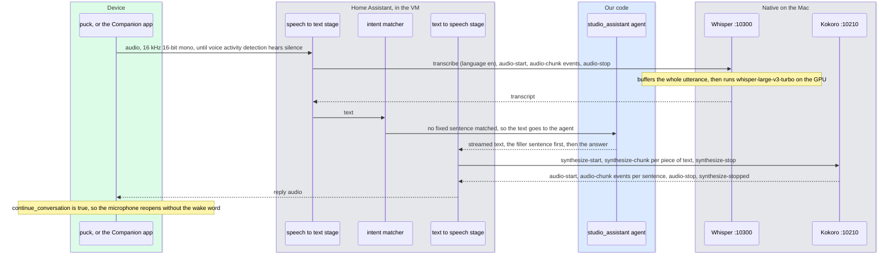

# 5. The voice pipeline
<!-- complexity: packages=3 parts=3 concepts=3 tier=deep -->

This part is everything between your voice and the agent's text, and back again. A microphone hears you, a speech-to-text model turns the sound into words, the words go through Home Assistant to the agent, and a text-to-speech model turns the answer into sound that plays back to you. The speech models run natively on the Mac, outside the Home Assistant virtual machine, and plug into Home Assistant's pipeline over a small network protocol called Wyoming. Today the microphone is the Home Assistant Companion app on a phone or the Assist window in a browser. The puck takes that role when it arrives.

## Where this fits

```mermaid
flowchart LR
--8<-- "_includes/system_map.mmd"
class puck,stt,tts,whisper,kokoro,piper current
```

Audio enters on the left, from the puck or, today, from the Companion app on a phone. Home Assistant's speech-to-text stage forwards it over Wyoming to Whisper, a native process on the Mac that uses the GPU, and receives text. The text passes through the intent matcher and the conversation agent, which sections [6](06_home_assistant_core.md) and [4](04_conversation_agent.md) cover. The answer arrives at the text-to-speech stage, which hands it either to Kokoro on the Mac or to the Piper add-on inside the VM, and the resulting audio leaves the highlighted path back to the device that asked.

## Key definitions

- **Wyoming.** A small line-based protocol Home Assistant uses to talk to speech services over the network. It lets a speech model run anywhere Home Assistant can reach by host and port.
- **Assist pipeline.** Home Assistant's chain of stages for one spoken request: wake word, speech to text, intent matching or a conversation agent, and text to speech. Each stage is an entity you pick in the pipeline's settings, and the "Jarvis" pipeline is the one this project runs.
- **Speech to text (STT).** Audio in, text out. Whisper is the family of open models used here.
- **Text to speech (TTS).** Text in, audio out. Piper and Kokoro are the two neural models used here.
- **Wake word.** A tiny always-on model that listens for one phrase and nothing else. It runs on the puck, so no audio leaves the device until you address it.
- **Voice activity detection (VAD).** Deciding when speech starts and stops.
- **Streaming.** Receiving the answer token by token as it is generated rather than waiting for the whole thing. For voice it means speech can start after the first sentence.
- **PCM audio.** Uncompressed sound as a sequence of integer samples, described by a sample rate, a sample width, and a channel count. Wyoming carries 16-bit mono PCM, at 16 kHz into Whisper and 24 kHz out of Kokoro.
- **Time to first audio.** How long a text-to-speech server takes from receiving text to sending its first audio chunk. It is the delay before the filler sentence starts, and `scripts/voice_check.py` measures it.
- **Phonemizer.** A program that turns written words into the sequence of speech sounds a text-to-speech model pronounces. Kokoro uses espeak-ng for this.
- **Metal and MLX.** Metal is Apple's GPU programming interface; MLX is Apple's machine learning framework on top of it. Only native macOS processes can reach the GPU through them.
- **Add-on.** A Docker container that Home Assistant OS installs and manages for you, such as Piper or Music Assistant. Only Home Assistant OS can run add-ons, which is why the system runs the OS image in a virtual machine.
- **ESPHome.** A firmware framework for small Wi-Fi microcontrollers, configured in YAML and integrated with Home Assistant. The puck runs it.
- **Far-field microphones.** Microphones and processing built to hear a voice across a room, with echoes and background noise, rather than next to the mouth.
- **Acoustic echo cancellation.** Subtracting the sound a device is playing from what its microphones hear, so it can listen while it talks.

## Packages and tools

| Tool | What it is | How this part uses it |
|---|---|---|
| `wyoming` 1.7.2 | The Python library for the Wyoming protocol: event classes such as `Transcribe`, `AudioChunk`, `Synthesize`, and a TCP client and server | Both speech servers are built on its `AsyncEventHandler`; `scripts/voice_check.py` uses its `AsyncTcpClient` to talk to them without Home Assistant |
| `wyoming-mlx-whisper` 1.5.0 and `mlx-whisper` 0.4.3 | A Wyoming server around OpenAI's Whisper model, run through MLX on the Mac's GPU | Speech to text. launchd runs `wyoming-mlx-whisper` on port 10300 with the model `mlx-community/whisper-large-v3-turbo` and `--language en`; Home Assistant sees it as `stt.mlx_whisper` |
| `wyoming-kokoro-torch` 3.2.0 and `kokoro` 0.9.4 | A Wyoming server around the Kokoro-82M text-to-speech model, run through PyTorch | Text to speech. launchd runs our `kokoro-server` entry point on port 10210 with the `af_heart` voice, `--streaming`, and `--device cpu`; Home Assistant sees it as `tts.kokoro` |
| `hexgrad/Kokoro-82M` weights | The model file `kokoro-v1_0.pth` and its `config.json`, published on Hugging Face | `scripts/services.sh install` downloads them once and links them into `~/.cache/wyoming-kokoro`, the server's data directory. Voices download on first use |
| espeak-ng | A phonemizer, installed with Homebrew from the `Brewfile` | Kokoro's text processing uses it to turn words into phonemes before synthesis |
| Piper add-on 2.3.4 | Home Assistant's own neural text-to-speech engine, running as an add-on inside the VM | The pipeline's default text-to-speech entity, `tts.piper`, with the voice `en_US-lessac-medium` and streaming on. `scripts/ha_setup.py --tts kokoro` switches the pipeline to Kokoro |
| openWakeWord add-on 2.1.1 | A server-side wake word engine, running as an add-on | Installed with threshold 0.5 and trigger level 1, and not assigned to the pipeline. The puck detects the wake word on its own chip, so this add-on is a spare |
| ESPHome add-on 2026.8.2 | The firmware framework and the add-on that adopts devices running it | Waits for the puck. It discovers the device on the network and exposes its wake word selector, LEDs, and media player |
| Home Assistant Voice Preview Edition | A small puck with two far-field microphones, an XMOS audio chip for echo cancellation and noise suppression, an ESP32-S3 running the wake word, a speaker, and a hardware mute switch | The microphone and speaker the system is built for. It is not connected yet |
| Home Assistant Companion app | Home Assistant's phone app, which includes a push-to-talk Assist button | The microphone today. It records on the phone and sends the audio to the Jarvis pipeline, so Whisper, the agent, and Piper all run for real |
| launchd | macOS's service manager | `scripts/services.sh install` writes one agent each for Whisper and Kokoro, started at login and kept alive, logging to `~/Library/Logs/studio-assistant/` |

## How it works

### One utterance, end to end



Every spoken question is one pass through this diagram, and the Assist pipeline named "Jarvis" is what runs it. `scripts/ha_setup.py` creates that pipeline over Home Assistant's websocket API with `stt.mlx_whisper` as the speech-to-text engine, `conversation.studio_assistant` as the conversation engine, `tts.piper` as the text-to-speech engine, language `en` for speech to text and `en_US` for text to speech, and `prefer_local_intents` on. It sets no wake word entity, because the puck detects the wake word itself, and marks the pipeline as preferred, so the Companion app and the browser use it without being told.

The pipeline talks to both speech servers over Wyoming. A Wyoming exchange is a sequence of events on one TCP connection. Each event is a line of JSON naming a type, such as `transcribe` or `audio-chunk`, followed by an optional binary payload, which is how raw audio travels without being encoded into text. Home Assistant opens a fresh connection for each request and closes it when the exchange ends. It also opens one for a `describe` event whenever it wants to know what a server offers, and the `info` event that comes back lists the models, the voices, and whether the server can stream.

Two facts about the text half of the diagram matter for what you hear. The agent streams its text, and the first thing it streams is a filler sentence such as "Let me pull some sources on that" whenever the model asks for a search tool, so the speaker starts before the search finishes. The agent also returns `continue_conversation`, which tells the device to listen again for a few seconds after the reply, so "and tomorrow?" works without the wake word. Both are the agent's decisions and are described in section [4](04_conversation_agent.md).

### Speech to text: Whisper on the GPU

```mermaid
flowchart LR
--8<-- "_includes/palette.mmd"
stt["speech to text stage,<br/>or voice_check.py stt"]
server["wyoming-mlx-whisper<br/>port 10300"]
model["mlx_whisper.transcribe<br/>whisper-large-v3-turbo on Metal"]
stt -- "transcribe, language en" --> server
stt -- "audio-start, then audio-chunk events" --> server
stt -- "audio-stop" --> server
server -- "the whole utterance as float32 samples" --> model
model -- "text" --> server
server -- "transcript" --> stt
class stt,server,model third
```

Whisper is a model that reads a whole clip of audio and writes the words in it. The server around it is small. On `transcribe` it notes the language. On each `audio-chunk` it converts the samples to 16 kHz 16-bit mono if they are not already, and appends them to a buffer. On `audio-stop` it turns the buffer into floating-point samples, calls `mlx_whisper.transcribe` once, sends a single `transcript` event with the text, and closes the connection. Nothing is transcribed until you stop talking, which is why voice activity detection sits in front of it and why the whole clip's transcription time lands in the latency budget below.

MLX is what puts the model on the GPU. The process runs natively on the Mac, not inside the VM or a container, because only a native process can reach Metal. The model `mlx-community/whisper-large-v3-turbo` downloads from Hugging Face on the first start and loads into about 1.6 GB of unified memory, and `--language en` skips language detection. The launchd agent is written by `scripts/services.sh install`, next to the Kokoro one.

*From `scripts/services.sh`, `install_agents`:*

```bash
    ENV_KEYS=() ENV_VALUES=()
    write_plist whisper "$PROJECT_DIR/.venv/bin/wyoming-mlx-whisper" --uri tcp://0.0.0.0:10300 --model mlx-community/whisper-large-v3-turbo --language en
    write_plist kokoro "$PROJECT_DIR/.venv/bin/kokoro-server" --uri tcp://0.0.0.0:10210 --voice af_heart --data-dir "$HOME/.cache/wyoming-kokoro" --streaming --device cpu
```

Both servers bind `0.0.0.0`, so the VM can reach them across the LAN at the Mac's address, and both are registered in Home Assistant by `scripts/ha_setup.py` through the Wyoming integration, which asks only for a host and a port. macOS asks once, per binary, whether to allow incoming connections; the answer must be yes or the VM's calls time out.

### Text to speech: Kokoro, with streaming

```mermaid
flowchart LR
--8<-- "_includes/palette.mmd"
tts["text to speech stage,<br/>or voice_check.py tts"]
server["kokoro-server<br/>port 10210, --streaming"]
sbd["SentenceBoundaryDetector"]
shared["voice/kokoro_server.py<br/>SharedKModel, SharedKPipeline"]
model["KModel + af_heart voice<br/>24 kHz mono, on the CPU"]
tts -- "synthesize-start, synthesize-chunk events, synthesize-stop" --> server
server -- "text as it arrives" --> sbd
sbd -- "one complete sentence" --> model
shared -- "loaded once, reused by every connection" --> model
model -- "int16 samples" --> server
server -- "audio-start, audio-chunk events per sentence, audio-stop, synthesize-stopped" --> tts
class tts,server,sbd,model third
class shared ours
```

Text to speech has two shapes in Wyoming. The simple one is a single `synthesize` event carrying the whole text, answered by `audio-start`, a run of `audio-chunk` events, and `audio-stop`. The streaming one, which the pipeline uses when a server's `info` says `supports_synthesize_streaming`, sends `synthesize-start`, then a `synthesize-chunk` for each piece of text as the agent produces it, then `synthesize-stop`. The server answers with audio as soon as it can and finishes with `synthesize-stopped`. Kokoro advertises streaming because the launchd agent passes `--streaming`, and `scripts/voice_check.py info --port 10210` shows the flag.

Inside the server, a `SentenceBoundaryDetector` collects the incoming text pieces and releases one sentence at a time. Each sentence is turned into phonemes, with espeak-ng behind the text processing, and then goes through the Kokoro model, which returns floating-point samples at 24 kHz. The server scales them to 16-bit integers, cuts them into chunks of 1,024 samples, and writes each chunk as an `audio-chunk` event. The first chunk therefore leaves after the first sentence is synthesized, not after the whole answer, and that is what lets the filler sentence play while the search runs.

The upstream server builds a new model and a new per-language pipeline for every connection, and Home Assistant opens a new connection for every piece of text it synthesizes and for every capability check. On this machine that costs one to two seconds before the first sample, which is the whole budget for the filler sentence. `voice/kokoro_server.py` runs the upstream server unchanged except that the model and the pipeline are shared across connections.

*From `voice/kokoro_server.py`, `SharedKModel` and `main`:*

```python
@functools.lru_cache(maxsize=None)
def shared_model(model: str, config: str) -> Any:
    return _ORIGINAL_MODEL(model=model, config=config)
...
class SharedKModel:
    """Stands in for kokoro.KModel: same constructor, returns the one cached instance. `.to(device)` and `.eval()` are cheap on an already-moved model."""

    def __new__(cls, model: str, config: str) -> Any:
        instance = shared_model(model, config)
        _MODELS_BY_ID[id(instance)] = instance
        return instance
...
def main() -> None:
    kokoro_handler.KModel = SharedKModel
    kokoro_handler.KPipeline = SharedKPipeline
    asyncio.run(upstream_main())
```

The entry point replaces the two classes the upstream handler constructs with stand-ins whose constructors return one cached instance, then starts the upstream `main`. `pyproject.toml` registers it as the `kokoro-server` command, and `scripts/services.sh install` fetches `kokoro-v1_0.pth` and `config.json` from `hexgrad/Kokoro-82M` and links them into `~/.cache/wyoming-kokoro` before the agent first runs. The model has 82 million parameters and takes under 1 GB of memory, and it runs on the CPU fast enough that a ten-second answer costs well under a second of synthesis spread across its sentences.

Piper is the other text-to-speech engine and the pipeline's default. It runs as an add-on inside the VM, so Home Assistant discovers it without a host or port, and `scripts/ha_setup.py` configures it with the voice `en_US-lessac-medium` and streaming on. Piper is faster and plainer; Kokoro sounds more like a person. Both advertise region codes such as `en_US` rather than `en`, which is why the pipeline's text-to-speech language is `en_US`. A pipeline saved with `en` is accepted by the editor and fails every run with `tts-not-supported`.

### The latency budget

```mermaid
flowchart LR
--8<-- "_includes/palette.mmd"
stop(["you stop talking"])
vad["end of speech detected<br/>0.3 to 0.8 s"]
whisper["Whisper transcribes the clip<br/>2.7 s for a 3.7 s clip on the M1 Pro"]
agent["agent writes its first sentence<br/>2.3 s warm, 35 s after a model load"]
tts["first sentence synthesized<br/>Piper 0.05 s, Kokoro 0.2 s"]
hear(["you hear the first sentence"])
stop --> vad --> whisper --> agent --> tts --> hear
class stop,hear hw
class vad,whisper,tts third
class agent ours
```

What you feel is the silence between your last word and the first spoken word, and the diagram lists the stages that fill it in order. Voice activity detection needs a stretch of silence before it is sure you have finished. Whisper then transcribes the whole clip in one call, which on the prototype laptop took 2.7 s for a 3.7 s recording. The agent's time to its first sentence is the largest and most variable stage: 2.3 s with the model warm and no tool call, and 35 s on the first question after a model load, which is why Ollama's keep-alive is set to keep the model resident (section [2](02_local_llm.md)). Text to speech adds almost nothing, and once the first sentence is playing, each later sentence is synthesized while the previous one plays.

| Stage | Measured or expected | Where the number comes from |
|---|---|---|
| Wake word to streaming | under 100 ms, on the puck | Design doc 05, section 4 |
| End of speech detection | 300 to 800 ms | Design doc 05, section 4 |
| Whisper large-v3-turbo on MLX | 2.7 s for a 3.7 s clip on the M1 Pro | Design doc 05, as built |
| Agent, warm model, no tool call | 2.3 s to the answer | Design doc 05, as built |
| Agent, first question after a model load | 35 s | Design doc 05, as built |
| Filler sentence through text to speech | 0.05 s with Piper, 0.2 s with Kokoro | Design doc 05, section 4 |
| Search plus a second model call | 2 to 5 s, covered by the filler sentence | Design doc 05, section 4 |

`scripts/voice_check.py` measures the two speech stages directly. Its `tts` command reports time to first audio, seconds of audio produced, wall time, the ratio between them, and the chunk count, and its `stt` command reports the transcription time against the clip's length. The pipeline records its own timings too: in a run from typed text, `tts-start` followed `intent-end` at once and `tts-end` came 0.0 s later, so the wait a listener notices is the agent's time.

### What runs today, and what the puck adds

The system map at the top already shows both arrangements, so this part needs no diagram of its own. The puck is the microphone and speaker the pipeline is built for, and it is not connected yet. Until it is, the Companion app on a phone and the Assist window in a browser play its part, and everything behind them is the real thing.

| Stage | Today | With the puck |
|---|---|---|
| Wake word | None. You hold the Assist button in the Companion app, or type in the browser | "Hey Jarvis" detected on the puck's own ESP32-S3 by microWakeWord, so no audio leaves the device until it fires. The openWakeWord add-on stays unused |
| Microphone and end of speech | The phone's microphone, through the Companion app's Assist button | Two far-field microphones behind an XMOS chip that cancels the puck's own playback and suppresses noise, so it hears you across the room and while it speaks |
| Transport to Home Assistant | The Companion app's connection to the VM at its LAN address | ESPHome's voice assistant protocol over Wi-Fi, after the ESPHome add-on adopts the puck by mDNS, which works because the VM is bridged onto the network |
| Speech to text, agent, text to speech | Whisper on the Mac, `studio_assistant`, Piper by default or Kokoro | The same |
| Playback | The phone's speaker, or the browser | The puck's small speaker or its 3.5 mm line out, with an LED ring, a dial, and a hardware mute switch that physically cuts the microphones |
| Follow-up | Press the Assist button again | The puck reopens its microphone for a few seconds after the reply because the agent returns `continue_conversation` |

When the puck arrives, the ESPHome add-on adopts it, its device page gets the Jarvis pipeline assigned and "Hey Jarvis" selected, and the rest of this section applies unchanged. Section [8](08_hardware_and_deployment.md) covers the network side: the puck, the VM, and the Mac each need a fixed address, and the puck's own speaker is for voice, not music.

## Run it yourself

Everything here runs on the Mac, from the repository folder, and needs the two speech services up. Check first, because they are stopped when a benchmark needs the memory:

```bash
scripts/services.sh status
```

You want `whisper: listening on 10300` and `kokoro: listening on 10210`. If either says `NOT listening`, load the agents and watch Whisper come up:

```bash
scripts/services.sh start
scripts/services.sh logs whisper      # Ctrl-C to stop tailing
```

The log tails `~/Library/Logs/studio-assistant/whisper.log`. On a first start Whisper prints the URI, the model name, and `Loading model...`, downloads the model from Hugging Face, and then prints `Ready`; later starts skip the download. `scripts/services.sh logs kokoro` shows the same `Ready` for Kokoro. Now ask each server what it offers, with the same `describe` event Home Assistant sends:

```bash
uv run python scripts/voice_check.py info --port 10300
uv run python scripts/voice_check.py info --port 10210
```

The first prints `asr: mlx-whisper models=['mlx-community/whisper-large-v3-turbo']`. The second prints `tts: kokoro supports_synthesize_streaming=True voices=[...]` with the first twelve voice names; `af_heart` is the one the server was started with. Next synthesize a sentence with Kokoro and listen to it:

```bash
uv run python scripts/voice_check.py tts --port 10210 --text "Let me work that out. Eighteen percent of two hundred forty-five dollars is forty-four dollars and ten cents." --out /tmp/kokoro.wav
afplay /tmp/kokoro.wav
```

The script prints one line of the form `tts: first audio after 0.00s, 0.0s of audio in 0.00s (0.0x real time), 0 chunks -> /tmp/kokoro.wav`, filled in with your numbers. "First audio" is the time to first audio, and a value well below the total time means the server sent the first sentence while it was still synthesizing the second. `--voice am_michael` or any name from the `info` output tries another voice. Then feed the file you just made to Whisper:

```bash
uv run python scripts/voice_check.py stt --port 10300 --wav /tmp/kokoro.wav
```

You get the sentence back as text on one line of the form `stt: 0.00s for 0.0s of audio -> 'Let me work that out. ...'`, with Whisper's own punctuation and capitalisation; on the prototype laptop a clip takes a little less than its own length to transcribe. To transcribe your own voice, record a 16 kHz mono WAV with QuickTime or any recorder, export it as WAV, and pass it with `--wav`; the script cuts the file into tenth-of-a-second `audio-chunk` events the way Home Assistant does.

To speak to the whole pipeline, start the Home Assistant VM (section [6](06_home_assistant_core.md)) and use one of two microphones. The Home Assistant Companion app on a phone on the same Wi-Fi: add the server at `http://192.168.1.156`, sign in, tap the Assist icon, and hold the microphone button while you ask a question. Whisper on the Mac hears you, the agent answers, and Piper speaks through the phone. Or open `http://192.168.1.156` in a browser, open the Assist window, and type a question; Piper's audio plays in the browser. Listen for how soon the filler sentence starts after you stop talking, around 2 to 3 s on the prototype laptop with the model warm, and whether the answer sounds like a person talking rather than a document being read.

When you are done, stop the two speech services and leave Ollama and the tool server running:

```bash
launchctl bootout gui/$(id -u) ~/Library/LaunchAgents/com.studio-assistant.whisper.plist
launchctl bootout gui/$(id -u) ~/Library/LaunchAgents/com.studio-assistant.kokoro.plist
scripts/services.sh status         # ollama and mcp stay up; whisper and kokoro should be gone
```

Unloading an agent this way is what the health check reads as "stopped on purpose", so it does not restart them. `scripts/services.sh stop` unloads all five agents instead, including Ollama, the tool server, and the health check, and `scripts/services.sh start` brings everything back.

## Where to look in the code

| Path | What you find there |
|---|---|
| [`voice/kokoro_server.py`](https://github.com/seanlin2000/home_assistant/blob/main/voice/kokoro_server.py) | The `kokoro-server` entry point: `SharedKModel` and `SharedKPipeline`, which load the Kokoro model once and hand it to every connection, and `main`, which patches them into the upstream handler and starts the upstream server |
| [`scripts/voice_check.py`](https://github.com/seanlin2000/home_assistant/blob/main/scripts/voice_check.py) | A Wyoming client with three commands, `info`, `tts`, and `stt`: the events each exchange sends, the timing lines they print, and `write_wav`, which turns audio chunks into a file |
| [`scripts/services.sh`](https://github.com/seanlin2000/home_assistant/blob/main/scripts/services.sh) | `install_agents`, which writes the Whisper and Kokoro launchd agents with their ports, model, voice, and flags; `prepare_kokoro`, which fetches and links the model weights; `status` and `logs` |
| [`scripts/ha_setup.py`](https://github.com/seanlin2000/home_assistant/blob/main/scripts/ha_setup.py) | `WYOMING_SERVICES` and `integrations`, which register the two servers by host and port; `ADDONS`, with the Piper and openWakeWord options; `pipeline`, which creates the Jarvis pipeline and its languages |
| [`pyproject.toml`](https://github.com/seanlin2000/home_assistant/blob/main/pyproject.toml) | The `voice` dependency group, `wyoming-kokoro-torch` and `wyoming-mlx-whisper`, and the `kokoro-server` script entry |
| [`Brewfile`](https://github.com/seanlin2000/home_assistant/blob/main/Brewfile) | `espeak-ng`, the phonemizer Kokoro needs |
| [`ops/health.py`](https://github.com/seanlin2000/home_assistant/blob/main/ops/health.py) | The probes on ports 10300 and 10210, and the rule that an unloaded agent counts as stopped on purpose |
| [`docs/VERSIONS.md`](https://github.com/seanlin2000/home_assistant/blob/main/docs/VERSIONS.md) | The versions of the Wyoming packages and of the Piper, openWakeWord, and ESPHome add-ons on the running system |

## Further reading

- Design doc: [`design_docs/v1/05_voice_pipeline.md`](https://github.com/seanlin2000/home_assistant/blob/main/design_docs/v1/05_voice_pipeline.md), which also lists the failure modes, from false wake-ups to cut-off transcripts, and what to tune for each
- [Wyoming protocol](https://github.com/rhasspy/wyoming), for the full list of event types and the exact wire format of an event and its binary payload
- [wyoming-mlx-whisper](https://pypi.org/project/wyoming-mlx-whisper/), for the server's flags and the Whisper models it can load
- [Kokoro-82M](https://huggingface.co/hexgrad/Kokoro-82M), for the model's voices, languages, and licence
- [Home Assistant streaming text to speech](https://www.home-assistant.io/integrations/tts/), for how the pipeline hands streamed text to an engine that supports it
- [Piper voice samples](https://rhasspy.github.io/piper-samples/), to hear the voices before changing `en_US-lessac-medium`
- [Voice Preview Edition](https://www.home-assistant.io/voice-pe/), for the puck's hardware, and [wake words on the puck](https://www.home-assistant.io/voice_control/about_wake_word/), for what the device detects on its own chip
