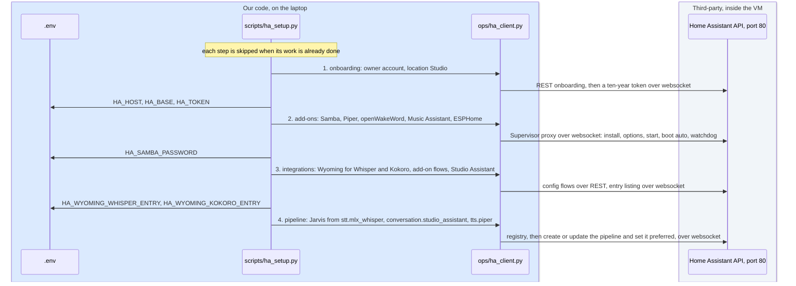
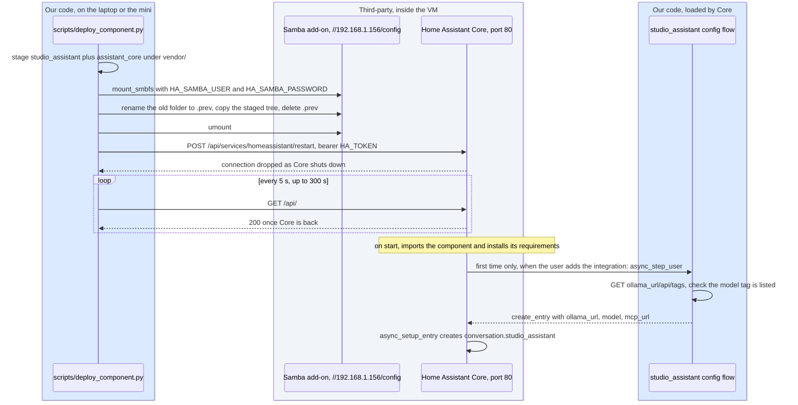

# 6. Home Assistant, the orchestrator
<!-- complexity: packages=3 parts=2 concepts=3 tier=deep -->

This part is the switchboard between you and everything else. Home Assistant receives the audio from the puck or the text you type, turns it into words, decides whether a fixed command such as "play Radiohead" can handle it, and otherwise hands it to our conversation agent. It then turns the answer back into speech. It also hosts the add-ons that speak, adopt the puck, and play music, and it is where every part of the system is wired together from one settings page. Home Assistant runs as its own operating system inside a virtual machine on the Mac, with its own address on the studio Wi-Fi, and the laptop configures it, deploys code into it, and asks it questions over its HTTP API.

## Where this fits

```mermaid
flowchart TB
--8<-- "_includes/system_map.mmd"
class stt,intents,agent,tts,ma current
style haos stroke:#f59e0b,stroke-width:4px
```

The rows run top to bottom in the order a request travels: your devices, then the highlighted row, which is the virtual machine, then the Mac's native services with the Sonos beside them, then Docker, then the traffic that leaves the apartment. Audio from the puck in the top row enters the speech-to-text stage, which forwards it to Whisper in the row below and gets a transcript back. The intent matcher reads the transcript first: a music request goes to the Music Assistant add-on and on to the Sonos, a weather question goes straight down to Met.no in the bottom row, and anything else goes to the `studio_assistant` conversation agent, which is our code running inside Home Assistant. The agent calls Ollama and the tool server in the row below and streams its answer to the text-to-speech stage, which hands each sentence to Kokoro on the Mac or to the Piper add-on inside the VM. The reply audio travels back up the edge it came in on. The laptop's dotted line skips the highlighted row and lands on the health check, which probes the VM and restarts it, and the same deploy path is what copies code into the VM.

## Key definitions

- **Home Assistant.** An open-source home automation platform. Here it is the plumbing that already knows how to talk to the puck, run a speech pipeline, control music, and host our agent.
- **Home Assistant OS.** The whole-operating-system image of Home Assistant: a minimal Linux that runs Home Assistant Core and the Supervisor as containers. It is the only install method that can run add-ons, which is why the system runs this image in a virtual machine rather than a bare container.
- **Supervisor.** The service inside Home Assistant OS that installs, starts, updates, and watches add-ons and applies operating-system updates. The setup script talks to it through Home Assistant's websocket API.
- **Add-on.** A Docker container that Home Assistant OS installs and manages for you, such as Piper or Music Assistant. Only Home Assistant OS can run add-ons, which is why the system runs the OS image in a virtual machine.
- **UTM.** A free virtualisation app for macOS built on Apple's hypervisor. It runs the Home Assistant OS disk image as a virtual machine.
- **Bridged networking.** A virtual machine setting that gives the VM its own address on the Wi-Fi, like a separate computer. It is what lets devices discover Home Assistant.
- **mDNS and zeroconf.** How devices on a home network announce themselves by name without a central server. The puck and the Sonos rely on it.
- **Integration.** Home Assistant's word for a connector to a device or service: Spotify, Sonos, Wyoming, Met.no. Configured from the UI, it produces entities.
- **Entity.** A single thing with state in Home Assistant: a media player, a weather forecast, a speech-to-text engine, a conversation agent.
- **Custom component.** A Python package placed in Home Assistant's `custom_components/` folder and loaded at startup. It declares its dependencies in `manifest.json`.
- **Config flow.** The wizard Home Assistant shows when you add an integration or custom component. Ours asks for the Ollama address, the model tag, and the tool server address, and checks that Ollama answers and has the model before it saves.
- **Assist pipeline.** Home Assistant's chain of stages for one voice request: wake word, speech to text, intent matching or a conversation agent, then text to speech. A pipeline is built by picking one entity for each stage. Ours is named "Jarvis".
- **Intent.** A structured meaning extracted from a sentence, such as `HassPlayMedia(artist="Radiohead")`. Home Assistant matches thousands of sentence patterns to intents without a language model.
- **Conversation agent.** The entity in an Assist pipeline that turns a transcript into a reply when no intent matches. Ours is `conversation.studio_assistant`, provided by the custom component.
- **Wyoming.** A small line-based protocol Home Assistant uses to talk to speech services over the network. It lets a speech model run anywhere Home Assistant can reach by host and port.
- **Long-lived access token.** A bearer token Home Assistant issues to one user for scripts, valid for years rather than minutes. `HA_TOKEN` in `.env` is one, minted by the setup script with a ten-year lifespan.
- **SMB share.** A folder served over SMB, the network file-sharing protocol that macOS and Windows speak natively. Samba is the open-source server for it, and the Samba add-on serves the VM's `/config` folder so the laptop can mount it and copy files in.

## Packages and tools

| Tool | What it is | How this part uses it |
|---|---|---|
| UTM 4.7.5 | A virtualisation app for macOS, installed with `brew install --cask utm`, that runs QEMU virtual machines on Apple's hypervisor | Runs the Home Assistant OS disk image as a VM named "Home Assistant" with 4 GB of memory, 2 cores, UEFI boot, and a bridged network interface. `utmctl`, its command line, is what `scripts/haos_vm.sh` and the health check call to start, stop, and query it |
| Home Assistant OS 18.2, Core 2026.9.1 | The appliance image and the Python application inside it | The VM's whole operating system. Core serves the web interface and the REST and websocket APIs on port 80 of the VM's address, runs the Assist pipeline, and loads our custom component from `/config/custom_components/` |
| Supervisor and the add-ons: Samba 12.10.0, Piper 2.3.4, openWakeWord 2.1.1, Music Assistant 2.10.2, ESPHome 2026.8.2 | The Supervisor is the add-on manager inside Home Assistant OS; each add-on is a container it runs | Samba is how code is copied into the VM. Piper is the text-to-speech engine the Jarvis pipeline uses. openWakeWord is a server-side wake word engine, installed and idle. Music Assistant is the music layer (section [7](07_music_spotify.md)). ESPHome adopts the puck (section [5](05_voice_pipeline.md)). All five start at boot with the Supervisor's watchdog on |
| Wyoming integration | Home Assistant's built-in connector for speech services that speak the Wyoming protocol | One entry per service: Whisper at `192.168.1.152:10300` and Kokoro at `192.168.1.152:10210` on the Mac, added by the setup script, plus Piper and openWakeWord discovered from their add-ons. Each entry produces an `stt.` or `tts.` entity the pipeline can pick |
| `httpx` 0.28.1 and `websockets` 17.1 | An async HTTP client and a websocket client, both from `uv.lock` | `ops/ha_client.py` uses them to reach Home Assistant from the laptop: REST for services, config flows, and conversation, and a fresh websocket per command for tokens, registries, pipelines, and the Supervisor |
| `python-dotenv` 1.2.3 | Reads and writes `KEY=value` files | The setup script reads the admin credentials from `.env` and writes back the address, the token, the Samba password, and the ids of the entries it created, so a rerun changes nothing |
| `mount_smbfs` and `osascript` | macOS's SMB mounter and its AppleScript runner | The deploy script mounts `//192.168.1.156/config` with the first; `scripts/haos_vm.sh create` tells UTM to build the VM with the second |

## How it works

### Part 1: A virtual machine with its own address

```mermaid
flowchart TB
--8<-- "_includes/palette.mmd"
subgraph people["You and your devices on the studio Wi-Fi"]
  laptop[["Laptop"]]
  puck[["Voice PE puck"]]
end
subgraph utmrow["UTM 4.7.5 on the Mac, 192.168.1.152"]
  utm["the VM named Home Assistant, QEMU on Apple's hypervisor<br/>4 GB memory, 2 cores, UEFI, virtio disk<br/>bridged onto the Wi-Fi as 192.168.1.156, homeassistant.local"]
end
subgraph haos["Home Assistant OS 18.2 inside the VM: the two doors and the add-on manager"]
  core["Home Assistant Core 2026.9.1<br/>web UI, REST and websocket API on port 80<br/>/config, custom_components, recorder on the disk"]
  samba["Samba add-on 12.10.0<br/>/config as an SMB share"]
  supervisor["Supervisor<br/>installs, starts, and watches add-ons"]
end
subgraph addons["Add-ons run by the Supervisor, one container each"]
  piper["Piper 2.3.4<br/>text to speech, Wyoming"]
  ma["Music Assistant 2.10.2"]
  others["openWakeWord 2.1.1<br/>ESPHome 2026.8.2"]
end
subgraph native["Native macOS services on the Mac, called by Core"]
  whisper["Whisper :10300"]
  kokoro["Kokoro :10210"]
  ollama["Ollama :11434"]
  mcp["web_search_mcp :8765"]
end
laptop -- "utmctl, AppleScript" --> utm
laptop -- "HTTP :80" --> core
laptop -- "SMB" --> samba
puck -- "audio" --> core
utm -- "boots" --> core
utm -- "boots" --> supervisor
supervisor --> piper
supervisor --> ma
supervisor --> others
core -- "Wyoming" --> whisper
core -- "Wyoming" --> kokoro
core -- "HTTP" --> ollama
core -- "MCP" --> mcp
class utm,core,supervisor,samba,piper,ma,others,ollama,whisper,kokoro third
class mcp ours
class laptop,puck hw
style haos stroke:#f59e0b,stroke-width:4px
```

Home Assistant OS is not a program you install on the Mac. It is a complete Linux operating system, published as a disk image, that expects to own a whole computer. On a Mac that computer is a virtual one: UTM runs the official `aarch64` image (`vm/haos_generic-aarch64-18.2.qcow2.xz`, decompressed on first use) as a QEMU virtual machine on Apple's hypervisor. The VM is given 4,096 MB of memory and 2 cores, boots through UEFI, and reads its disk through the `virtio` interface. Inside it, Home Assistant Core and the Supervisor run as containers, and every add-on is one more container that the Supervisor pulls, configures, starts, and restarts if it dies.

The one setting that shapes everything else is the network mode. The VM's network interface is bridged onto the Mac's default interface, so the VM appears on the Wi-Fi as a separate computer with its own address, `192.168.1.156`, and its own name, `homeassistant.local`, which it announces over mDNS. Devices such as the puck and the Sonos find Home Assistant by that name, and Home Assistant finds them the same way. Docker Desktop on macOS cannot host Home Assistant this way: containers there sit behind the Mac and never receive the multicast packets discovery runs on, and they cannot run add-ons at all. The VM costs memory for that: with Home Assistant OS and its add-ons running, the QEMU process is about 7.5 GB resident on the 16 GB prototype, which is why the VM and a benchmark run never share the machine.

From the outside the VM has two doors. Home Assistant's own HTTP API, REST and websocket, is on port 80 of the VM's address; the web interface is the same port. The Samba add-on serves the `/config` folder, where custom components live, as an SMB share on the same address. The health check in section [10](10_operations.md) uses a third door, `utmctl`, to learn whether the VM is running and to start or restart it.

*From `scripts/haos_vm.sh`, `create_vm`:*

```bash
VM_NAME="${HAOS_VM_NAME:-Home Assistant}"
VM_MEMORY_MB="${HAOS_VM_MEMORY_MB:-4096}"
VM_CPUS="${HAOS_VM_CPUS:-2}"
BRIDGE_INTERFACE="${HAOS_BRIDGE_INTERFACE:-$(route -n get default 2>/dev/null | awk '/interface:/{print $2}')}"
...
    osascript <<EOF
tell application "UTM"
	set diskImage to POSIX file "$image"
	set newVM to make new virtual machine with properties {backend:qemu, configuration:{name:"$VM_NAME", notes:"Home Assistant OS, created by scripts/haos_vm.sh", architecture:"aarch64", memory:$VM_MEMORY_MB, cpu cores:$VM_CPUS, uefi:true, hypervisor:true, drives:{{source:diskImage, interface:virtio}}, network interfaces:{{mode:bridged, host interface:"$BRIDGE_INTERFACE"}}}}
	return id of newVM
end tell
EOF
```

UTM exposes its virtual machine settings to AppleScript, so the script creates the VM without a click in the app: name, architecture, memory, cores, UEFI, the disk image, and the bridged interface, which defaults to whichever interface carries the Mac's default route. The four environment variables at the top let the Mac mini give the VM less memory than the laptop does. `scripts/haos_vm.sh start`, `stop`, and `status` wrap `utmctl`, and `scripts/haos_vm.sh ip` resolves `homeassistant.local` to the address the VM was given.

### Part 2: What the setup script puts in place



A fresh Home Assistant OS knows nothing about the Mac, the speech services, or our agent. `scripts/ha_setup.py` brings it from that state to the configured one without touching the web interface, in four steps that each check whether their work is already done, so the script can be rerun after a change and only the missing pieces are added.

The first step, onboarding, is what a person would otherwise do in the browser on first boot: create the owner account, set the location to "Studio" with the time zone and coordinates passed on the command line, and skip the analytics and integration screens. It then mints a long-lived access token named "studio_assistant tooling" with a lifespan of 3,650 days and writes it to `.env` as `HA_TOKEN`. Every later call from the laptop, in this script, the deploy, the health check, and the smoke test, carries that token as a bearer header. The second step reloads the add-on store, installs the five add-ons, sets each one's options, starts it, and sets it to start at boot under the Supervisor's watchdog. The Samba add-on gets a generated password, saved as `HA_SAMBA_PASSWORD`, and is told to serve its shares only to private address ranges. Piper gets the `en_US-lessac-medium` voice with streaming on.

The third step creates integrations. For Whisper and Kokoro it runs the Wyoming config flow with the Mac's address and the port, and records the id of the entry it created in `.env`, because the entry listing does not show host or port and the id is the only reliable way to recognise the entry on a rerun. Add-ons such as Piper and Music Assistant announce themselves to Home Assistant, which opens a flow that only needs confirming; the script confirms every flow whose source is the Supervisor. Last it runs our component's config flow with `http://192.168.1.152:11434`, the model tag (`gemma4:e4b-it-qat` unless `ASSISTANT_MODEL` says otherwise), and `http://192.168.1.152:8765/mcp`. The fourth step builds the pipeline, which Part 3 describes.

Two APIs are involved, and `ops/ha_client.py` hides the split. Home Assistant answers some requests only over REST, such as onboarding, config flows, service calls, and the conversation endpoint, and others only over its websocket, such as minting tokens, listing the entity registry, creating pipelines, and proxying to the Supervisor. The client's `ws` method opens a fresh websocket for each command, authenticates with the token, sends one message, waits for the reply with the matching id, and closes, so the callers need no connection management. `discover_base` finds the API by asking `/api/` on port 8123 and then on port 80 and accepting any answer below 500, including the 401 an unauthenticated request gets, so the script works whether Home Assistant is still onboarding or already set up.

### Part 3: The Assist pipeline and the intent matcher

```mermaid
flowchart LR
--8<-- "_includes/palette.mmd"
subgraph you["You"]
  say(["speak to the puck or the app,<br/>or type in the Assist window"])
end
subgraph stage1["1. speech to text stage"]
  stt["stt.mlx_whisper<br/>Wyoming to the Mac"]
end
subgraph stage2["2. intent matcher"]
  intents{"prefer_local_intents true<br/>does a sentence template match?"}
end
subgraph stage3["3. the answer"]
  builtin["built-in intent handler<br/>music, weather, volume"]
  agent["conversation.studio_assistant<br/>our agent loop"]
end
subgraph stage4["4. text to speech stage"]
  tts["tts.piper<br/>language en_US"]
end
subgraph back["Back to you"]
  reply(["audio on the puck<br/>or in the browser"])
end
say -- "audio, or text<br/>that skips this stage" --> stt
stt -- "transcript" --> intents
intents -- "yes" --> builtin
intents -- "no" --> agent
builtin -- "reply" --> tts
agent -- "sentences as they stream,<br/>continue_conversation true" --> tts
tts -- "speech" --> reply
class say,reply hw
class stt,intents,builtin,tts third
class agent ours
```

A pipeline is Home Assistant's name for the chain of stages one request passes through, and building one means choosing an entity for each stage. The setup script's fourth step looks up three entities in the registry: the Wyoming speech-to-text entity whose entry mentions Whisper, the Wyoming text-to-speech entity for Piper, and the conversation entity our component registered. It creates or updates a pipeline named "Jarvis" from them and marks it as the preferred pipeline, which is the one the Assist window, the Companion app, and a newly adopted puck use unless told otherwise.

*From `scripts/ha_setup.py`, `pipeline`:*

```python
    stt = entity_id(registry, "stt", "wyoming", "whisper")
    tts = entity_id(registry, "tts", "wyoming", args.tts)
    agent = entity_id(registry, "conversation", "studio_assistant", "")
    payload = {
        "name": PIPELINE_NAME,
        "language": "en",
        "conversation_engine": agent,
        "conversation_language": "en",
        "stt_engine": stt,
        "stt_language": "en",
        "tts_engine": tts,
        "tts_language": "en_US",  # Piper and Kokoro advertise region codes (en_US, en_GB); a bare "en" is rejected at run time with tts-not-supported
        "tts_voice": None,
        "wake_word_entity": None,
        "wake_word_id": None,
        "prefer_local_intents": True,
    }
```

Two values in that payload matter more than the others. `tts_language` is `en_US` rather than `en` because both text-to-speech engines advertise region codes, and a pipeline that asks for a bare `en` fails at run time with "tts-not-supported". `prefer_local_intents` is what puts the intent matcher in front of our agent. Home Assistant ships thousands of sentence templates in English, and Music Assistant adds its own, so "play Radiohead", "what's the weather tomorrow", and "set volume to 50 percent" are recognised as intents and executed in tens of milliseconds, with no language model involved and no chance of a made-up answer. Only a transcript that matches no template reaches `conversation.studio_assistant`. That is the "small router in front of a large model" shape, and it is why music and weather are fast while open questions take seconds.

When the agent does get the text, Home Assistant hands it a `ConversationInput` and a chat log that already holds the earlier turns of the same conversation, keyed by the conversation id. Our entity declares that it supports streaming, so the sentences it produces reach the text-to-speech stage as they arrive rather than after the whole answer is written, and the filler sentence plays while a search runs. Every reply carries `continue_conversation=True`, so the puck keeps listening for a follow-up without a new wake word. Section [4](04_conversation_agent.md) covers what happens inside the agent; section [5](05_voice_pipeline.md) covers the speech stages on either side of it.

The pipeline also has a text-only entrance. `POST /api/conversation/process` with an `agent_id` hands text straight to that agent, skipping speech to text, the intent matcher, and text to speech, and returns the reply as JSON with the conversation id. The smoke test in section [10](10_operations.md) uses it, and so does the command-line step below.

### Part 4: Hosting the custom component



Home Assistant loads any Python package it finds under `/config/custom_components/` at startup, and that folder lives on the VM's disk, so getting our code into it means copying files across the network and restarting. `scripts/deploy_component.py` does exactly that. It first stages the tree that will land in the VM: the component itself, plus a copy of `assistant_core` under `vendor/`, because `assistant_core` is not published on PyPI and Home Assistant has no other way to import it. The component's `__init__.py` adds `vendor/` to the import path when the folder exists, so the same source runs from the repository in tests and from the vendored copy in the VM. It then mounts the Samba add-on's `config` share with `mount_smbfs`, swaps the deployed folder for the staged one, unmounts, and asks Home Assistant to restart.

*From `scripts/deploy_component.py`, `sync`:*

```python
def sync(source: Path, target: Path) -> None:
    """Replace the deployed tree, keeping the previous one aside until the copy has finished so a failure halfway leaves the old component in place."""
    previous = target.with_name(target.name + ".prev")
    if previous.exists():
        shutil.rmtree(previous)
    if target.exists():
        target.rename(previous)
    try:
        shutil.copytree(source, target)
    except Exception:
        shutil.rmtree(target, ignore_errors=True)
        if previous.exists():
            previous.rename(target)
        raise
    if previous.exists():
        shutil.rmtree(previous)
```

The restart call is a service call, `POST /api/services/homeassistant/restart`, and Home Assistant often drops the connection as it shuts down instead of answering it, so the script treats that as success and then polls `/api/` every five seconds, for up to five minutes, until it gets an authenticated 200. The whole cycle takes about thirty seconds. On the Mac mini the script is not run by hand: `ops/deploy.py` compares the old and new commits of a deploy, and its rules table maps any change under `custom_components/` or `assistant_core/` to the `deploy_component` action, which runs this script through the project's virtual environment. Before that it checks that the versions pinned in `manifest.json` agree with `uv.lock`, because Home Assistant installs the manifest's requirements into its own environment and the vendored code must meet the same `ollama` and `pydantic` it was tested with. Section [10](10_operations.md) covers the rest of that protocol.

What Home Assistant does with the folder is governed by three files. `manifest.json` names the domain `studio_assistant`, declares `config_flow: true`, depends on the `conversation` integration, and pins `ollama==0.6.2` and `pydantic>=2.0`; Home Assistant reads it at startup and installs those requirements before importing the code. `config_flow.py` is the wizard that runs once, when the integration is added: it shows a form for the Ollama URL, the model tag, and the MCP URL, calls Ollama's `/api/tags` to prove the address answers and lists that model, and only then creates the config entry. The same file defines an options flow, reached from the entry's Configure button, that edits the answer policy: the model, temperature, spoken word budget, tool rounds, context window, output cap, thinking switch, tool timeout, and whether the microphone stays open. `__init__.py` is what runs on every start: `async_setup_entry` forwards the saved entry to the conversation platform, which creates the `conversation.studio_assistant` entity, and registers a listener that reloads the entry whenever the options change, so a new model tag takes effect without a restart.

## Run it yourself

Everything below runs from the repository folder with `.env` loaded (`set -a; source .env; set +a`). The VM and a benchmark must not run at the same time, so check first:

```bash
pgrep -fl benchmark-run || echo "no benchmark running"
scripts/haos_vm.sh status
```

`status` prints `stopped` or `started`. Start the VM and wait for the API, which takes about a minute after a normal stop and a few minutes on a first boot:

```bash
scripts/haos_vm.sh start
until curl -s -o /dev/null -w "%{http_code}" -H "Authorization: Bearer $HA_TOKEN" http://192.168.1.156/api/ | grep -q 200; do sleep 5; done; echo "Home Assistant is up"
```

`scripts/haos_vm.sh ip` prints the address the VM was given, which is `192.168.1.156` on the studio network. Now open `http://192.168.1.156` in a browser and sign in with `HA_ADMIN_USER` and `HA_ADMIN_PASSWORD` from `.env`. Four settings pages show the pieces this section describes:

| Page | What you see |
|---|---|
| Settings, Devices & services | The Wyoming Protocol card with Whisper, Kokoro, Piper, and openWakeWord; Studio Assistant, our component, with a Configure button that opens the options flow; Music Assistant |
| Settings, Voice assistants | The "Jarvis" pipeline: speech to text `mlx-whisper`, conversation agent Studio Assistant, text to speech Piper. Click it to change any stage; switching text to speech to Kokoro here is how you compare voices |
| Settings, Add-ons | Samba, Piper, openWakeWord, Music Assistant, and ESPHome, each with its state, version, and log |
| Settings, System, Logs | Where component errors appear. Search for `studio_assistant` |

To chat with the assistant, open the Overview dashboard, tap the three-dot menu at the top right, and choose Assist. It opens a chat window on the Jarvis pipeline. Type "Why does bread rise?" and an answer arrives in two to five seconds once the model is warm. Type "What is 18 percent of 245 dollars?" and you see "Let me work that out." first, the filler sentence, then the answer from the calculator. Type "And what did I ask you first?" and the agent recalls it, because the chat log carries the conversation. The microphone button in the browser needs HTTPS, which the VM does not have, so typing is the way here; the Companion app on a phone gives you voice.

The same conversation from the command line goes through the text-only entrance of Part 3 and shows the timing:

```bash
ask() { curl -s -m 240 -X POST http://192.168.1.156/api/conversation/process \
  -H "Authorization: Bearer $HA_TOKEN" -H "Content-Type: application/json" \
  -d "{\"text\": \"$1\", \"language\": \"en\", \"agent_id\": \"conversation.studio_assistant\"${2:+, \"conversation_id\": \"$2\"}}" \
  | python3 -c 'import sys,json; d=json.load(sys.stdin); print(d["response"]["speech"]["plain"]["speech"]); print("conversation_id:", d["conversation_id"])'; }

time ask "If I put 300 dollars a month into an account paying 5 percent a year, how much do I have after 3 years?"
```

You see the spoken answer, a `conversation_id`, and the elapsed time. Pass that id as a second argument to continue the same conversation:

```bash
ask "And after 5 years?" 01M1VPD9JAPX816PT6V0PHNNVZ
```

To watch the stages, go to Settings, Voice assistants, Jarvis, the three-dot menu, then Debug. Open the last run and every stage is listed with its timing and the exact text that passed between them: speech to text if you spoke, our agent, then text to speech. In a second terminal, `ollama ps` shows the model resident while an answer streams and `scripts/services.sh logs mcp` shows the tool server's request log.

If you have changed the component and want the VM to run it, deploy it; the copy takes seconds and the restart about thirty:

```bash
uv run python scripts/deploy_component.py
```

You see `deployed to //192.168.1.156/config/custom_components/studio_assistant`, then `Home Assistant restarting ...` and `Home Assistant back up`. Pass `--no-restart` to copy without restarting.

When you are done, stop the VM so the memory is free for the next benchmark pass:

```bash
scripts/haos_vm.sh stop
scripts/haos_vm.sh status
```

The rows of the troubleshooting table that belong to this section:

| Symptom | Likely cause | Check |
|---|---|---|
| Assist answers "Sorry, I couldn't understand that" | the pipeline could not reach the agent | Settings, System, Logs for `studio_assistant`; is Ollama up on the Mac? |
| The answer says it could not check the web | the tool server was unreachable from the VM | `curl http://192.168.1.152:8765/mcp` from the Mac; was the macOS firewall prompt for python denied? |
| Text to speech fails with "not supported" | pipeline language set to `en` instead of `en_US` | Settings, Voice assistants, Jarvis, text to speech language |
| The Mac gets sluggish and apps get killed | the VM, the speech services, and something else heavy at once | stop the VM as above, then Activity Monitor, Memory |

## Where to look in the code

| Path | What you find there |
|---|---|
| [`scripts/haos_vm.sh`](https://github.com/seanlin2000/home_assistant/blob/main/scripts/haos_vm.sh) | `create_vm`, which builds the VM through UTM's AppleScript interface with bridged networking; the `start`, `stop`, and `status` wrappers around `utmctl`; `resolve_ip` for `homeassistant.local` |
| [`scripts/ha_setup.py`](https://github.com/seanlin2000/home_assistant/blob/main/scripts/ha_setup.py) | The four rerunnable steps: `onboarding`, `addons` with the option tables, `integrations` with `run_flow` and `confirm_discovered_flows`, and `pipeline` with the Jarvis payload |
| [`ops/ha_client.py`](https://github.com/seanlin2000/home_assistant/blob/main/ops/ha_client.py) | `HomeAssistant`: `discover_base`, REST `get` and `post`, the one-shot `ws` command, the `supervisor` proxy; `wait_for_api`, `entity_id`, and `converse`, the text-only call |
| [`scripts/deploy_component.py`](https://github.com/seanlin2000/home_assistant/blob/main/scripts/deploy_component.py) | `stage_component`, which vendors `assistant_core`; `mount` and `sync` over the Samba share; `restart_and_wait` |
| [`ops/deploy.py`](https://github.com/seanlin2000/home_assistant/blob/main/ops/deploy.py) | The `RULES` table that maps changed paths to actions, `deploy_component` among them, and `manifest_lock_mismatches`, the preflight that compares `manifest.json` with `uv.lock` |
| [`custom_components/studio_assistant/manifest.json`](https://github.com/seanlin2000/home_assistant/blob/main/custom_components/studio_assistant/manifest.json) | The domain, the `conversation` dependency, the pinned requirements, and the component version |
| [`custom_components/studio_assistant/config_flow.py`](https://github.com/seanlin2000/home_assistant/blob/main/custom_components/studio_assistant/config_flow.py) | `StudioAssistantConfigFlow` with the Ollama check, and `StudioAssistantOptionsFlow` with the answer policy form |
| [`custom_components/studio_assistant/__init__.py`](https://github.com/seanlin2000/home_assistant/blob/main/custom_components/studio_assistant/__init__.py) | The `vendor/` import path, `async_setup_entry`, and the reload-on-options listener |
| [`ops/pipeline_runs.py`](https://github.com/seanlin2000/home_assistant/blob/main/ops/pipeline_runs.py) | The websocket commands that read the Debug view's pipeline runs from the laptop |
| [`docs/VERSIONS.md`](https://github.com/seanlin2000/home_assistant/blob/main/docs/VERSIONS.md) | The UTM, Home Assistant OS, Core, and add-on versions on the running system, and the rule for updating Home Assistant monthly |

## Further reading

- Design doc: [`design_docs/v1/06_home_assistant_core.md`](https://github.com/seanlin2000/home_assistant/blob/main/design_docs/v1/06_home_assistant_core.md), whose as-built appendix records the API port, the flow-listing quirks, and the memory the VM takes on the prototype
- [Home Assistant installation methods](https://www.home-assistant.io/installation/), for the table of which install can run add-ons and which cannot
- [Home Assistant OS on macOS](https://www.home-assistant.io/installation/macos), the page the UTM setup follows, with the bridged-network step
- [Assist pipelines and local voice](https://www.home-assistant.io/voice_control/voice_remote_local_assistant/), for how the stages are chosen and what "prefer handling commands locally" does
- [The Wyoming integration](https://www.home-assistant.io/integrations/wyoming/), for how a host and port become an `stt.` or `tts.` entity
