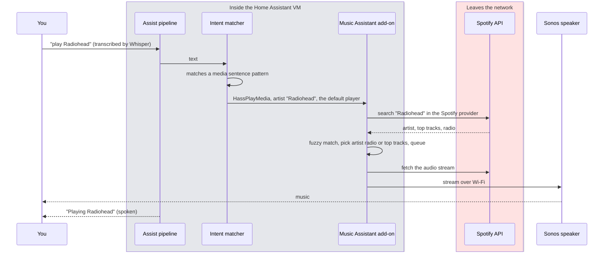

# 7. Music, Spotify to Sonos
<!-- complexity: packages=2 parts=1 concepts=2 tier=standard -->

"Hey Jarvis, play Radiohead" starts music on a speaker without a language model in the loop. The sentence matches one of Home Assistant's built-in media commands, Music Assistant looks the artist up in Spotify and streams it, and a speaker plays it. Today the Music Assistant add-on is installed and running inside the Home Assistant virtual machine, and the pipeline is set to handle commands locally before asking the agent. What is missing is the two ends: Spotify is not yet authorised, and there is no network speaker, so nothing plays yet. This section explains the path so that connecting those two ends is a matter of clicking through two setup wizards.

## Where this fits

```mermaid
flowchart LR
--8<-- "_includes/system_map.mmd"
class ma,sonos,spotify current
```

The intent matcher inside Home Assistant sends "play X" straight to the Music Assistant add-on, which lives in the same virtual machine. Music Assistant asks Spotify's API, one of the three kinds of traffic that leaves the apartment, for the catalogue entry and the audio stream, and pushes the audio to the Sonos speaker over Wi-Fi. The conversation agent, Ollama, and the search server are never involved.

## Key definitions

- **Intent.** A structured meaning extracted from a sentence, such as `HassPlayMedia(artist="Radiohead")`. Home Assistant matches thousands of sentence patterns to intents without a language model.
- **Add-on.** A Docker container that Home Assistant OS installs and manages for you, such as Piper or Music Assistant. Only Home Assistant OS can run add-ons, which is why the system runs the OS image in a virtual machine.
- **Provider and player.** Music Assistant's two abstractions: a provider is where music comes from (Spotify), a player is where it goes (Sonos).
- **Spotify Connect.** Spotify's mechanism for controlling playback on another device from any client.
- **OAuth.** The login flow where you authorise an application to act on your account without giving it your password. The application receives tokens it refreshes on its own.
- **Fuzzy matching.** Tolerant string comparison, so "Radio Head" resolves to Radiohead.
- **Ducking.** Lowering music volume while speech plays.

## Packages and tools

| Tool | What it is | How this part uses it |
|---|---|---|
| Music Assistant add-on 2.10.2 | An open-source music library and streaming engine that runs as a Home Assistant add-on. It knows how to search a provider, resolve a fuzzy name to an artist, album, track, or playlist, keep a queue, and stream audio to a player | Installed by `scripts/ha_setup.py` and started at boot with the Supervisor's watchdog on. It is the thing that turns "Radiohead" into sound |
| Music Assistant integration | The Home Assistant side of the add-on. It exposes each player as a media player entity and registers the media intents the voice pipeline uses | Lets the intent matcher hand a "play" command to the add-on, and lets you see and control playback from the Home Assistant UI |
| Spotify Web API and a developer app | Spotify's programming interface, reached with credentials from a free developer app on your account. Playback control needs a Premium account | The provider. Music Assistant's Spotify provider logs in with OAuth once and keeps the refresh token; the Home Assistant Spotify integration does the same for playback state |
| Sonos integration | Home Assistant's connector for Sonos speakers, which it finds on the network by mDNS | Turns the speaker into a media player entity that Music Assistant can stream to |
| Sonos Era 100 SL | A Wi-Fi speaker with no microphones | The player. It is always on and always reachable, unlike a Bluetooth speaker that powers down when idle |
| Assist pipeline, `prefer_local_intents` | The "Jarvis" pipeline's setting that tries the built-in sentence patterns before the conversation agent | `scripts/ha_setup.py` sets it to `true`, so music and weather commands never wait for the language model |

## How it works

### "Play Radiohead", from sentence to sound



The path has one decision and three hops. The decision happens in the intent matcher: because the pipeline prefers local intents, Home Assistant first tries its library of sentence patterns against the transcript, and "play Radiohead" matches a media pattern. The conversation agent in [section 4](04_conversation_agent.md) never sees the sentence. A transcript that matches nothing, such as "what did Radiohead release last year", goes to the agent instead.

The first hop is Home Assistant handing the intent to Music Assistant with the studio's default player as the target. The second hop is Music Assistant asking its Spotify provider. Whisper sometimes hears "Radio Head", so Music Assistant's fuzzy matching is what makes the command robust; it then decides between artist, album, track, or playlist and builds a queue. The third hop is streaming: Music Assistant pulls the audio from Spotify and sends it to the player over the local network, so the speaker never talks to Spotify itself. Transport commands, "pause", "next", "volume down", are further intents on the same path.

Two things make talking over music work. The speaker and the puck are separate devices, so the puck's echo cancellation only has to remove the room's echo rather than its own output. And Home Assistant can duck the music while the assistant speaks, so a reply is audible without stopping the song.

Authorisation happens once. You create a free app in Spotify's developer dashboard, which gives you a client id and secret. The Home Assistant Spotify integration and Music Assistant's Spotify provider each run an OAuth login against your Premium account and store a refresh token inside the VM. The credentials never go into this repository.

## Run it yourself

The middle of the path runs today; the two ends do not. Start the virtual machine as in [section 6](06_home_assistant_core.md#run-it-yourself), open Home Assistant in a browser, and look at three places:

1. **Settings → Add-ons → Music Assistant.** The add-on shows as started, with "Start on boot" and "Watchdog" on. `scripts/ha_setup.py --only addons` is what installed it; rerunning it prints `addons: d5369777_music_assistant already installed (2.10.2)` and changes nothing.
2. **Settings → Devices & services.** The Music Assistant integration is present, discovered from the add-on. The Spotify and Sonos integrations are not there yet.
3. **Settings → Voice assistants → Jarvis.** "Prefer handling commands locally" is on. Type "play Radiohead" into the Assist window and Home Assistant answers that it found no media player, which is the intent matcher working and the player missing.

To connect the ends, the two wizards are: Settings → Devices & services → Add integration → Spotify, which opens the OAuth login and asks for the developer app's client id and secret; then, once a speaker is on the Wi-Fi, the Sonos integration appears in the discovered list on the same page and needs one confirmation. Music Assistant then lists Spotify under providers and the speaker under players in its own panel, and the same "play Radiohead" starts music.

Until a network speaker exists, the prototype path is the Spotify desktop app on the Mac as a Spotify Connect target with the Mac's audio sent to the JBL Flip 5 over Bluetooth. It works for a demonstration and fails for daily use, because the Flip 5 powers off when idle and Bluetooth drops when the Mac sleeps.

## Where to look in the code

| Path | What you find there |
|---|---|
| `scripts/ha_setup.py` | The add-on table with the Music Assistant slug and options, the `install_addon` routine that installs, configures, starts, and sets boot and watchdog, `confirm_discovered_flows` for add-ons that announce themselves, and the pipeline payload with `prefer_local_intents` |
| `docs/VERSIONS.md` | The add-on versions of record |
| `design_docs/v1/07_music_spotify.md` | The reasoning behind the speaker choice and the configuration the project intends to control |

No Python in this repository handles music; everything is Home Assistant and Music Assistant configuration.

## Further reading

- Design doc: [07_music_spotify.md](https://github.com/seanlin2000/home_assistant/blob/main/design_docs/v1/07_music_spotify.md), for the speaker alternatives that were weighed and the failure modes
- [Music Assistant documentation](https://www.music-assistant.io/), for providers, players, and the voice intents it registers
- [Home Assistant Spotify integration](https://www.home-assistant.io/integrations/spotify/), for the developer app setup and the Premium requirement
- [Sonos Era 100 SL](https://newsroom.sonos.com/262995-sonos-returns-to-the-system-that-built-the-brand-with-two-essential-speakers-for-the-home/), the speaker the design settles on
