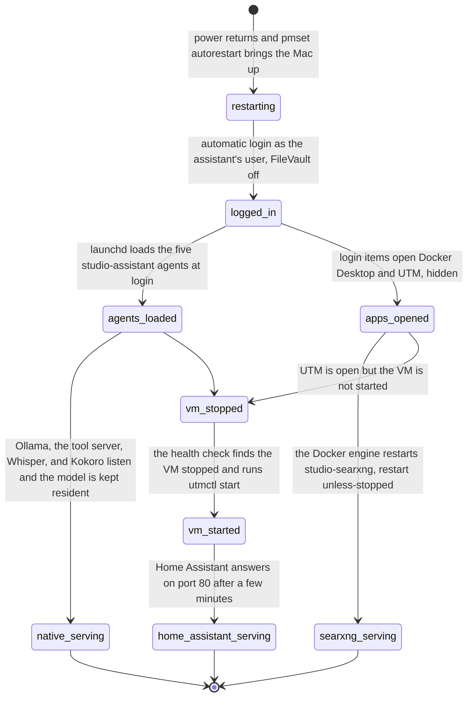

# 8. Hardware and deployment
<!-- complexity: packages=3 parts=3 concepts=2 tier=deep -->

This part is the computer in the room and the way the assistant's pieces are arranged on it. Everything you have read about so far, the language model, the two speech services, the tool server, Home Assistant, and the search aggregator, runs on one Mac that never turns off. This section explains why some of those pieces run as plain macOS processes, why one runs inside a virtual machine with its own network address, why one runs in Docker, how the Mac's memory decides which model you can afford, and what happens, without anyone touching a keyboard, when the power comes back after a cut.

## Where this fits

```mermaid
flowchart TB
--8<-- "_includes/system_map.mmd"
style native stroke:#f59e0b,stroke-width:4px
style haos stroke:#f59e0b,stroke-width:4px
style docker stroke:#f59e0b,stroke-width:4px
```

The three highlighted rows are the three places a process can run on the Mac. Audio from the puck, in the top row, enters the Home Assistant OS virtual machine, which has its own address on the Wi-Fi. From there, requests go down to the native processes on the Mac's own address: Whisper and Kokoro over Wyoming, Ollama over HTTP, the tool server over MCP. The tool server alone talks to the Docker row below, where SearXNG listens on the Mac's loopback address and sends the only outbound traffic, the search query, to the bottom row. The laptop reaches the Mac over SSH to deploy and to collect logs, and nothing else reaches it from outside the apartment.

## Key definitions

- **Unified memory.** One pool of memory shared by the CPU and GPU on Apple Silicon. Its size decides which models fit.
- **Metal and MLX.** Metal is Apple's GPU programming interface; MLX is Apple's machine learning framework on top of it. Only native macOS processes can reach the GPU through them.
- **launchd.** macOS's service manager. A plist file describes a program to run at login and keep alive, or to run every N seconds. The equivalent of systemd on Linux.
- **Login item.** An application macOS opens when a user logs in, listed under System Settings, General, Login Items. Docker Desktop and UTM are login items on the assistant's Mac so their virtual machines come back after a reboot.
- **Docker Desktop on macOS.** Runs Linux containers inside a hidden Linux VM. Containers there cannot see the GPU and cannot receive the network's discovery packets.

## Packages and tools

| Tool | What it is | How this part uses it |
|---|---|---|
| The Mac | An Apple Silicon computer with unified memory. The prototype is a 16 GB M1 Pro MacBook; the production machine is a Mac mini that is not yet bought, and the benchmark points at a 32 GB one | Runs every service. Its memory size is the one number that decides which model the assistant can run, and its GPU is why the model and Whisper run natively |
| macOS 15.7.3 | The operating system, with its power settings (`pmset`), application firewall (`socketfilterfw`), login items, and automatic login | Configured once by `scripts/bootstrap_mac.sh` so the machine restarts after a power failure, logs itself in, allows the LAN-facing programs through the firewall, and accepts SSH by key only |
| Homebrew and the `Brewfile` | macOS's package manager and a file listing what to install with `brew bundle` | Installs `git`, `uv`, `ollama`, `espeak-ng`, `rsync`, `shellcheck`, `shfmt`, and `mermaid-cli`, plus the `docker-desktop` and `utm` applications. `brew bundle check` says whether the machine matches the file |
| launchd | macOS's service manager | `scripts/services.sh install` writes five agents under `~/Library/LaunchAgents`, one each for Ollama, the tool server, Whisper, Kokoro, and the health check, and loads them. Four are kept alive; the health check runs every 300 seconds |
| UTM 4.7.5 | A free virtualisation app for macOS built on Apple's hypervisor. It runs the Home Assistant OS disk image as a virtual machine | `scripts/haos_vm.sh` creates the VM with a bridged network interface, 4,096 MB of memory, and 2 cores, and wraps `utmctl` to start, stop, and inspect it. Section [6](06_home_assistant_core.md) describes what runs inside |
| Docker Desktop 4.89.0, engine 29.7.2 | Docker for macOS, which keeps a hidden Linux VM and runs containers inside it | Runs the SearXNG container from `docker/searxng/docker-compose.yml`, published on `127.0.0.1:8080` only. Section [3](03_web_search_mcp.md) describes the container itself |

## How it works

### Part 1: Three places to run a service on one Mac

```mermaid
flowchart TB
--8<-- "_includes/palette.mmd"
subgraph haos["On the Mac, a UTM virtual machine: Home Assistant OS, bridged, its own LAN address"]
  core("Home Assistant :80")
  addons("add-ons: Piper, Samba,<br/>Music Assistant, ESPHome, openWakeWord")
end
subgraph native["On the Mac, native processes: launchd agents, listening on 0.0.0.0"]
  whisper("Whisper :10300<br/>.venv/bin/wyoming-mlx-whisper")
  kokoro("Kokoro :10210<br/>.venv/bin/kokoro-server, CPU")
  ollama("Ollama :11434<br/>/opt/homebrew/bin/ollama")
  mcp("web_search_mcp :8765<br/>.venv/bin/web-search-mcp")
  health("health check<br/>every 300 s")
end
subgraph silicon["The Mac's GPU"]
  gpu("Apple Silicon GPU, reached through Metal,<br/>one pool of unified memory")
end
subgraph docker["Docker Desktop, a hidden Linux VM"]
  searxng("SearXNG<br/>published on 127.0.0.1:8080 only")
end
core -- "Wyoming :10300" --> whisper
core -- "Wyoming :10210" --> kokoro
core -- "HTTP :11434" --> ollama
core -- "MCP :8765" --> mcp
whisper -- "MLX" --> gpu
ollama -- "MLX" --> gpu
mcp -- "loopback" --> searxng
class ollama,whisper,kokoro,core,addons,searxng third
class mcp,health ours
class gpu hw
```

A service on this Mac lives in one of three places, and each place trades something for something else.

A native process is an ordinary program started by launchd under the user's account. It is the only kind of process that can reach the GPU, because Metal, the interface MLX uses to run a model on the graphics cores, is not exposed to a virtual machine or a container on macOS. Ollama and Whisper need the GPU, so they are native. Kokoro and the tool server do not need it, but running them from the project's `.venv` keeps them on the pinned dependencies in `uv.lock` and makes them easy to watch with `scripts/services.sh logs`. Every native service binds `0.0.0.0`, all of the Mac's addresses, rather than loopback, because its caller is the virtual machine, which arrives over the LAN at the Mac's Wi-Fi address. The first time each program listens, macOS asks whether to allow incoming connections; the answer must be "allow", and on a headless machine the bootstrap script answers it in advance by adding the programs to the firewall's allow-list.

The UTM virtual machine is a whole second computer. Home Assistant OS is an operating system image, not a program, and its add-ons only exist on that image, so it needs a machine of its own. UTM gives it one on Apple's hypervisor, and its network interface is bridged onto the Mac's, so the VM has its own address and its own name, `homeassistant.local`, on the Wi-Fi. That is what lets the puck and the Sonos discover it: device discovery uses multicast packets that only reach real LAN addresses. Section [6](06_home_assistant_core.md) covers the machine's contents; this section only places it.

Docker Desktop is the third place. It runs Linux containers inside a Linux VM that it hides from you, which is convenient for software that ships as a container image, and SearXNG does. A container there cannot see the GPU and cannot receive multicast, which is why neither the model nor Home Assistant lives in Docker. The compose file publishes SearXNG's port on the Mac's loopback address only, so the one caller, the tool server on the same Mac, can reach it and nothing on the Wi-Fi can.

*From `scripts/services.sh`, `install_agents`:*

```bash
install_agents() {
    mkdir -p "$AGENTS_DIR" "$LOG_DIR"
    prepare_kokoro
    # Ollama: Homebrew's service binds to localhost only; ours binds the LAN and keeps the model loaded.
    brew services stop ollama >/dev/null 2>&1 || true
    ENV_KEYS=(OLLAMA_HOST OLLAMA_KEEP_ALIVE OLLAMA_MAX_LOADED_MODELS) ENV_VALUES=(0.0.0.0:11434 -1 1)
    write_plist ollama "$OLLAMA_BIN" serve
    ...
    ENV_KEYS=(WEB_SEARCH_HOST WEB_SEARCH_PORT WEB_SEARCH_TURNS_DIR WEB_SEARCH_ALLOWED_HOSTS)
    ENV_VALUES=(0.0.0.0 8765 "$LOG_DIR/turns" "${WEB_SEARCH_ALLOWED_HOSTS:-${lan_address:+$lan_address:8765,}localhost:8765,127.0.0.1:8765}")
    write_plist mcp "$PROJECT_DIR/.venv/bin/web-search-mcp"
    ENV_KEYS=() ENV_VALUES=()
    write_plist whisper "$PROJECT_DIR/.venv/bin/wyoming-mlx-whisper" --uri tcp://0.0.0.0:10300 --model mlx-community/whisper-large-v3-turbo --language en
    write_plist kokoro "$PROJECT_DIR/.venv/bin/kokoro-server" --uri tcp://0.0.0.0:10210 --voice af_heart --data-dir "$HOME/.cache/wyoming-kokoro" --streaming --device cpu
    ...
    PLIST_START_INTERVAL="$HEALTH_INTERVAL_SECONDS" write_plist health "$PROJECT_DIR/.venv/bin/python" "$PROJECT_DIR/scripts/health_check.py" "${health_flags[@]}"
    start_agents
}
```

`write_plist` turns each line into a file named `com.studio-assistant.<name>.plist` with the program, its arguments, its environment, the repository as working directory, and a log at `~/Library/Logs/studio-assistant/<name>.log`. Four of the five get `RunAtLoad` and `KeepAlive`, so launchd starts them at login and restarts them within ten seconds if they exit. The health check gets `StartInterval` instead and runs once every 300 seconds. Ollama's own Homebrew service is stopped first, because it binds loopback only and the VM could never reach it. The port table is fixed: Ollama 11434, Whisper 10300, Kokoro 10210, the tool server 8765, SearXNG 8080 on loopback, and Home Assistant on port 80 of the VM's address.

### Part 2: The memory budget, 16 GB against 32 GB

```mermaid
flowchart LR
--8<-- "_includes/palette.mmd"
subgraph machine["Two machines, one row each"]
  p_mac("Prototype<br/>MacBook M1 Pro, 16 GB")
  m_mac("Mid tier<br/>Mac mini, 32 GB")
end
subgraph os["macOS"]
  p_os("about 3 GB")
  m_os("about 3 GB")
end
subgraph vm["Home Assistant VM"]
  p_vm("given 4,096 MB<br/>about 7.5 GB resident with add-ons")
  m_vm("given 3,072 MB")
end
subgraph speech["Speech services"]
  p_speech("Whisper 1.6 GB<br/>Kokoro under 1 GB")
  m_speech("Whisper 1.6 GB<br/>Kokoro and Piper under 1 GB")
end
subgraph model["The language model"]
  p_model[("gemma4:e4b-it-qat<br/>6.1 GB of weights<br/>+ 1 to 2 GB of KV cache")]
  m_model[("Gemma 4 26B-A4B, 4-bit<br/>about 16 GB of weights<br/>+ 1 to 2 GB of KV cache")]
end
subgraph verdict["Does it all fit?"]
  p_note("over 16 GB up at once,<br/>so one heavy workload at a time")
  m_note("25 to 27 GB in total,<br/>leaves headroom")
end
p_mac --> p_os --> p_vm --> p_speech --> p_model --> p_note
m_mac --> m_os --> m_vm --> m_speech --> m_model --> m_note
class p_mac,m_mac hw
class p_os,p_vm,p_speech,p_model,m_os,m_vm,m_speech,m_model third
```

On Apple Silicon there is no separate graphics memory. The CPU, the GPU, and every virtual machine draw from the same pool, so the question of which machine to buy is the question of what has to be resident at the same time. Section [2](02_local_llm.md) explains what the model itself costs; this part adds everything around it.

On the 16 GB prototype the resident set is macOS at about 3 GB, the Home Assistant VM at about 7.5 GB once its add-ons are running, the two speech services at about 2.5 GB, and the default model, `gemma4:e4b-it-qat`, at 6.1 GB of weights plus 1 to 2 GB of KV cache. Added up that passes 16 GB, and macOS survives it by compressing memory and swapping, which is tolerable for a spoken answer and fatal for a benchmark, where a model that spills off the GPU generates at a fraction of a token per second. That is why the introduction's rule stands: the VM with the speech services, or a benchmark pass, never both. The 26B mixture-of-experts model the benchmark points at needs about 16 GB for its weights alone and does not fit on this machine at all.

On a 32 GB Mac mini the same list totals 25 to 27 GB with that model in place: macOS 3 GB, the VM trimmed to 3,072 MB by `HAOS_VM_MEMORY_MB` in the bootstrap script, the model's 16 GB, its cache at 1 to 2 GB, Whisper 1.6 GB, and text to speech under 1 GB. The tiers below are the Mac mini configurations the design compares; the machine is not yet bought, and the benchmark in section [1](01_llm_benchmark.md) is what decides between them.

| Tier | Machine | Runs comfortably |
|---|---|---|
| Budget | Mac mini M6, 24 GB, $1,100 | Gemma 4 E4B and Qwen 3.5-9B at full precision; Gemma 4 26B-A4B only at 3-bit with a small context |
| Mid | Mac mini M6, 32 GB, $1,300 | Gemma 4 26B-A4B at 4-bit with a 16k context; Qwen 3.6-35B-A3B at 4-bit if the VM is trimmed |
| High | Mac mini M5 Pro, 48 GB, about $2,100 | Qwen 3.6-35B-A3B at 8-bit, Gemma 4 31B dense at about 20 tokens per second |
| Not recommended | Refurbished M4 Mac mini, 16 GB, $849 | The same limits as the prototype MacBook, without neural accelerators |

Beyond memory size, the neural accelerators in the M5 and M6 GPU cores cut the time to first token three to four times against the M4, which after a search puts thousands of tokens of page text in the prompt is the difference between a two-second and an eight-second pause. A Mac mini idles at about 4 W and draws 30 to 40 W while generating, silently, which is what a 500 square foot studio needs from a machine that is always on.

### Part 3: Coming back after a reboot



Nobody sits at this Mac, so a power cut must end with the assistant answering again and no hands involved. The chain has four links, each set once by the bootstrap script or by a person at the screen.

The first link is power. `pmset -a sleep 0 disksleep 0 displaysleep 5 autorestart 1 womp 1 powernap 0` tells the Mac never to sleep, to start up on its own when power returns, and to wake on a LAN packet. The second is login. Every service runs under the user's account, so the machine must log that user in without a password prompt. Automatic login is a System Settings switch, and it requires FileVault to be off, because an encrypted disk asks for a password before the operating system starts.

The third link is launchd and login items. The five `com.studio-assistant` agents have `RunAtLoad`, so the moment the user is logged in launchd starts Ollama, the tool server, Whisper, Kokoro, and the health check timer. Ollama loads the model on the first request and keeps it forever. In parallel, macOS opens the two login items the bootstrap registered, Docker Desktop and UTM, both hidden. Docker's engine starts and, because the compose file says `restart: unless-stopped`, brings the SearXNG container back with it.

The fourth link is the VM, and it comes back through the health check rather than through UTM. Every 300 seconds `scripts/health_check.py` probes each port, asks `utmctl status` about the VM, and applies a policy table. A VM that reports `stopped` gets `utmctl start` on the next run, at most once every 30 minutes; a VM that is running while Home Assistant has failed five checks in a row gets stopped and started, at most once every two hours. Home Assistant then needs a few minutes to boot its containers and answer on port 80. Section [10](10_operations.md) covers the rest of the health check's actions and the maintenance flag that switches them off during a deploy.

*From `scripts/bootstrap_mac.sh`, the services and power steps:*

```bash
step "launchd agents: ollama, mcp, whisper, kokoro, health"
run "$TARGET_DIR/scripts/services.sh" install

step "Docker and UTM open at login (the VM and SearXNG must come back after a power cut)"
for app in Docker UTM; do
    run osascript -e "tell application \"System Events\" to if not (exists login item \"$app\") then make login item at end with properties {path:\"/Applications/$app.app\", hidden:true}"
done
...
    step "power: never sleep, restart after a power failure, wake on LAN"
    as_root pmset -a sleep 0 disksleep 0 displaysleep 5 autorestart 1 womp 1 powernap 0
```

Software updates are part of the same discipline. Automatic macOS updates are switched off, and Home Assistant, Ollama, the models, and the Python packages are upgraded on purpose, one at a time, with the versions of record in `docs/VERSIONS.md` updated in the same change. That file is the reference for what is running now, and its refresh procedure is the upgrade procedure.

### Part 4: What a fresh Mac gets

```mermaid
flowchart TB
--8<-- "_includes/palette.mmd"
laptop("laptop: scripts/mini.sh bootstrap, over SSH") --> tools
tools("1. tools<br/>Xcode command line tools, Homebrew, brew bundle, uv python install 3.12")
tools --> checkout("2. the checkout<br/>git clone, detached at origin/main, uv sync --frozen, log directory")
checkout --> services("3. services<br/>Docker Desktop and SearXNG up, services.sh install, Docker and UTM as login items, VM present or not")
services --> system("4. system settings, with sudo<br/>pmset, application firewall allow-list, SSH by key only for one user")
system --> person(["5. left for a person<br/>automatic login, automatic updates off, router reservations, HDMI dummy plug"])
class tools,checkout,services,system,person ours
class laptop hw
```

`scripts/bootstrap_mac.sh` is the one script that turns a Mac out of the box into the machine described above. It is idempotent, so a run that fails halfway is repaired by running it again, and it takes `--dry-run` to print every step without changing anything. On the production machine it is launched from the laptop by `scripts/mini.sh bootstrap` once Remote Login is on; on the prototype laptop it runs with `--skip-system`, which does everything except the steps that need `sudo`.

The first phase installs tools: the Xcode command line tools that `git` needs, Homebrew, everything in the `Brewfile` with `brew bundle --no-upgrade`, and Python 3.12 through `uv`, the version `uv.lock` was resolved for. The second phase clones the repository into `~/code/home_assistant` and checks out `origin/main` detached, so the machine never has a branch to drift on, then builds `.venv` from the lock file with `scripts/dev_setup.sh` and creates the log directory. The third phase opens Docker Desktop, waits for its engine, starts SearXNG, installs the five launchd agents, and registers Docker and UTM as login items. It does not create the VM: the script reports whether a VM named "Home Assistant" is registered with UTM, and if not says how to get one, either by copying the laptop's VM bundle with `scripts/mini.sh push-vm`, which keeps the Home Assistant configuration and the VM's MAC address, or by creating a fresh one with `HAOS_VM_MEMORY_MB=3072 scripts/haos_vm.sh create`.

The fourth phase is the `sudo` steps: the power settings, the application firewall turned on with `ollama`, the `.venv` Python, Docker, and UTM on its allow-list, and an SSH drop-in that permits only this user and only keys. The script ends by printing what it cannot do: the automatic login switch, automatic updates off, the DHCP reservations on the router for the Mac and the VM, and the HDMI dummy plug that keeps a headless Mac rendering. Deploying new code afterwards is a different script, `scripts/mini.sh deploy`, and belongs to section [10](10_operations.md).

## Run it yourself

Everything below is read-only or reversible and runs from the repository folder on the Mac. Start with the native services and launchd:

```bash
scripts/services.sh status
launchctl list | grep studio-assistant
```

The first prints one line per port, `ollama: listening on 11434`, `mcp: listening on 8765`, and either `listening` or `NOT listening` for `whisper` on 10300 and `kokoro` on 10210, then `health: checks every 300 s` and the last health snapshot with its timestamp and any failing checks. On the prototype laptop between sessions the speech services and the VM are stopped on purpose, so `whisper`, `kokoro`, and the snapshot's `vm` and `home_assistant` show as not running. The second command prints one row per loaded agent: a process id or `-`, the last exit status, and the label, such as `138  0  com.studio-assistant.ollama`. Agents that are unloaded do not appear.

Now the other two places. `docker` is not on the shell's path on this Mac, because Docker Desktop keeps its command line tool inside the application bundle, so use the wrapper or the full path:

```bash
scripts/haos_vm.sh status
scripts/searxng.sh status
/Applications/Docker.app/Contents/Resources/bin/docker ps
```

`haos_vm.sh status` prints `stopped` or `started`. `searxng.sh status` prints the compose table and `SearXNG JSON API: ok` when the container answers, or `not responding` when Docker Desktop is not open. `docker ps` lists the running containers, `studio-searxng` with `127.0.0.1:8080->8080/tcp` when SearXNG is up, and only the header when nothing runs. Then check that the Mac matches the `Brewfile`:

```bash
brew bundle check
```

It prints `The Brewfile's dependencies are satisfied.` or names the missing formulae after `brew bundle check --verbose`; `brew bundle install` fixes the gap. To see every step a fresh Mac would go through without touching this one, rehearse the bootstrap:

```bash
bash scripts/bootstrap_mac.sh --repo https://github.com/seanlin2000/home_assistant.git --dry-run --skip-system
```

Each step prints as `==> ...` followed by `(dry run)` and the command it would run, and ends with the list of what a person still does at the screen. Nothing changes.

To take the native services down and bring them back:

```bash
scripts/services.sh stop
scripts/services.sh status
scripts/services.sh start
```

`stop` unloads all five agents, including Ollama, so the model leaves memory and the next question is slow while it reloads; `start` loads them again and prints the status. To restart a single agent, `scripts/services.sh restart ollama` (or `mcp`, `whisper`, `kokoro`, `health`). To stop only the two speech services, unload their agents as section [5](05_voice_pipeline.md) shows; to start or stop the VM, use `scripts/haos_vm.sh start` and `stop` as section [6](06_home_assistant_core.md) shows.

## Where to look in the code

| Path | What you find there |
|---|---|
| [`scripts/bootstrap_mac.sh`](https://github.com/seanlin2000/home_assistant/blob/main/scripts/bootstrap_mac.sh) | The five phases of setting up a fresh Mac: tools, the detached checkout, services and login items, the `sudo` system settings, and the list of what a person still does |
| [`Brewfile`](https://github.com/seanlin2000/home_assistant/blob/main/Brewfile) | Everything Homebrew installs, with one comment per line saying which part of the system needs it |
| [`scripts/services.sh`](https://github.com/seanlin2000/home_assistant/blob/main/scripts/services.sh) | `write_plist` and `install_agents`: the five launchd agents, their ports, the `0.0.0.0` binding, and the `status`, `logs`, and `restart` subcommands |
| [`scripts/haos_vm.sh`](https://github.com/seanlin2000/home_assistant/blob/main/scripts/haos_vm.sh) | The UTM virtual machine: memory, cores, UEFI, the virtio disk, the bridged interface, and the `utmctl` wrappers |
| [`docker/searxng/docker-compose.yml`](https://github.com/seanlin2000/home_assistant/blob/main/docker/searxng/docker-compose.yml) | The SearXNG container: the loopback-only port, `restart: unless-stopped`, and the dropped capabilities |
| [`scripts/searxng.sh`](https://github.com/seanlin2000/home_assistant/blob/main/scripts/searxng.sh) | `up`, `down`, `status`, and `logs` for the container, and the path fix for Docker Desktop's command line tool |
| [`ops/health.py`](https://github.com/seanlin2000/home_assistant/blob/main/ops/health.py) | `Policy` and `decide_actions`: when the health check starts or restarts the VM and kickstarts an agent, with the cooldowns |
| [`docs/VERSIONS.md`](https://github.com/seanlin2000/home_assistant/blob/main/docs/VERSIONS.md) | The versions of record for macOS, Homebrew tools, Docker, UTM, Home Assistant OS, the add-ons, and the models, with the refresh procedure |

## Further reading

- Design doc: [`design_docs/v1/08_hardware_and_deployment.md`](https://github.com/seanlin2000/home_assistant/blob/main/design_docs/v1/08_hardware_and_deployment.md), which also carries the bill of materials, the running cost, and the failure modes
- [Home Assistant OS on macOS with UTM](https://www.home-assistant.io/installation/macos), the official steps behind `scripts/haos_vm.sh`, including why the VM must be bridged
- [Apple, exploring LLMs with MLX on the M5](https://machinelearning.apple.com/research/exploring-llms-mlx-m5), for the measurements behind the claim that the neural accelerators cut time to first token
- [MacRumors, Apple announces the 2026 Mac mini](https://www.macrumors.com/2026/08/25/apple-announces-2026-mac-mini/), for the M6 and M5 Pro configurations the tier table compares
- [unsloth/gemma-4-26B-A4B-it-GGUF](https://huggingface.co/unsloth/gemma-4-26B-A4B-it-GGUF), for the file size of each quantization of the model that sets the 32 GB budget
