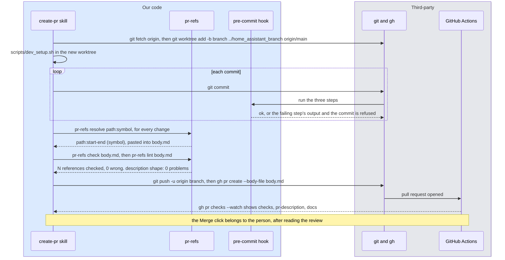

# 9. The development environment and code review
<!-- complexity: packages=3 parts=3 concepts=2 tier=deep -->

Nothing in this part answers a question. It is how the code that does gets built, checked, and merged, so that the Mac in the room runs code that was tested the same way on the laptop and on GitHub. One tool builds the Python environment from a lock file. A git hook refuses a commit that fails formatting, the coding conventions, or the tests. A pull request runs the same checks again on a fresh machine, verifies its own description, and builds this manual. `main` accepts only pull requests that passed, and every merge publishes the manual.

## Where this fits

```mermaid
flowchart LR
--8<-- "_includes/system_map.mmd"
class laptop current
```

The laptop is the only node on the map that is not part of the running system. Code is edited and committed there, pushed to GitHub, checked, and merged; section [10](10_operations.md) then deploys it to the Mac over ssh and rsync, which is the dashed edge. Nothing on the map sends anything to the laptop. Everything in this section happens before that dashed edge is used.

## Key definitions

- **Lock file.** A record of the full resolved dependency graph with hashes, regenerated deterministically from the declared constraints. `uv.lock` is one.
- **Git hook.** A program git runs at a fixed moment, such as just before a commit is recorded. A non-zero exit cancels the commit. This repository keeps its hooks in `.githooks/` so they are versioned with the code.
- **Worktree.** A second checkout of the same repository in its own folder. It shares the history but has its own branch and working files, so a change can start from `origin/main` while other edits stay in progress elsewhere.
- **Line reference.** A citation in a pull request description of the form `` `path:start-end` (`symbol`) `` naming the exact lines a reviewer should open. `pr-refs` produces and verifies them, so none is typed from memory.
- **Branch protection.** A GitHub setting that makes `main` accept only merges of pull requests whose required checks passed and whose review threads are all resolved.

## Packages and tools

| Tool | What it is | How this part uses it |
|---|---|---|
| uv 0.12.10 | One binary, installed with Homebrew, that manages Python interpreters, virtual environments, dependency resolution, and the lock file | Installs Python 3.12.14 into its own folder, builds `.venv/` from `uv.lock`, and runs every Python command through `uv run` so the machine's own Python is never involved |
| `pyproject.toml` and `uv.lock` | The project's declared dependencies and the exact resolved graph | The first lists ten direct dependencies with loose constraints, four dependency groups, nine console scripts, and the black and isort settings; the second pins every package with a hash and is committed |
| black 26.5.1 and isort 9.0.1 | A Python code formatter and an import sorter | `scripts/lint.sh` runs both at line length 200 with the black profile; the hook runs them in check mode |
| shfmt 3.14.0 and shellcheck 0.11.0 | A shell script formatter and a shell script linter | `scripts/lint.sh` formats every `.sh` file and the hooks with four-space indents and lints them; CI installs the same shfmt version |
| pytest 9.1.1 and pytest-asyncio 1.4.0 | The test runner and its asyncio plugin | `uv run pytest -q` runs the 193 tests in `tests/` in about four seconds; `asyncio_mode = "auto"` lets async tests run without a marker |
| git 2.39 and the GitHub CLI `gh` 2.100 | Version control and GitHub from the terminal | Hooks, worktrees, and branches on the laptop; `gh pr create`, `gh pr edit`, and `gh pr checks --watch` for the pull request |
| GitHub Actions | GitHub's hosted runners, driven by YAML workflows in `.github/workflows/` | `checks.yml` runs three jobs on every pull request; `pages.yml` builds and publishes the manual on every push to `main` |
| MkDocs 1.6.1 with Material 9.7.7 | A static site generator for markdown and the theme that gives it navigation, search, and a dark scheme | Turns `operator_manual/` into the site at `https://seanlin2000.github.io/home_assistant/`; `--strict` fails the build on any broken link or missing include |
| Mermaid, mermaid-cli 11.17.0, and Google Chrome | A text language for diagrams, its command-line renderer `mmdc`, and the browser `mmdc` drives | The manual's diagrams are Mermaid text; `manual-check` renders each one through `mmdc` and Chrome to prove it parses |
| Claude Code skills | Markdown procedures in `.claude/skills/` that a Claude Code session loads when you type their slash command | `/create-pr` walks a change from worktree to open pull request; `/operator-manual` writes and checks this manual |

## How it works

### Part 1: One environment, rebuilt from the lock

```mermaid
flowchart TB
--8<-- "_includes/palette.mmd"
setup["scripts/dev_setup.sh"]
uv["uv 0.12.10<br/>from Homebrew"]
pyver[(".python-version<br/>3.12")]
interp["standalone Python 3.12.14<br/>in uv's own folder"]
pyproject[("pyproject.toml<br/>direct dependencies, loose constraints<br/>console scripts, black and isort settings")]
lock[("uv.lock<br/>every package, exact version and hash<br/>committed")]
venv[(".venv/<br/>ignored by git, rebuilt anywhere")]
run["uv run command<br/>always inside .venv"]
setup -- "uv sync --frozen" --> uv
uv -- "reads" --> pyver
pyver -- "selects" --> interp
uv -- "uv lock resolves" --> pyproject
pyproject -- "into" --> lock
lock -- "uv sync installs exactly" --> venv
interp --> venv
run --> venv
class setup,pyver,pyproject,lock ours
class uv,interp,venv,run third
```

A virtual environment is a folder holding one Python interpreter and one set of installed packages, separate from anything else on the machine. This project has exactly one, `.venv/` in the repository folder, and every Python command runs inside it. The command that makes that true is `uv run`: it finds the project, checks that `.venv/` matches the lock, and runs the command with that environment's interpreter. The Python that ships with macOS and any Homebrew Python are never used.

Three files describe the environment. `.python-version` says `3.12`, so uv downloads a standalone interpreter of that version into its own folder and uses it here; `pyproject.toml` restricts it further with `requires-python = ">=3.12,<3.13"`. `pyproject.toml` lists the ten direct dependencies with loose constraints such as `httpx>=0.27`, and four dependency groups: `dev` (black, isort, pytest, pytest-asyncio), `docs` (mkdocs-material), `deploy` (websockets), and `voice` (the Whisper and Kokoro servers, whose MLX wheels exist only for Apple Silicon). `[tool.uv] default-groups` installs all four by default. `uv.lock` is the result of resolving those constraints: every package, direct or transitive, at one exact version with its hash. It is committed and reviewed in diffs like code, because two machines with the same lock and the same interpreter run the same bytes.

`pyproject.toml` also turns nine functions into commands under `[project.scripts]`. `uv run deslop` calls `deslop.cli:main`, `uv run pr-refs` calls `pr_references.cli:main`, `uv run manual-check` calls `manual_checks.cli:main`, and the same table gives the search server, the benchmark, and the Kokoro server their names. Long-running services on the Mac do not go through `uv run`: their launchd plists call `.venv/bin/python` by absolute path, so they run inside the environment without uv on the path at login (section [10](10_operations.md)).

*From `scripts/dev_setup.sh`:*

```bash
if [ "${1:-}" = "--upgrade" ]; then
    uv lock --upgrade
    uv sync
else
    uv sync --frozen
fi

chflags -R nohidden .venv
git config core.hooksPath .githooks
uv run python -c "import assistant_core, benchmark, web_search_mcp; print('environment ready:', __import__('sys').executable)"
```

`scripts/dev_setup.sh` is the one way to create or refresh the environment. `uv sync --frozen` installs exactly what the lock says and fails loudly if the lock no longer matches `pyproject.toml`, instead of silently re-resolving. `--upgrade` is the deliberate path: `uv lock --upgrade` moves every package to the newest version its constraint allows and rewrites the lock, `uv sync` installs it, and the lock diff shows what moved before it is committed. The `chflags` line matters because the repository can live in an iCloud-synced folder, where macOS marks dot-prefixed items hidden, and Python 3.12.14 refuses to load hidden `.pth` files, which would silently drop the project's own packages from the environment. The `git config` line points git at the versioned hooks folder. The last line proves the environment works by importing three of the project's packages and printing the interpreter path.

Not everything is Python. Ollama, Docker Desktop, UTM, Home Assistant OS and its add-ons, mermaid-cli, and uv itself come from Homebrew or from their own installers, and their versions are recorded on the [Versions of record](versions.md) page with the command that checks each one. Models are pinned by Ollama tag and build id in the same table, because a re-pull of the same tag can fetch a different build.

### Part 2: The path a change takes to main

```mermaid
flowchart LR
--8<-- "_includes/palette.mmd"
edit(["edit in a worktree<br/>branched from origin/main"])
commit(["git commit"])
subgraph hook[".githooks/pre-commit, on the laptop"]
  lint["1. scripts/lint.sh -c<br/>black, isort, shfmt, shellcheck"]
  deslopstep["2. uv run deslop"]
  tests["3. uv run pytest -q"]
end
push(["git push, gh pr create"])
subgraph ci[".github/workflows/checks.yml, on GitHub's Ubuntu runners"]
  jchecks["job checks<br/>the same three steps"]
  jdesc["job pr-description<br/>pr-refs check, pr-refs lint"]
  jdocs["job docs<br/>mkdocs build --strict, manual-check"]
end
protect{"branch protection on main<br/>three jobs green,<br/>every review thread resolved"}
merge(["Merge, squash"])
pages["pages.yml<br/>mkdocs build --strict, deploy to GitHub Pages"]
edit --> commit --> lint --> deslopstep --> tests --> push
push --> jchecks --> protect
push --> jdesc --> protect
push --> jdocs --> protect
protect -- "yes" --> merge --> pages
protect -- "no: fix on the branch" --> edit
class lint,deslopstep,tests,jchecks,jdesc,jdocs,pages ours
class protect ext
```

Every change starts on a branch in its own worktree, cut from the latest `origin/main`, and reaches `main` only through a pull request. The same three checks run twice on the way: once on the laptop before the commit exists, and once on GitHub before the merge is allowed.

The first run is the git hook. `scripts/dev_setup.sh` sets `core.hooksPath` to `.githooks/`, so git runs `.githooks/pre-commit` before recording any commit. The hook checks the whole working tree rather than only the staged files, which keeps it identical to CI, and it takes under ten seconds on the laptop. Each step's output is hidden unless it fails, so a passing commit prints three lines: `== pre-commit: formatting check ... ok`, `== pre-commit: deslop ... ok`, `== pre-commit: tests ... ok`. A failing step prints its output and a hint that says what to do, and the commit is refused.

*From `.githooks/pre-commit`, `run_step`:*

```bash
run_step() {
    local title=$1 hint=$2
    shift 2
    printf '== pre-commit: %s ... ' "$title"
    if "$@" >"$LOG" 2>&1; then
        printf 'ok\n'
    else
        printf 'FAILED\n\n'
        cat "$LOG"
        printf '\npre-commit: %s failed. %s\n' "$title" "$hint" >&2
        exit 1
    fi
}

run_step "formatting check" "Run scripts/lint.sh, then git add the reformatted files and commit again." scripts/lint.sh -c
run_step "deslop" "Fix the findings above, or add '# deslop: allow-comments' to a function whose comment earns its length, and commit again." uv run deslop
run_step "tests" "Fix the failing tests and commit again." uv run pytest -q
```

`git commit --no-verify` skips the hook. `CLAUDE.md` forbids it, and the second run catches it anyway. `checks.yml` runs on every pull request against `main` when it is opened, pushed to, reopened, edited, or marked ready for review, and again on every push to `main`. Each job starts on a fresh Ubuntu machine, checks out the code, installs uv, and runs `uv sync --frozen --no-group voice`, leaving out the group whose wheels need Apple Silicon. The `checks` job installs shellcheck from apt and shfmt 3.14.0 from its release binary, then runs `scripts/lint.sh -c`, `uv run deslop`, and `uv run pytest -q`. The `pr-description` job checks out the pull request's head commit, writes the pull request body to a file, and runs `uv run pr-refs check` and `uv run pr-refs lint` on it (Part 4). The `docs` job installs Node 22 and mermaid-cli 11.17.0, runs `uv run mkdocs build --strict`, then `uv run manual-check --no-sandbox` (Part 5).

Branch protection on `main` requires a pull request, all three jobs green, and every review thread resolved, with no bypass for administrators. No approving review is required, because GitHub never lets an author approve their own pull request and this is a one-person repository, so a required approval would block every merge. The human step is the Merge click, which squashes the branch into one commit on `main`. That push triggers `pages.yml`, which builds the manual again with `uv run mkdocs build --strict`, uploads the `site/` folder, and deploys it to GitHub Pages. Its `concurrency` group cancels an older deploy when a newer one starts.

### Part 3: The three checkers, and what deslop reads

```mermaid
flowchart TB
--8<-- "_includes/palette.mmd"
subgraph manualbox["manual-check: uv run manual-check"]
  pages[("operator_manual/*.md<br/>and _includes/")]
  struct["headings, complexity comment,<br/>map include, palette, glossary"]
  mmdc["mmdc, mermaid-cli 11.17.0"]
  chrome["headless Google Chrome<br/>draws each diagram"]
  pages --> struct
  pages --> mmdc --> chrome
end
subgraph refsbox["pr-refs: uv run pr-refs check, lint"]
  body[("the PR body, body.md")]
  code[("the checked-out code")]
  compare["each reference against the<br/>definition span or the quoted text"]
  shape["required sections<br/>bullet shape"]
  body --> compare
  code --> compare
  body --> shape
end
subgraph deslopbox["deslop: uv run deslop"]
  pyfiles[("every .py file<br/>outside .venv, .git, vm, __pycache__")]
  astree["ast.parse<br/>functions, parameters, annotations"]
  tokens["tokenize<br/>comment lines, allow-comments markers"]
  rules["typed parameters<br/>comments never outnumber code"]
  pyfiles --> astree --> rules
  pyfiles --> tokens --> rules
end
class pyfiles,astree,tokens,rules,body,code,compare,shape,pages,struct ours
class mmdc,chrome third
```

Three small packages in this repository do the checking that no off-the-shelf tool does. Each prints findings as `path:line: message`, prints nothing when clean, and exits 1 when there is any finding, so the hook and CI treat them alike. `deslop` reads Python source. `pr-refs` reads a pull request description and the code it cites. `manual-check` reads this manual and drives a browser. This part covers `deslop`; the next two cover the others.

`deslop` enforces the two rules in `claude_docs/CLEAN_CODE.md` that a script can judge without taste. The first: every function parameter has a type annotation, including `*args`, `**kwargs`, keyword-only, and positional-only parameters. The only exceptions are `self` and `cls` as the first parameter of a method inside a class. The second: within one function, the comment lines, docstring included, never outnumber the code lines. It walks every `.py` file under the given paths, skipping `.venv`, `.git`, `vm`, and `__pycache__`, parses each into an abstract syntax tree to find the functions and their parameters, and separately runs Python's tokenizer to find comment lines, so a `#` inside a string is never counted as a comment.

*From `deslop/checks.py`, `count_lines`:*

```python
def count_lines(node: FunctionNode, source: ParsedSource) -> tuple[int, int]:
    docstring = docstring_lines(node)
    nested = nested_function_lines(node)
    comment_count = len(docstring)
    code_count = 0
    for line in range(node.lineno + 1, (node.end_lineno or node.lineno) + 1):
        if line in docstring or line in nested:
            continue
        if line in source.comment_lines:
            comment_count += 1
        elif line >= node.body[0].lineno and source.lines[line - 1].strip():
            code_count += 1
    return comment_count, code_count
```

Lines that belong to a nested function are left out of the outer function's count, so each function is judged on its own. When a short function carries a long comment that earns its place, the marker `# deslop: allow-comments` on the `def` line, the line above it, or the line above its first decorator exempts that one function from the ratio rule and leaves the exception visible in review. The finding for the other rule reads `path:line: name: parameter 'x' has no type annotation`, and the hook's hint tells you to fix it or add the marker.

### Part 4: The pull request description and the create-pr skill



A pull request description has a fixed shape, set by `.github/pull_request_template.md`. It opens with `## Summary`, two to five sentences on what and why. Then one `## <Change>` section per important change, each made of bullets. Every bullet has three parts in one order: the line references a reviewer should open, a short bold phrase naming the change and ending in a period, and one or two sentences of business logic. The reference comes first so a reviewer can open the code before reading the claim about it. `## How to verify` holds the commands in a fenced block, and `## Review notes` says where to focus and what to skip.

Line references are never typed. `uv run pr-refs resolve deslop/checks.py:count_lines` parses the file, finds the definition, and prints `` `deslop/checks.py:115-127` (`count_lines`) ``, the span including any decorators. A dotted name reaches a method, `pr_references/references.py:SymbolAnchor.span`. For shell, YAML, and markdown files, which have no symbols, a quoted text anchor such as `.githooks/pre-commit:"uv run deslop"` prints the first line containing that text through the end of its indented block, `` `.githooks/pre-commit:27-27` ("uv run deslop") ``. The printed form is pasted unchanged.

Two commands verify the file before its body is used. `uv run pr-refs check body.md` finds every reference by its pattern, ignores HTML comments, and re-resolves each against the checked-out code: a symbol reference must match the definition's exact span, and a text reference must have its quoted text on one of the cited lines. It prints a warning for any change section that cites no code, one line per wrong reference, and a summary such as `2 references checked, 0 wrong`. `uv run pr-refs lint body.md` checks the shape instead: the three required sections exist, every change section has bullets, and every bullet matches reference, bold phrase, description. It ends with `description shape: 0 problems`. The `pr-description` CI job runs both on the pull request body at every push, so a reference that goes stale after a later commit blocks the merge until it is resolved again.

The `/create-pr` skill is the procedure that puts these pieces in order. A Claude Code skill is a markdown file that a session loads when you type its slash command; `.claude/skills/create-pr/SKILL.md` is checked in, so every session follows the same steps. It finds out where the work stands, starts the branch in its own worktree from `origin/main` and runs `scripts/dev_setup.sh` there so the hook can run, commits through the hook, writes the description outside the tree with references from `pr-refs resolve`, runs `check` and `lint`, offers to add an entry to the manual's [Current working changes](current_changes.md) page, pushes, opens or edits the pull request with `gh`, and waits with `gh pr checks --watch`. It reports the URL and the CI result and leaves the Merge click to you.

### Part 5: The manual, its build, and its checks

```mermaid
flowchart LR
--8<-- "_includes/palette.mmd"
md[("operator_manual/*.md<br/>Mermaid in fences, includes from _includes/")]
cfg[("mkdocs.yml<br/>nav, snippets, superfences, strict validation")]
mk["mkdocs build --strict<br/>Material 9.7.7"]
site[("site/<br/>plain HTML, ignored by git")]
serve["mkdocs serve<br/>127.0.0.1:8000, rebuilds on save"]
pagesjob["pages.yml<br/>on every push to main"]
ghp>"GitHub Pages<br/>seanlin2000.github.io/home_assistant"]
browser["the reader's browser<br/>draws each Mermaid block"]
md --> mk
cfg --> mk
mk --> site --> pagesjob --> ghp --> browser
md --> serve
class md,cfg,pagesjob ours
class mk,site,serve,browser third
class ghp ext
```

MkDocs is a static site generator: it reads a folder of markdown files and one `mkdocs.yml`, and writes plain HTML that any web server can host. Material is the theme that adds the sidebar, the page outline, search, and the light and dark schemes. Both are Python packages in the `docs` dependency group, so they are pinned in `uv.lock` like everything else. `mkdocs.yml` names `operator_manual/` as the source, lists every page in `nav`, and turns on two extensions this manual depends on. `pymdownx.snippets` expands a line such as `--8<-- "_includes/system_map.mmd"` into the file's contents, with `check_paths: true` so a missing include is an error. `pymdownx.superfences` turns a ```` ```mermaid ```` fence into a block that Material's bundled Mermaid draws in the reader's browser, so the diagram lives in the markdown as text and is reviewed and diffed as text. The `validation` block makes every broken link, missing anchor, and page absent from `nav` a warning, and `--strict` turns any warning into a failed build.

A browser draws Mermaid, so nothing in Python can tell whether a diagram parses. `manual-check` closes that gap. It finds every Mermaid block in every page, expands the includes, and renders each block through `mmdc`, the command-line renderer from mermaid-cli, which starts a headless Google Chrome and draws the diagram to an SVG. Four render in parallel by default, about three seconds each. A failure is reported as `path:line: Parse error on line N` at the line in the markdown, mapped back through the include so an error inside `system_map.mmd` points at the include line. On this Mac it finds Chrome in `/Applications`; `PUPPETEER_EXECUTABLE_PATH` names another browser, and `--no-sandbox` is what GitHub's Ubuntu runners need.

The same command checks structure. Each page is matched to a profile by its filename: a numbered section must have the seven `##` headings in order, a complexity comment whose tier matches its score, and a "Where this fits" block that includes the system map and highlights something; the Introduction and the Current working changes page have profiles of their own. Every `classDef` must equal a line of the palette, every class name must be one of its five, and every term under "Key definitions" must exist in `glossary.md`. `--no-render` runs only these checks. The test suite includes `test_the_real_manual_structure_is_clean`, which runs the structure check on the real manual, so the pre-commit hook covers structure on every commit; the `docs` CI job renders everything. The `/operator-manual` skill holds the procedure for writing a page, the page profiles, the diagram style, the system map with each page's highlights, and the complexity rubric that sets a page's length.

## Run it yourself

Everything here runs on the laptop from the repository folder. Build the environment first. The Homebrew line is needed once per machine:

```bash
brew install uv shfmt shellcheck gh mermaid-cli
uv python install 3.12
scripts/dev_setup.sh
```

You should see uv resolve and install the locked packages, then `environment ready: /Users/<you>/code/home_assistant/.venv/bin/python`. Now run the three checks the hook runs:

```bash
uv run pytest -q
scripts/lint.sh -c
uv run deslop; echo "exit $?"
```

The tests print rows of dots and end with `193 passed in 3.72s`, give or take a second. The formatting check ends with a black line such as `90 files would be left unchanged.` and isort's `Skipped 1 files`; shfmt and shellcheck print nothing when the shell scripts are clean. Without `-c`, `scripts/lint.sh` rewrites files in place. `deslop` prints nothing and exits 0 on the clean tree. To watch it find something, give it a file with an untyped parameter:

```bash
printf 'def double(x):\n    return 2 * x\n' > /tmp/untyped.py
uv run deslop /tmp/untyped.py
```

It prints `/tmp/untyped.py:1: double: parameter 'x' has no type annotation` and exits 1.

Next, the pull request tools. Resolve two references, one to a function and one to a line of shell:

```bash
uv run pr-refs resolve deslop/checks.py:count_lines '.githooks/pre-commit:"uv run deslop"'
```

You should see `` `deslop/checks.py:115-127` (`count_lines`) `` and `` `.githooks/pre-commit:27-27` ("uv run deslop") ``. Paste them into a description written outside the tree and verify it:

````bash
cat > /tmp/body.md <<'BODY'
## Summary

Exercise the description checks.

## Comment counting

- `deslop/checks.py:115-127` (`count_lines`) **Nested functions are excluded.** Each function is judged on its own lines.

## How to verify

```
uv run pytest -q
```

## Review notes

None.
BODY
uv run pr-refs check /tmp/body.md
uv run pr-refs lint /tmp/body.md
````

`check` prints `1 references checked, 0 wrong`; `lint` prints `description shape: 0 problems`. Change `115-127` to `115-126` and run `check` again to see the finding `` `count_lines` actually spans lines 115-127 ``.

Now the manual. Check this page's structure, then render its diagrams, then read the book in a browser:

```bash
uv run manual-check --no-render operator_manual/09_dev_environment.md
uv run manual-check operator_manual/09_dev_environment.md
uv run mkdocs serve
```

The first two print nothing when the page is clean; the second takes a few seconds for this page's six diagrams. `mkdocs serve` prints `Serving on http://127.0.0.1:8000/home_assistant/` and rebuilds whenever a file under `operator_manual/` is saved. Open that address, and press Ctrl-C to stop the server. `uv run mkdocs build --strict` builds once into `site/` and ends with `Documentation built in 0.36 seconds`, or with `Aborted with N warnings in strict mode!` and the offending links.

To upgrade dependencies on purpose:

```bash
scripts/dev_setup.sh --upgrade
git diff --stat uv.lock
uv run pytest -q
```

The lock diff shows every package that moved. If the tests fail or the move is unwanted, `git checkout uv.lock && scripts/dev_setup.sh` puts the environment back.

Finally, ship a change the repository's way, which is what `/create-pr` does for you. Replace `my-change` with a short kebab-case name:

```bash
git fetch origin
git worktree add -b my-change ../home_assistant_my-change origin/main
cd ../home_assistant_my-change
scripts/dev_setup.sh
```

Edit, then `git commit`. You should see the three `== pre-commit:` lines end in `ok`, or one end in `FAILED` followed by its output and a hint. Then:

```bash
git push -u origin my-change
gh pr create --base main --head my-change --title "Summary line" --body-file /tmp/body.md
gh pr checks --watch
```

`gh pr checks --watch` prints one row per job, `checks`, `pr-description`, and `docs`, refreshes every ten seconds, and exits when all three have finished. Ctrl-C stops watching without affecting the jobs. After the Merge click, `git worktree remove ../home_assistant_my-change` deletes the folder.

## Where to look in the code

| Path | What you find there |
|---|---|
| [`pyproject.toml`](https://github.com/seanlin2000/home_assistant/blob/main/pyproject.toml) | The direct dependencies, the four dependency groups, the nine console scripts, the packages built into the wheel, and the black, isort, uv, and pytest settings |
| [`uv.lock`](https://github.com/seanlin2000/home_assistant/blob/main/uv.lock) | Every package at its exact version with hashes; `docs/VERSIONS.md` quotes the notable ones |
| [`scripts/dev_setup.sh`](https://github.com/seanlin2000/home_assistant/blob/main/scripts/dev_setup.sh) | The frozen sync, the `--upgrade` path, the hidden-flag fix, the hook installation, and the import check |
| [`scripts/lint.sh`](https://github.com/seanlin2000/home_assistant/blob/main/scripts/lint.sh) | black, isort, shfmt, and shellcheck with their options, and the `-c` check mode the hook uses |
| [`.githooks/pre-commit`](https://github.com/seanlin2000/home_assistant/blob/main/.githooks/pre-commit) | `run_step` and the three steps, each with the hint printed on failure |
| [`deslop/checks.py`](https://github.com/seanlin2000/home_assistant/blob/main/deslop/checks.py) | `check_source`, `unannotated_parameters`, `implicit_receiver`, `count_lines`, `is_exempt`, and the `ALLOW_COMMENTS_MARKER` constant |
| [`deslop/cli.py`](https://github.com/seanlin2000/home_assistant/blob/main/deslop/cli.py) | The file walk with `EXCLUDED_DIRS`, the sorted findings, and `format_finding`, which `manual-check` reuses |
| [`pr_references/references.py`](https://github.com/seanlin2000/home_assistant/blob/main/pr_references/references.py) | `SymbolAnchor`, `TextAnchor`, `Reference`, the two reference patterns, `find_definition`, and `indented_block_end` |
| [`pr_references/lint.py`](https://github.com/seanlin2000/home_assistant/blob/main/pr_references/lint.py) | `WELL_FORMED_BULLET`, `REQUIRED_SECTIONS`, and `change_sections` |
| [`pr_references/cli.py`](https://github.com/seanlin2000/home_assistant/blob/main/pr_references/cli.py) | The `resolve`, `check`, and `lint` subcommands and their summary lines |
| [`manual_checks/cli.py`](https://github.com/seanlin2000/home_assistant/blob/main/manual_checks/cli.py) | `check`, the `--root`, `--no-render`, `--no-sandbox`, and `--jobs` flags, and the page loader |
| [`manual_checks/headings.py`](https://github.com/seanlin2000/home_assistant/blob/main/manual_checks/headings.py) | The three profiles, `COMPLEXITY` and `TIERS`, the map and palette checks, and the glossary check |
| [`manual_checks/render.py`](https://github.com/seanlin2000/home_assistant/blob/main/manual_checks/render.py) | `find_mmdc`, `find_browser`, `write_puppeteer_config`, `render_source`, and the parse-error mapping |
| [`manual_checks/blocks.py`](https://github.com/seanlin2000/home_assistant/blob/main/manual_checks/blocks.py) | Fence scanning, `--8<--` snippet expansion, and the file-line mapping behind every finding |
| [`.github/workflows/checks.yml`](https://github.com/seanlin2000/home_assistant/blob/main/.github/workflows/checks.yml) | The `checks`, `pr-description`, and `docs` jobs |
| [`.github/workflows/pages.yml`](https://github.com/seanlin2000/home_assistant/blob/main/.github/workflows/pages.yml) | The build and deploy jobs that publish the manual on every push to `main` |
| [`.github/pull_request_template.md`](https://github.com/seanlin2000/home_assistant/blob/main/.github/pull_request_template.md) | The description's shape, with the bullet form and the `pr-refs` commands in its comments |
| [`.claude/skills/create-pr/SKILL.md`](https://github.com/seanlin2000/home_assistant/blob/main/.claude/skills/create-pr/SKILL.md) | The six steps from worktree to open pull request |
| [`.claude/skills/operator-manual/SKILL.md`](https://github.com/seanlin2000/home_assistant/blob/main/.claude/skills/operator-manual/SKILL.md) | The modes for writing and checking this manual, with the profiles, diagram style, system map, and rubric under `references/` |
| [`mkdocs.yml`](https://github.com/seanlin2000/home_assistant/blob/main/mkdocs.yml) | The Material theme, the snippets and superfences extensions, the strict validation rules, and the `nav` |
| [`CLAUDE.md`](https://github.com/seanlin2000/home_assistant/blob/main/CLAUDE.md) and [`claude_docs/CLEAN_CODE.md`](https://github.com/seanlin2000/home_assistant/blob/main/claude_docs/CLEAN_CODE.md) | The rules the hook and `deslop` enforce: the virtual environment, the branch-and-pull-request path, typed parameters, and comments that explain why |
| [`tests/test_deslop.py`](https://github.com/seanlin2000/home_assistant/blob/main/tests/test_deslop.py), [`tests/test_pr_references.py`](https://github.com/seanlin2000/home_assistant/blob/main/tests/test_pr_references.py), [`tests/test_manual_checks.py`](https://github.com/seanlin2000/home_assistant/blob/main/tests/test_manual_checks.py) | The tests for the three checkers, including the one that checks the real manual's structure on every commit |

## Further reading

- Design doc: [`design_docs/v1/09_dev_environment.md`](https://github.com/seanlin2000/home_assistant/blob/main/design_docs/v1/09_dev_environment.md), whose sections 12 and 13 cover the review process and the manual tooling
- [uv documentation](https://docs.astral.sh/uv/), for the commands behind `dev_setup.sh` and the `uv run` guarantee
- [uv lock and sync semantics](https://docs.astral.sh/uv/concepts/projects/sync/), for what `--frozen` checks and when a lock is stale
- [git hooks](https://git-scm.com/docs/githooks), for the moments git runs a hook and how the exit code is read
- [GitHub branch protection](https://docs.github.com/en/repositories/configuring-branches-and-merges-in-your-repository/managing-protected-branches/about-protected-branches), for the settings behind the Merge button
- [Python `ast`](https://docs.python.org/3/library/ast.html) and [Python `tokenize`](https://docs.python.org/3/library/tokenize.html), the two standard modules `deslop` reads source with
- [MkDocs](https://www.mkdocs.org/) and [Material for MkDocs diagrams](https://squidfunk.github.io/mkdocs-material/reference/diagrams/), for how the site is built and how Mermaid fences are drawn
- [Mermaid](https://mermaid.js.org/) and [mermaid-cli](https://github.com/mermaid-js/mermaid-cli), for the diagram syntax and the renderer `manual-check` drives
- [GitHub Pages with Actions](https://docs.github.com/en/pages/getting-started-with-github-pages/configuring-a-publishing-source-for-your-github-pages-site), for what `pages.yml` does on every merge
