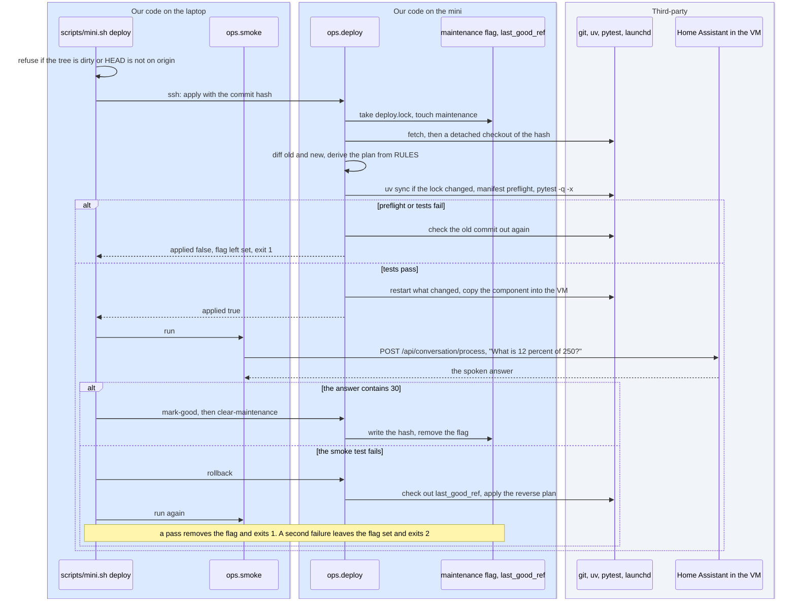

# 10. Operating the headless Mac mini
<!-- complexity: packages=3 parts=3 concepts=3 tier=deep -->

This part keeps the assistant answering when nobody is sitting at the Mac. The laptop is where people and Claude work; the Mac mini is a box on a shelf with no screen. Everything in this section runs from the laptop over SSH: the first-time setup, moving new code onto the mini, watching that every service is alive, restarting what has died, and pulling every log back to the laptop where it can be read. The mini never reaches out to the laptop. The mini does not exist yet, so the tooling is exercised on the laptop, which plays both roles, with a second clone of the repository standing in for the mini.

## Where this fits

```mermaid
flowchart TB
--8<-- "_includes/system_map.mmd"
class laptop,health current
style native stroke:#f59e0b,stroke-width:4px
```

Three things are lit up. The laptop, in the top row beside the puck, is the only place an operation starts: it sends SSH commands, `rsync` copies, and deploys down into the Mac. The orange row, the native macOS services that launchd keeps alive, is what is operated: every process in it, together with the Home Assistant VM in the row above and Docker in the row below, is written to by one of the tools here or restarted by one of them. The health check, inside that orange row, is the one part of this section that runs on its own: launchd starts it every five minutes, it probes the VM and its neighbours, restarts what the policy allows, and writes a snapshot to disk. What leaves the Mac is a directory of log files, mirrored up to the laptop when the laptop asks.

## Key definitions

- **launchd.** macOS's service manager. A plist file describes a program to run at login and keep alive, or to run every N seconds. The equivalent of systemd on Linux.
- **KeepAlive and StartInterval.** Two launchd settings. `KeepAlive` means "this program should always be running; restart it if it exits", right for a server. `StartInterval` means "run this program every N seconds and let it exit", right for a check.
- **Kickstart.** `launchctl kickstart -k` restarts one launchd agent by name: it kills the running program and launchd starts it again at once. It is how the health check and the deploy restart a service.
- **SSH key.** A secret file on the laptop and a matching public file on the Mac mini. The mini checks that the laptop holds the secret without the secret crossing the network.
- **rsync.** A copy tool that compares source and destination and sends only the differences. Over SSH it is the standard way to mirror a folder between two machines.
- **Idempotent.** Safe to run again: every step checks whether it is already done before doing it, so a script that fails halfway is simply rerun. The bootstrap is written this way.
- **Detached checkout.** Checking out a specific commit hash rather than a branch, so what is running is unambiguous and rolling back means checking out an older hash.
- **Deploy plan.** The list of restarts derived from the paths that changed between the running commit and the new one, in a fixed order, so a documentation change restarts nothing and a lock file change restarts every Python service.
- **Smoke test.** The smallest end-to-end exercise that proves the system is alive: one question through the same path a spoken question takes.
- **Last good commit.** The commit hash that most recently passed the smoke test, written to the file `last_good_ref` on the mini. Rollback checks it out again.
- **Maintenance flag.** A file the deploy creates before it changes anything and removes when the smoke test passes. While it exists the health check records but takes no action.
- **Health snapshot.** One health check's result: the outcome of every probe, the memory figures, and the actions taken, written to `health.json` and appended to `health.jsonl`.
- **Cooldown.** The minimum time between two automatic runs of the same action on the same target, so a broken service is restarted a few times a day rather than every five minutes.
- **Turn record.** The trimmed copy of a transcript the component posts to the tool server's `/turns` route after each answer: the question, the answer, the route, the tool calls with their timings, and the failure flags, without the page text.
- **JSON Lines.** A text file with one JSON object per line. Appending a record is one write and reading a day is a loop over lines. The turn records, the health history, and the pipeline runs use it.
- **Append mode.** Opening a file so that every write lands at its current end. A log opened this way can be truncated underneath the writer safely, but not renamed.
- **FileVault.** macOS disk encryption. It asks for a password before the operating system starts, so a headless machine must have it off to reboot unattended.

## Packages and tools

| Tool | What it is | How this part uses it |
|---|---|---|
| `ops` package (ours) | Seven Python modules under `ops/` | `health` holds the probes, the policy, and the housekeeping; `deploy` the plan, the apply, and the rollback; `smoke` the one-question test; `pipeline_runs` the pull of Home Assistant's debug runs; `report` the summary of a log directory; `paths` the one list of where files live; `ha_client` the Home Assistant REST and websocket calls the other five share |
| `scripts/mini.sh`, `scripts/bootstrap_mac.sh`, `scripts/services.sh` (ours) | Three shell scripts | `mini.sh` is the laptop side of every operation and the only script that knows the mini's address. `bootstrap_mac.sh` is copied to the mini and run there once. `services.sh` writes and controls the five launchd agents on whichever Mac it runs on |
| launchd and `launchctl` | macOS's service manager and its command line | Four agents with `KeepAlive` run Ollama, the tool server, Whisper, and Kokoro; a fifth with `StartInterval` 300 runs the health check. `launchctl kickstart -k` restarts one by name, `bootout` unloads one, `print` tells the health check whether one is loaded at all |
| OpenSSH: `ssh`, `scp`, `ssh-copy-id`, `sshd` | The remote shell and its server, built into macOS | Every command on the mini travels over `ssh` with `BatchMode=yes`, so a missing key fails instead of prompting. The bootstrap writes an `sshd` drop-in that turns passwords off |
| rsync 3.x from Homebrew | The copy tool; macOS ships an older `openrsync` without the flags used here | Pulls the mini's log directory into `logs/mini/`, pushes the model's blobs, and pushes the VM folder. Interrupted copies resume |
| git | Version control | The mini holds a detached checkout of one commit. A deploy is `git fetch` then `git checkout --detach SHA`; rollback is the same with the last good hash. The mini never commits or pushes |
| `utmctl` (UTM 4.7.5) | UTM's command line | The health check reads `utmctl status "Home Assistant"` and runs `utmctl start` or `stop`. Section [6](06_home_assistant_core.md) covers the VM itself |
| `httpx` 0.28.1, `websockets` 17.1, `pydantic` 2.13.5 | An async HTTP client, a websocket client, and typed models, all from `uv.lock` | The probes, the turn record post, and the conversation call are `httpx` requests; the pipeline runs come over a websocket; every record and snapshot is a pydantic model that serialises to one JSON line |
| `packaging` and `tomllib` | A requirement-specifier parser and the standard library's TOML reader | The deploy's preflight parses `custom_components/studio_assistant/manifest.json` and `uv.lock` and refuses to go live if the component asks Home Assistant for a version the lock does not hold |
| Homebrew and `brew bundle` with the `Brewfile` | macOS's package manager and its "install this list" command | The bootstrap installs git, uv, ollama, espeak-ng, rsync, shellcheck, shfmt, mermaid-cli, Docker Desktop, and UTM from one file in the repository |
| `pmset`, `socketfilterfw`, `dseditgroup` | Apple's command lines for power, the application firewall, and group membership | The bootstrap's `sudo` steps: never sleep and restart after a power failure; firewall on with Ollama, the virtual environment's Python, Docker, and UTM allowed through; Remote Login restricted to the one user |

## How it works

### Part 1: Bootstrap, and the three things git cannot carry

```mermaid
flowchart TB
--8<-- "_includes/palette.mmd"
subgraph laptop["On the laptop: what is sent"]
  script["scripts/bootstrap_mac.sh<br/>and the Brewfile"]
  env[(".env<br/>addresses and secrets")]
  models[("~/.ollama/models<br/>blobs named by digest")]
  bundle[("Home Assistant.utm<br/>the whole configured VM")]
end
subgraph commands["scripts/mini.sh, one command each, over SSH"]
  cmdboot["bootstrap<br/>scp the script and the Brewfile,<br/>then run it over ssh -t"]
  cmdenv["push-env<br/>scp, chmod 600"]
  cmdmodels["push-models<br/>rsync exactly the blobs<br/>the manifest names"]
  cmdvm["push-vm<br/>rsync, refused while<br/>the local VM runs"]
end
subgraph mac["On the Mac mini afterwards"]
  checkout["MINI_PROJECT_DIR: detached checkout,<br/>.venv, five launchd agents, SearXNG up,<br/>pmset, firewall, sshd drop-in"]
  store[("~/.ollama/models")]
  utm["UTM: the VM with 3 GB,<br/>bridged, same MAC address"]
end
script --> cmdboot --> checkout
env --> cmdenv --> checkout
models --> cmdmodels --> store
bundle --> cmdvm --> utm
class script,env,cmdboot,cmdenv,cmdmodels,cmdvm,checkout ours
class models,bundle,store,utm third
```

A Mac out of the box has no user account, and the wizard that creates one runs only on a physical display. So the mini is plugged into a TV for ten minutes: create the account, join the Wi-Fi, and turn on Remote Login and, for now, Screen Sharing under System Settings, General, Sharing. Then `ssh-copy-id` from the laptop installs the laptop's public key, and the TV is unplugged.

`scripts/mini.sh bootstrap` does the rest. It copies `scripts/bootstrap_mac.sh` and the `Brewfile` to the mini and runs the script there in an interactive session, because the `sudo` steps ask for the account password once. The script is idempotent and runs in order: the Xcode command line tools (it stops and asks you to approve the dialog if they are missing), Homebrew and `brew bundle`, `uv python install 3.12`, a clone at `MINI_PROJECT_DIR` checked out detached at `origin/main`, `scripts/dev_setup.sh`, the log directory, Docker Desktop and `scripts/searxng.sh up`, `scripts/services.sh install` for the five launchd agents, and Docker and UTM as login items so they return after a power cut. Section [8](08_hardware_and_deployment.md) covers those agents and the memory budget; section [9](09_dev_environment.md) covers the environment `dev_setup.sh` builds.

The `sudo` steps come last, and `--skip-system` leaves them out for a rehearsal on the laptop. `pmset` sets never sleep, restart after a power failure, and wake on network. The application firewall is turned on with the four programs that listen on the LAN allowed through it, because a headless machine cannot answer the per-application dialog. `dseditgroup` restricts Remote Login to the one account. The SSH drop-in, `/etc/ssh/sshd_config.d/010-studio-assistant.conf`, turns off password login and forbids root; it is written only when a public key is installed and the session came in over SSH, and kept only if `sshd -t` accepts it, so the script can never lock out its own operator. The script ends with a printed checklist of what only a person at the GUI can finish: automatic login, which needs FileVault off; the first-launch approvals of Docker and UTM; DHCP reservations for the mini and the VM; the HDMI dummy plug; automatic updates off.

Three things are deliberately not in the repository, and `mini.sh` has a push command for each. `push-env` copies `.env` and sets its mode to 600. `push-models` reads the manifest of `MINI_MODEL` (default `gemma4:e4b-it-qat`) under `~/.ollama/models/manifests/` and copies exactly the blobs it names, so the mini runs the same bytes the benchmark scored; `push-models --pull` has the mini pull the tag instead. `push-vm` copies the UTM folder `~/Library/Containers/com.utmapp.UTM/Data/Documents/Home Assistant.utm`, which carries the whole configured Home Assistant, add-ons and all; it refuses while the laptop's VM is running, because a copy of a running disk is corrupt and two VMs with the same network identity cannot coexist. The terminal running it needs Full Disk Access, because the folder is inside an app sandbox. On the mini the VM is started with 3 GB (`HAOS_VM_MEMORY_MB=3072`) rather than the laptop's 4 GB.

### Part 2: Deploy, smoke test, and rollback



Pushing to GitHub changes nothing on the mini. Going live is a separate act, `scripts/mini.sh deploy`, and it refuses to start for two reasons: the laptop's working tree has uncommitted changes (pass `--ref` to deploy a specific commit anyway), or the commit is not on any `origin` branch, because the mini can only fetch what the remote has.

On the mini, `python -m ops.deploy apply --ref SHA` takes an exclusive lock on `deploy.lock`, so two deploys cannot overlap, and creates the maintenance flag so the health check stands down. It fetches, checks out the exact commit, and diffs the old commit against the new one. The list of changed paths goes through a rules table and comes out as a plan.

*From `ops/deploy.py`, `RULES`:*

```python
RULES: tuple[Rule, ...] = (
    Rule(
        prefixes=("uv.lock", "pyproject.toml"),
        actions=("sync_env", "restart:mcp", "restart:whisper", "restart:kokoro"),
        why="dependencies changed: sync the venv and restart every long-running Python service",
    ),
    Rule(prefixes=("web_search_mcp/", "calculator_mcp/", "assistant_core/", "utils/"), actions=("restart:mcp",), why="tool server code changed"),
    Rule(prefixes=("custom_components/", "assistant_core/"), actions=("deploy_component",), why="the component or its vendored core changed"),
    Rule(prefixes=("voice/",), actions=("restart:kokoro",), why="Kokoro server wrapper changed"),
    Rule(prefixes=("scripts/services.sh",), actions=("reinstall_agents",), why="launchd definitions changed"),
    Rule(prefixes=("docker/searxng/",), actions=("restart_searxng",), why="SearXNG configuration changed"),
)
ACTION_ORDER = ("sync_env", "reinstall_agents", "restart:mcp", "restart:kokoro", "restart:whisper", "restart_searxng", "deploy_component")
```

A change under `ops/`, `tests/`, `benchmark/`, or the docs produces an empty plan, because the health check is a fresh process every five minutes and picks up new code by itself. A change to `scripts/services.sh` replaces the individual restarts with one `reinstall_agents`. The plan records which changed path asked for each action, and `--dry-run` prints it without touching anything.

Before anything restarts, the deploy runs three checks: `scripts/dev_setup.sh` if the lock file changed, the preflight that compares the component's `manifest.json` against `uv.lock`, and `pytest -q -x` with a fifteen-minute limit. If any fails, the checkout goes back to the old commit, the environment is synced back if it had changed, nothing is restarted, and the maintenance flag stays up so the laptop's command reports it. Otherwise the actions run in `ACTION_ORDER`, each a subprocess: `services.sh restart NAME`, `services.sh install`, `searxng.sh restart`, or `scripts/deploy_component.py`, which copies the component into the VM over the Samba share and restarts Home Assistant (section [6](06_home_assistant_core.md)).

Back on the laptop, `python -m ops.smoke` waits up to 300 seconds for Home Assistant's `/api/` to answer 200 with the token, then asks `conversation.studio_assistant` "What is 12 percent of 250?" through `POST /api/conversation/process`, the same REST call the Assist pipeline makes. The answer must contain `30` or `thirty` within 60 seconds. That one call exercises Home Assistant, the component, Ollama, and the tool server without touching the web; `--full` (`mini.sh deploy --full-smoke`) adds one searched question. On a pass the laptop tells the mini `mark-good SHA` and `clear-maintenance`. On a failure it tells the mini `rollback`, which checks out `last_good_ref` and applies the reverse plan with the tests skipped, then runs the smoke test again. A pass there clears the flag and the command exits 1 with the failure printed. A second failure leaves the flag, keeps self-healing off, and exits 2, because a person should look before the machine restarts anything.

### Part 3: What the health check decides

```mermaid
flowchart TB
--8<-- "_includes/palette.mmd"
tick(["launchd runs scripts/health_check.py<br/>every 300 s"])
probe["probe every service in parallel,<br/>5 s timeout each"]
counts["count consecutive failures,<br/>carried in health_state.json"]
flag{"maintenance flag present?"}
agent{"a service failed 2 in a row,<br/>no kick of it in 30 min?"}
kick["launchctl kickstart -k that agent"]
sx{"SearXNG failed 2 in a row,<br/>none in 30 min?"}
sxup["scripts/searxng.sh up"]
vm{"utmctl says the VM is stopped?"}
vmstart["utmctl start,<br/>at most once per 30 min"]
ha{"Home Assistant failed<br/>5 in a row, no VM<br/>restart in 2 h?"}
vmrestart["utmctl stop, wait 10 s,<br/>utmctl start"]
hold["record the snapshot,<br/>take no action"]
snap[("health.json: the latest<br/>health.jsonl: every snapshot")]
tick --> probe --> counts --> flag
flag -- "yes" --> hold
flag -- "no" --> agent
agent -- "yes" --> kick --> sx
agent -- "no" --> sx
sx -- "yes" --> sxup --> vm
sx -- "no" --> vm
vm -- "yes" --> vmstart --> snap
vm -- "no, it is started" --> ha
ha -- "yes" --> vmrestart --> snap
ha -- "no" --> snap
class tick,probe,counts,kick,sxup,vmstart,vmrestart,hold,snap ours
```

The fifth launchd agent runs `scripts/health_check.py` every 300 seconds. Each run probes every part of the stack the cheapest way that proves the part is really ours. Ollama answers `/api/version` on 11434. The tool server answers `/healthz` on 8765, and the check fails unless the reply lists every tool name in `REQUIRED_TOOL_NAMES`. Whisper on 10300 and Kokoro on 10210 are TCP connects. SearXNG on 8080 is a GET of its front page; the real query, which reaches upstream engines, runs only with `--full`, so the loop does not fire 288 searches a day. Home Assistant is a GET of `/api/`, where a 401 without a token still proves the server is up. The VM's state comes from `utmctl status`. The run also records free memory from `memory_pressure`, swap from `sysctl vm.swapusage`, and the model Ollama has resident from `/api/ps`, because memory creep is the failure this machine is most likely to have.

A launchd agent that is not loaded at all, as Whisper and Kokoro are on the laptop between sessions, is reported as `skip` rather than `FAIL`, so a deliberate stop is never healed. Missing tools (`utmctl` on a machine without UTM, `HA_HOST` unset) are also `skip`.

What the check may do on its own is a pure function of the probe results, the counts carried from earlier runs, the policy, and the clock. The tests in `tests/test_health.py` pin every threshold and cooldown without touching launchd or UTM.

*From `ops/health.py`, `decide_actions`:*

```python
def decide_actions(checks: dict[str, Check], state: State, policy: Policy, now: float, maintenance: bool) -> list[Action]:
    if maintenance:
        return []
    actions: list[Action] = []

    def cooled(key: str, cooldown: float) -> bool:
        return now - state.last_action_at.get(key, float("-inf")) >= cooldown

    failures = state.consecutive_failures
    for name in LAUNCHD_SERVICES:
        if failures.get(name, 0) >= policy.agent_failures and cooled(f"kickstart:{name}", policy.agent_cooldown_seconds):
            actions.append(Action(kind="kickstart", target=name, reason=f"{name} failed {failures[name]} checks in a row"))
    if failures.get("searxng", 0) >= policy.searxng_failures and cooled("searxng_up:searxng", policy.searxng_cooldown_seconds):
        actions.append(Action(kind="searxng_up", target="searxng", reason=f"searxng failed {failures['searxng']} checks in a row"))
    vm_check = checks.get("vm")
    if vm_check is not None and vm_check.ok is False and cooled("vm_start:vm", policy.vm_start_cooldown_seconds):
        actions.append(Action(kind="vm_start", target="vm", reason=f"vm is {vm_check.detail}"))
    elif vm_check is not None and vm_check.ok and failures.get("home_assistant", 0) >= policy.ha_failures and cooled("vm_restart:vm", policy.vm_restart_cooldown_seconds):
        actions.append(Action(kind="vm_restart", target="vm", reason=f"home assistant failed {failures['home_assistant']} checks while the vm runs"))
    return actions
```

The staging is deliberate. A service is kicked only after two consecutive failures, so one slow probe does not restart Ollama and unload the model. Home Assistant legitimately disappears for minutes during its own updates and add-on installs, so the VM is restarted only after five failures, 25 minutes, and then at most once every two hours. The cooldown bounds the damage if Home Assistant is genuinely broken: the VM restarts twelve times a day at worst, the report shows the pattern, and the fix is a person. Every action is written into the snapshot as one line, `kickstart:mcp (mcp failed 2 checks in a row): ok`, so the report can show what the machine did to itself.

On the laptop the agent is installed with `HEALTH_CHECK_FLAGS=--no-remediate scripts/services.sh install`, because there the VM is stopped on purpose most of the time and the policy would otherwise keep starting it. The mini uses the default and acts.

### Part 4: One service under the check

```mermaid
flowchart TB
--8<-- "_includes/palette.mmd"
subgraph count0["Count 0"]
  answering["answering<br/>services.sh install or start,<br/>KeepAlive keeps the process up"]
end
subgraph count1["Count 1, after one failed probe"]
  suspect["suspect<br/>nothing happens yet"]
  unloaded["unloaded<br/>launchctl bootout, on purpose:<br/>reported as skip, never kicked"]
end
subgraph count2["Count 2, the policy acts, unless the maintenance flag exists"]
  kicked["kicked<br/>launchctl kickstart -k, the time<br/>written to health_state.json"]
end
subgraph cooldown["Within 30 min of the kick"]
  cooling["cooling<br/>keeps failing, no second kick"]
end
subgraph recovered["A probe passes"]
  again["answering again<br/>count back to 0"]
end
answering -- "one probe fails" --> suspect
answering -- "a person unloads it" --> unloaded
suspect -- "second failure in a row,<br/>no kick in the last 30 min" --> kicked
suspect -- "the next probe passes" --> again
kicked -- "the next probe passes" --> again
kicked <-- "still fails, then after 30 min<br/>a failure kicks it again" --> cooling
cooling -- "it recovers on its own" --> again
unloaded -- "services.sh start" --> again
class answering,suspect,kicked,cooling,unloaded,again ours
```

Read the diagram for the tool server. launchd started it at login with `KeepAlive`, so if the process itself crashes launchd restarts it within its ten-second throttle and the health check never notices. The check exists for the other case: the process is alive but not answering, or answering as something else. One failed probe moves the service to `suspect`, where the consecutive count is 1 and nothing happens. A second failed probe five minutes later is what the policy acts on, with `launchctl kickstart -k gui/UID/com.studio-assistant.mcp`. The kick's time is written to `health_state.json` under the key `kickstart:mcp`, and for the next 30 minutes the service can fail every probe without another kick. A recovery at any point resets the count to zero.

`unloaded` is the state a person puts a service into. `launchctl bootout` unloads the agent; from then on the probe fails but `launchctl print` says the agent is not loaded, so the snapshot shows `skip` and the count stays at zero. `services.sh start` loads it again. The maintenance flag is the other override: it belongs to the whole machine, not one service, and while it exists the run records everything and does nothing.

### Part 5: Where the logs are written, and how they reach the laptop

```mermaid
flowchart TB
--8<-- "_includes/palette.mmd"
subgraph haos["Home Assistant OS VM on the Mac mini"]
  agent["studio_assistant<br/>conversation agent"]
  debug["Assist debug store<br/>the last few runs, in memory"]
end
subgraph native["Native services on the Mac mini"]
  mcp["tool server :8765<br/>POST /turns"]
  launchd["launchd: stdout and stderr<br/>of each agent, append mode"]
  healthchk["health check"]
end
subgraph logdir["~/Library/Logs/studio-assistant on the Mac mini"]
  turns[("turns/YYYY-MM-DD.jsonl")]
  svclogs[("ollama.log mcp.log whisper.log<br/>kokoro.log health.log, and .1 .2 .3")]
  hfiles[("health.json health.jsonl<br/>health_state.json")]
  marks[("last_good_ref, maintenance,<br/>deploy.lock")]
end
subgraph pull["On the laptop: the pull"]
  minilogs["scripts/mini.sh logs<br/>rsync -az over ssh,<br/>then the pipeline runs"]
end
subgraph mirrored["On the laptop: the mirror, git-ignored"]
  mirror[("logs/mini/<br/>plus pipeline_runs.jsonl")]
end
subgraph reader["On the laptop: the reader"]
  reportp["scripts/ops_report.py"]
end
agent -- "one trimmed record per turn" --> mcp --> turns
launchd --> svclogs
healthchk --> hfiles
turns -.-> minilogs
svclogs -.-> minilogs
hfiles -.-> minilogs
marks -.-> minilogs
debug -- "websocket" --> minilogs
minilogs --> mirror --> reportp
class agent,mcp,healthchk,minilogs,reportp,turns,svclogs,hfiles,marks,mirror ours
class launchd,debug third
```

Every file the operations tooling writes lives under one directory on the Mac, `~/Library/Logs/studio-assistant`, listed in `ops/paths.py`, so a single copy retrieves all of it. `STUDIO_LOG_DIR` overrides the root for tests.

Three writers fill it. launchd opens `NAME.log` for each agent's standard output and error in append mode and never closes it. The health check writes `health.json`, the latest snapshot, and appends the same snapshot to `health.jsonl`. The third writer is the assistant itself: after every answer the component builds a turn record from the transcript and posts it in a background task to the tool server's `/turns` route, next to the `/mcp` endpoint it already talks to for every search. The post has a three-second timeout and any failure is logged and swallowed, so logging can never make the assistant slower or quieter. The server appends the record as one line to `turns/YYYY-MM-DD.jsonl`. The record keeps the user's words, the answer, the route, every tool call with its arguments and duration, every model call's token counts, and the failure flags, and drops the page text, which is thousands of words per search and can be re-fetched.

Once per calendar day the health check does the housekeeping. Any service log over 20 MB is copied to `.1`, older generations shift up to `.2` and `.3`, the fourth is dropped, and the live file is truncated in place.

*From `ops/health.py`, `rotate_log`:*

```python
def rotate_log(path: Path, over_bytes: int = ROTATE_OVER_BYTES, generations: int = ROTATE_GENERATIONS) -> bool:
    if not path.exists() or path.stat().st_size <= over_bytes:
        return False
    for index in range(generations, 1, -1):
        older = path.with_name(f"{path.name}.{index}")
        newer = path.with_name(f"{path.name}.{index - 1}")
        if newer.exists():
            newer.replace(older)
    shutil.copyfile(path, path.with_name(f"{path.name}.1"))
    with path.open("r+b") as live:
        live.truncate(0)
    return True
```

Copy-then-truncate is what append mode makes safe: the running Ollama keeps writing at the new end of the same open file, so rotation never restarts a service and never unloads the model. The same daily pass deletes turn files older than 90 days and trims `health.jsonl` to 90 days. Turn records contain what was said in the apartment, and a quarter's worth is the amount kept.

`scripts/mini.sh logs` mirrors the directory into `logs/mini/` on the laptop with `rsync -az` over SSH. Only changed bytes travel, `deploy.lock` is excluded, and `--delete` is never passed, so the laptop keeps history the mini has pruned. After the copy it runs `python -m ops.pipeline_runs logs/mini/pipeline_runs.jsonl`, which asks Home Assistant over its websocket for the Assist pipeline's recent debug runs, the per-stage timings and transcripts that Home Assistant keeps only in memory and only for a handful of runs, and appends the ones it has not seen. A stopped Home Assistant makes that step print `skipped` rather than fail the pull. `mini.sh logs NAME` is different: it tails `NAME.log` live on the mini, for watching a service while you ask it something.

### Part 6: The report

No diagram is needed here: the report is a reader of the files in Part 5 and draws nothing new. `scripts/mini.sh report --days N` pulls the logs, then runs `scripts/ops_report.py --days N logs/mini`, and the script never talks to the mini. Its output has four blocks. Turns: how many per day, the median and 90th percentile of the time to the first spoken word and of the whole turn, the mix of routes, tool calls and failures by tool, the failure flags, the three slowest questions, and which model answered. Health checks: incidents as `mcp down 09-07T10:05 -> 09-07T10:15`, the actions the machine took, checks skipped under the maintenance flag, the memory trend, and which model was resident. Pipeline runs: median speech-to-text, agent, and text-to-speech times from Home Assistant's own clock, plus any pipeline errors. Ollama speeds: prompt-reading and generation rates parsed from the `print_timing` lines in `ollama.log`, which cover every request, not only the assistant's. When a number points at something, the raw lines are in `logs/mini/` for a person or a Claude session to read.

## Run it yourself

Everything below runs from the repository folder with `.env` loaded (`set -a; source .env; set +a`). The first four groups run on the Mac you are sitting at and need no mini. Start with the health check, which is installed on this laptop and has been writing snapshots every five minutes:

```bash
scripts/services.sh status
uv run python scripts/health_check.py --dry-run
```

`status` prints one line per port, `health: checks every 300 s`, and the last snapshot in one line, such as `last health snapshot 2026-09-08T13:23:33+00:00: FAILING home_assistant, searxng, vm`. The dry run probes everything now and writes nothing: one line per check marked `ok`, `FAIL`, or `skip` with its detail and duration, a memory line, then `action: would run vm_start:vm (vm is stopped)` for each thing the policy would do on the mini. The exit code is 1 whenever any check fails. To watch the installed agent's output arrive every five minutes, tail its log and press Ctrl-C to stop:

```bash
scripts/services.sh logs health
```

Now the report over this machine's own log directory. It reads the laptop's snapshots and any turn records the tool server has written here:

```bash
uv run python scripts/ops_report.py --days 1 ~/Library/Logs/studio-assistant
```

You see the four blocks of Part 6. On a laptop that has not asked the assistant anything today the first block says `Turns: 0`, and the health block lists which checks have been down since when.

Next the deploy protocol, run against this checkout with no SSH involved:

```bash
uv run python -m ops.deploy status
uv run python -m ops.deploy apply --ref HEAD~3 --dry-run
```

`status` prints JSON: the commit at `head`, its subject, `last_good_ref` (null until a deploy has passed a smoke test), `maintenance`, `dirty`, and `manifest_lock_mismatches`, which is empty when the component's pins match the lock. The dry run prints the plan for moving from `HEAD` to that older commit: `"plan": ["reinstall_agents"]` when `scripts/services.sh` differs, an empty list when only docs and tests differ, and `"note": "dry run"`. Nothing is checked out.

The smoke test needs the VM up; section [6](06_home_assistant_core.md) shows how to start it and wait for the API. Then:

```bash
uv run python -m ops.smoke
```

You see `smoke: pass   4.2s  'What is 12 percent of 250?' -> 'It is 30.'` and exit code 0, or `FAIL` with whatever came back and exit code 1. With a cold model the first answer can take most of the 60-second limit. `--full` adds a searched question and needs SearXNG running.

The mini commands wait for a mini. Run `scripts/mini.sh` with no arguments to see the usage; it exits 1. Once `MINI_HOST` is in `.env` and `ssh-copy-id "$MINI_USER@$MINI_HOST"` has installed your key, the order is:

```bash
scripts/mini.sh bootstrap --dry-run      # every step printed, nothing changed; drop the flag to run it
scripts/mini.sh push-env
scripts/mini.sh push-models
scripts/mini.sh push-vm                  # then, on the mini: scripts/haos_vm.sh start
scripts/mini.sh status
scripts/mini.sh deploy
scripts/mini.sh logs
scripts/mini.sh report --days 7
```

`status` prints the deploy JSON and the port list from the mini. `deploy` prints the hash and subject it is deploying, the mini's JSON with the plan and `"tests": "passed"`, the smoke line, and `deploy: done, SHA is the mini's last good commit`. Today this tooling has been rehearsed on the laptop with `MINI_HOST=localhost` and a second clone of the repository standing in for the mini: the dry runs, the installed health agent, the report, and the turn record path have run that way, and the SSH round trip of `deploy` and `rollback` against the second clone needs Remote Login turned on for the laptop first.

When you are done on the laptop, stop the memory-heavy parts so the next benchmark pass can run:

```bash
scripts/haos_vm.sh stop
launchctl bootout gui/$(id -u) ~/Library/LaunchAgents/com.studio-assistant.whisper.plist
launchctl bootout gui/$(id -u) ~/Library/LaunchAgents/com.studio-assistant.kokoro.plist
scripts/services.sh status
```

Ollama, the tool server, and the health check stay up. The next snapshot shows Whisper and Kokoro as `skip` and the VM as `FAIL`, which on the laptop is recorded and nothing more. On the mini the stopped VM would be started again within five minutes, which is the point of the machine.

The rows of the troubleshooting table that belong to this section:

| Symptom | Likely cause | Check |
|---|---|---|
| `scripts/services.sh status` shows a port not listening | the service stopped or crashed | `scripts/services.sh start`, then `scripts/services.sh logs NAME` |
| `MAINTENANCE FLAG SET` in `status` | a deploy died halfway, or a rollback did not answer | `scripts/mini.sh logs`, then `scripts/mini.sh rollback` or `ssh` in and `python -m ops.deploy clear-maintenance` |
| `deploy` refuses before contacting the mini | uncommitted changes, or the commit is not pushed | `git status`, `git push`, or pass `--ref` |
| `deploy` reports `applied false` | the preflight or the tests failed on the mini | the `tests` field in the printed JSON; the checkout is back on the old commit |
| The same `vm_restart:vm` action every two hours in the report | Home Assistant is genuinely broken and the cooldown is bounding the restarts | Settings, System, Logs in Home Assistant; `scripts/mini.sh logs` |
| `push-vm` fails with `Operation not permitted` | the terminal lacks Full Disk Access to UTM's sandboxed folder | System Settings, Privacy & Security, Full Disk Access |
| The Mac gets sluggish and apps get killed | the VM, the speech services, and something else heavy at once | the shutdown commands above, then Activity Monitor, Memory |

## Where to look in the code

| Path | What you find there |
|---|---|
| [`scripts/mini.sh`](https://github.com/seanlin2000/home_assistant/blob/main/scripts/mini.sh) | The laptop side of every operation: `cmd_bootstrap`, `cmd_deploy` with its two refusals and the smoke-then-mark-good-or-rollback logic, `cmd_logs`, `cmd_report`, and the three push commands |
| [`ops/deploy.py`](https://github.com/seanlin2000/home_assistant/blob/main/ops/deploy.py) | `RULES` and `plan_actions`, `manifest_lock_mismatches`, `switch_to` (the checkout, preflight, tests, and actions), `with_lock`, and the five subcommands |
| [`ops/smoke.py`](https://github.com/seanlin2000/home_assistant/blob/main/ops/smoke.py) | `CALCULATOR_QUESTION`, the expected pattern, and `smoke`, which waits for the API and asks through `converse` |
| [`ops/health.py`](https://github.com/seanlin2000/home_assistant/blob/main/ops/health.py) | The probes `check_ollama` through `check_vm`, `Policy` with every threshold and cooldown, `decide_actions`, `execute`, `rotate_log`, `prune_history`, `housekeeping`, and `run_once` |
| [`scripts/health_check.py`](https://github.com/seanlin2000/home_assistant/blob/main/scripts/health_check.py) | The command launchd runs: `--dry-run`, `--no-remediate`, `--full`, `--json`, and `--last` |
| [`ops/paths.py`](https://github.com/seanlin2000/home_assistant/blob/main/ops/paths.py) | Every file under `~/Library/Logs/studio-assistant` by name, and the `STUDIO_LOG_DIR` override |
| [`ops/report.py`](https://github.com/seanlin2000/home_assistant/blob/main/ops/report.py) | `turns_section`, `health_section`, `pipeline_section`, `ollama_section`, and `render` |
| [`ops/pipeline_runs.py`](https://github.com/seanlin2000/home_assistant/blob/main/ops/pipeline_runs.py) | `PipelineRun`, `summarize`, which flattens Home Assistant's event list, and `pull` over the websocket |
| [`ops/ha_client.py`](https://github.com/seanlin2000/home_assistant/blob/main/ops/ha_client.py) | `HomeAssistant`, `wait_for_api`, `conversation_entity_id`, and `converse`, shared by the smoke test, the health check, the deploy, and the setup script |
| [`web_search_mcp/server.py`](https://github.com/seanlin2000/home_assistant/blob/main/web_search_mcp/server.py) and [`web_search_mcp/turn_log.py`](https://github.com/seanlin2000/home_assistant/blob/main/web_search_mcp/turn_log.py) | `register_operations_routes` with `/healthz` and `/turns`; `TurnLog`, the day files and their pruning |
| [`custom_components/studio_assistant/adapter.py`](https://github.com/seanlin2000/home_assistant/blob/main/custom_components/studio_assistant/adapter.py) | `post_turn_record`, the best-effort post with its three-second timeout |
| [`scripts/services.sh`](https://github.com/seanlin2000/home_assistant/blob/main/scripts/services.sh) | `write_plist`, the `KeepAlive` and `StartInterval` branches, `install_agents`, `restart_agent`, `status`, and `logs` |
| [`scripts/bootstrap_mac.sh`](https://github.com/seanlin2000/home_assistant/blob/main/scripts/bootstrap_mac.sh) | The idempotent steps, the `sudo` block with `pmset`, the firewall, and the SSH drop-in, and the printed checklist |
| [`Brewfile`](https://github.com/seanlin2000/home_assistant/blob/main/Brewfile) | The non-Python software the bootstrap installs |
| [`tests/test_health.py`](https://github.com/seanlin2000/home_assistant/blob/main/tests/test_health.py), [`tests/test_deploy_plan.py`](https://github.com/seanlin2000/home_assistant/blob/main/tests/test_deploy_plan.py), [`tests/test_ops_report.py`](https://github.com/seanlin2000/home_assistant/blob/main/tests/test_ops_report.py) | The policy thresholds and cooldowns, rotation and pruning; the deploy rules and the manifest preflight; the report over a fixture shaped like the mini's files |
| [`docs/VERSIONS.md`](https://github.com/seanlin2000/home_assistant/blob/main/docs/VERSIONS.md) | The versions on the running machine, with a column for the mini, and the rule for refreshing them |

## Further reading

- Design doc: [`design_docs/v1/10_operations.md`](https://github.com/seanlin2000/home_assistant/blob/main/design_docs/v1/10_operations.md), which also lists the security posture and the failure modes with what each one needs from a person
- `man launchd.plist` on any Mac, for `KeepAlive`, `StartInterval`, and `ThrottleInterval`, the three keys `services.sh` writes
- [OpenSSH `sshd_config(5)`](https://man.openbsd.org/sshd_config), for `Include` and the first-match rule that lets the bootstrap's drop-in override Apple's defaults
- [Docker, host network driver](https://docs.docker.com/engine/network/drivers/host/), for the Docker Desktop note that only TCP and UDP reach a container, which is why Home Assistant lives in a UTM VM rather than Docker
- [Home Assistant REST API](https://developers.home-assistant.io/docs/api/rest/), for `POST /api/conversation/process`, the call the smoke test and `converse` make
- [Home Assistant, deprecating Core and Supervised installs](https://www.home-assistant.io/blog/2025/05/22/deprecating-core-and-supervised-installation-methods-and-32-bit-systems/), for why the OS image in a VM is the install method that keeps add-ons
